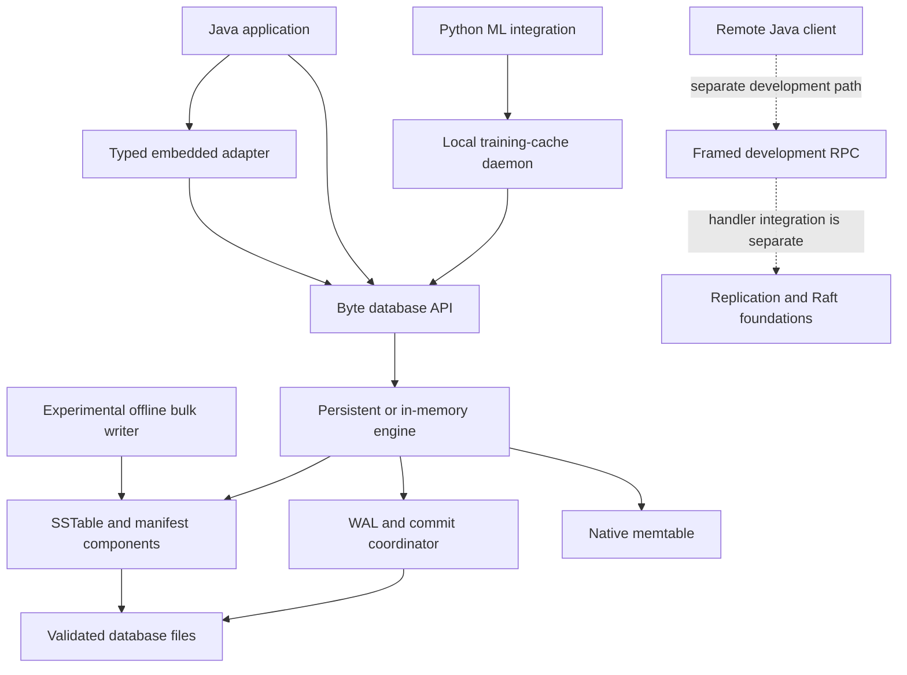

# Architecture and Repository Map

[Onboarding index](README.md) | [Storage internals](STORAGE-ENGINE.md) | [Glossary](GLOSSARY.md)

## Three Different Entry Paths

Aether is not a single distributed service with every module enabled. The current
checkout contains a local embedded engine, an application-specific training cache,
and independent distributed-system foundations.

Arrows describe calls and conceptual data flow, not every Gradle dependency. A
dashed path is not a claim that the repository provides an integrated production
Raft cluster. The training-cache wire protocol is also **not** the general Java
client/RPC protocol.

## Module Inventory

For an individual-module lookup with concrete class search targets and dependency
boundaries, use the [module guide](MODULE-GUIDE.md). For a first source-reading
session, follow the [guided code tour](CODE-TOUR.md) rather than opening every module.

[settings.gradle.kts](../../settings.gradle.kts) is the authoritative project list;
each module's `build.gradle.kts` defines its actual dependency boundary. In the
table, every name has the `aether-` prefix.

| Modules | Responsibility and where to begin |
|---|---|
| `aether-api` | Byte database contract, batches, cursors, snapshots, outcomes, typed interfaces |
| `aether-engine` | Entry points, persistent/in-memory implementations, commit coordination, lifecycle and metrics |
| `aether-memory`, `aether-memtable` | Native memory ownership/allocation and ordered mutable records |
| `aether-format`, `aether-io` | Shared binary-format helpers, identities, validated paths, locks, backup/restore primitives |
| `aether-wal` | Durable log format, fragments/groups, append/recovery primitives |
| `aether-sstable` | Immutable table encoding/readers, checksums, Bloom/index data, manifest versions |
| `aether-lsm`, `aether-cache` | LSM policies/utilities and cache building blocks; presence does not imply every policy is used by the engine |
| `aether-codec-annotations`, `aether-codec-processor` | Record schema annotations and compile-time generation |
| `aether-codec`, `aether-embedded-typed` | Typed envelopes/codecs, durable collection metadata, typed adapter |
| `aether-training-cache` | Immutable ML artifacts, loopback daemon, integrity policy, inline/segment storage and experimental bulk import |
| `aether-admission`, `aether-config` | Resource admission, typed setting registry, validation, configuration composition/reload models |
| `aether-observability-api`, `aether-reliability` | Diagnostic contracts and explicit fault/crash hooks |
| `aether-security-api`, `aether-security-core`, `aether-crypto` | Security contracts, audit/identity helpers and crypto primitives; not automatic end-to-end runtime security |
| `aether-rpc-api`, `aether-rpc-codec`, `aether-rpc-transport` | Calls/status/handler contracts, binary framing, bounded development socket transport |
| `aether-client-api`, `aether-client-codec`, `aether-client` | Remote get/write/scan contracts, serializers, pools, retry policy and typed client facade |
| `aether-replication-api`, `aether-replicated-log`, `aether-state-machine` | Replicated command contracts/encoding and applied-state foundations |
| `aether-raft-api`, `aether-raft-core`, `aether-raft-storage` | Raft records, quorum/progress/commit helpers and persisted-state codecs |
| `aether-cluster-api`, `aether-cluster-codec`, `aether-cluster-core` | Cluster identity/membership encodings and dual-majority logic |
| `aether-tools`, `aether-workbench` | Offline CLI and Swing database viewer/editor |
| `aether-testkit`, `aether-concurrency-tests` | Fixtures/testing boundaries; inspect tasks/source sets rather than assuming a runner |
| `aether-rpc-testkit`, `aether-client-testkit`, `aether-replication-testkit`, `aether-raft-testkit` | Domain fixtures and protocol/consensus test support |
| `aether-benchmarks` | Java benchmark sources and executable workloads; see actual registered tasks |
| `aether-release` | Release-evidence models, evaluation and certification-report machinery |
| `aether-bom`, `aether-gradle-plugin` | Consumer dependency alignment and application/schema build integration |

Do not use a testkit as a production dependency. Do not infer production readiness
from a module compiling or from a schema/configuration field existing.

## Non-Java Areas

| Path | What belongs here |
|---|---|
| [build-logic](../../build-logic/) | Shared Gradle conventions, Java 21 preview, tests and packaging behavior |
| [examples](../../examples/) | Social typed application and persistent desktop notes; runnable teaching fixtures |
| [clients/python](../../clients/python/) | Installed client packages, adapters and workload definitions |
| [scripts](../../scripts/) | Reproduction, campaign orchestration, analysis, remote preparation and tests |
| [configs](../../configs/) | Workload/protocol configuration and frozen dataset manifests |
| [env](../../env/) | Reproduction dependency locks and runtime requirements |
| [kaggle](../../kaggle/) | Notebook orchestration and experiment-specific protocols |
| [paper](../../paper/), [results](../../results/) | Research narrative/evidence and local results; not engine APIs |
| [benchmarks](../../benchmarks/) | Benchmark instructions/artifacts distinct from unit tests |
| [Docs](../), [website](../../website/) | Specifications/onboarding and static site/docs assets |
| [docker](../../docker/), [.github/workflows](../../.github/workflows/) | Packaging/deployment assets and automation; inspect coverage before relying on them |

## Actual Runtime Boundaries

### Embedded engine

[Aether](../../modules/aether-engine/src/main/java/io/aetherdb/engine/Aether.java)
chooses in-memory or local persistent implementations. The persistent engine owns
the database lock, WAL, native memtable, current immutable table inventory and
background compaction lifecycle. Reads and snapshots are local; no Raft quorum
is involved in an ordinary `Aether.open(path)` call.

### Typed application layer

[AetherEmbedded](../../modules/aether-embedded-typed/src/main/java/io/aetherdb/embedded/typed/AetherEmbedded.java)
wraps a byte database and transfers close ownership to the typed adapter. Collection
identity, key ordering, schema fingerprints and value envelopes are implemented
above the byte engine. The social sample's joins and relationship checks are
ordinary Java code, not native relational indexes or serializable transactions.

### Training cache

[TrainingCacheDaemon](../../modules/aether-training-cache/src/main/java/io/aetherdb/training/cache/TrainingCacheDaemon.java)
is a separate local service. Python clients identify derived artifacts and retrieve
them in batches; preprocessing and model code remain Python-side. The offline
bulk writer instead owns an empty database directly and does not route population
through the online daemon. See [integration details](TRAINING-CACHE-AND-PYTHON.md).

### Remote/distributed foundations

[PlaintextDevelopmentRpc](../../modules/aether-rpc-transport/src/main/java/io/aetherdb/rpc/transport/PlaintextDevelopmentRpc.java)
really does implement a development socket transport with framing, identity
handshake, multiplexing, limits, cancellation and deadlines. It explicitly lacks
confidentiality and certificate authentication. [RemoteAetherClient](../../modules/aether-client/src/main/java/io/aetherdb/client/RemoteAetherClient.java)
uses a supplied pool/resolver and conservative retry policy for remote operations.

[RaftCommitTracker](../../modules/aether-raft-core/src/main/java/io/aetherdb/raft/core/RaftCommitTracker.java),
[RaftPersistentState](../../modules/aether-raft-storage/src/main/java/io/aetherdb/raft/storage/RaftPersistentState.java)
and [DualMajority](../../modules/aether-cluster-core/src/main/java/io/aetherdb/cluster/core/DualMajority.java)
are useful foundations, not evidence of complete election, membership-change,
deployment and recovery orchestration. Do not deploy the training-cache daemon
as though it were a secured, replicated cluster server.

## Choose the Smallest Correct Ownership Boundary

| Change | Start here | Review companions |
|---|---|---|
| Public write result or snapshot lifetime | `aether-api`, typed interfaces | Engine/typed adapter tests and callers |
| Durable file bytes | Specific WAL/SSTable/manifest/format codec | Recovery, corruption, compatibility and crash tests |
| Commit ordering or compaction | `PersistentAetherDatabase`, commit coordinator | Concurrency, replay, snapshots, admission and drain behavior |
| Record schema | Record source + processor + committed locks | Evolution/older-writer tests; generated codec output |
| Cache miss or artifact identity | Python identity/adapter and Java cache key/envelope | Content/version invalidation and restart correctness |
| General RPC framing or retries | RPC/client codec and transport | Limits, cancellation, deduplication and ambiguous outcomes |
| Experiment endpoint | Campaign/analysis/configuration scripts | Provenance, pairing, accounting and fresh data policy |

Changing a benchmark is not a substitute for fixing an engine contract. Conversely,
do not modify engine storage behavior to fix a notebook path or environment problem.

## Source Reading Pattern

For each subsystem, read its public entry point, the owner of mutable state, the
format/identity boundary, a normal-path test, and a failure-path test. Follow a
complete call chain before optimizing one method. The most important questions
are: who owns this resource, when is success durable, what happens on failure,
and which persisted bytes must remain readable after the next release?
