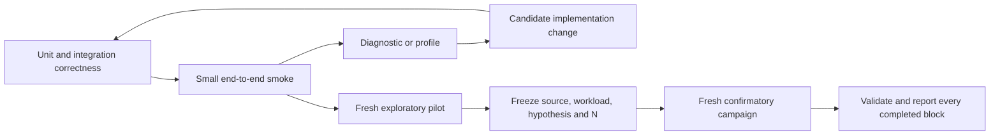
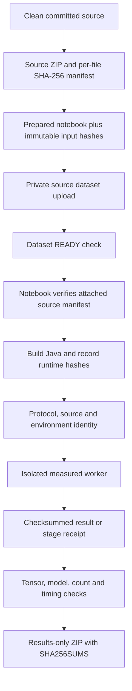
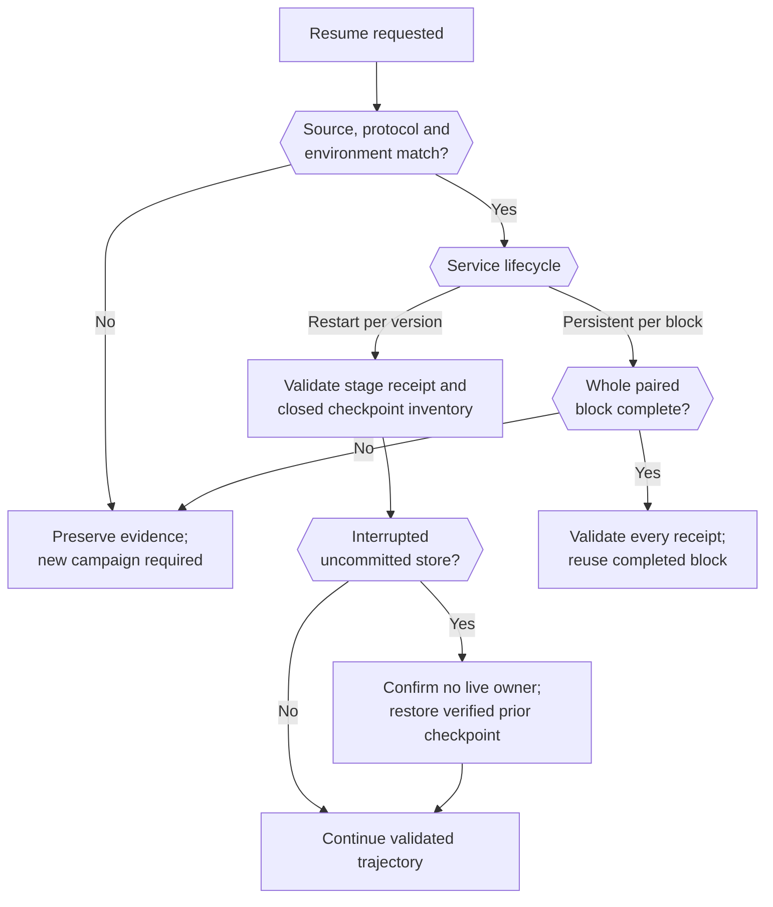

# Experiments And Profiling

[Onboarding index](README.md) | [Testing and contributing](TESTING-AND-CONTRIBUTING.md) | [Operations and debugging](OPERATIONS-AND-DEBUGGING.md)

The research code is part of the implementation, not a folder of interchangeable benchmark commands. Different campaigns answer different questions and use different timing boundaries. Preserve those distinctions when changing code, collecting data or explaining results.

This guide documents current runner behavior, not the status of a particular remote job. A local `run-status.json`, an old notebook log, or a historical result archive is not evidence that a new Kaggle version is running.

The separately frozen [H2 streaming pilot](H2-TRAINING-WORKLOAD.md) adds V0 training
and a same-JVM bulk-to-online transition. Its harness is a distinct committed
snapshot, not necessarily the active worktree. The longitudinal descriptions below
refer to the earlier protocols unless explicitly qualified; do not pool their
endpoints with H2.

## Evidence Levels



- **Correctness tests** check invariants on controlled fixtures; their timings are not benchmark results.
- **Smoke runs** exercise the complete plumbing with fewer samples/epochs, outside later inference.
- **Diagnostics/profiles** localize costs with tracing or JFR. Instrumented timings are not interchangeable with uninstrumented performance measurements.
- **Pilots** support design choices and variance estimates. They remain exploratory after a favorable result.
- **Confirmatory campaigns** bind the implementation, data membership, endpoint, hypotheses and sample size before fresh measurements. Do not pool pilot blocks, tune after inspection or choose the best-looking endpoint afterward.

The current `primary` command is specifically the frozen **20-epoch append75 superiority design**, not a generic alias for any proposed primary experiment. The [earlier 10-epoch equivalence design](../../kaggle/CONFIRMATORY-V1.md) remains separate historical evidence. The longitudinal runner explicitly rejects `confirmatory: true`; it does not implement a 24-block longitudinal confirmation.

## Entry Points And Ownership

| Entry point | Responsibility |
| --- | --- |
| [reproduce.py](../../scripts/reproduce.py) | Cross-platform wrapper for `test`, `smoke`, `profile`, `pilot`, `primary`, and `all`; runs Java cache tests/build before dispatch. |
| [run_matrix.py](../../scripts/run_matrix.py) | Paired training campaigns and their frozen conditions, outputs and resume validation. |
| [confirmatory.py](../../scripts/confirmatory.py) | Exact current primary design and evidence guards; knows the separate earlier design. |
| [analyze.py](../../scripts/analyze.py), [figures.py](../../scripts/figures.py) | Training statistical summaries and figures from validated outputs. |
| [monai_comparison.py](../../scripts/monai_comparison.py) | Existing canonical transform, native cache adapters and one-update MONAI comparison. |
| [longitudinal_comparison.py](../../scripts/longitudinal_comparison.py), [longitudinal_worker.py](../../scripts/longitudinal_worker.py) | Five-version paired orchestration and isolated backend jobs. |
| [longitudinal_state.py](../../scripts/longitudinal_state.py), [persistent_service.py](../../scripts/persistent_service.py) | Stage receipts/checkpoints versus uninterrupted persistent-service state. |
| [longitudinal_analyze.py](../../scripts/longitudinal_analyze.py) | Cumulative wall-time comparisons, descriptive paired intervals and plots. |
| [profile_population.py](../../scripts/profile_population.py), [bulk_population.py](../../scripts/bulk_population.py) | Population-only comparisons and the offline bulk writer adapter. |
| [profile_bulk_jfr.py](../../scripts/profile_bulk_jfr.py), [bulk_jfr_analyze.py](../../scripts/bulk_jfr_analyze.py) | Controlled JFR collection and phase/sample analysis. |
| [paper_common.py](../../scripts/paper_common.py), [system_campaign.py](../../scripts/system_campaign.py) | Runtime identity, subprocess lifecycle, atomic JSON, immutable protocol/environment and result receipts. |
| [package_artifact.py](../../scripts/package_artifact.py), [kaggle_remote.py](../../scripts/kaggle_remote.py), [kaggle_results.py](../../scripts/kaggle_results.py) | Source freeze, notebook submission controls and result-only packaging. |

Inspect a command before using it:

```powershell
.venv/Scripts/python.exe scripts/reproduce.py --help
.venv/Scripts/python.exe scripts/kaggle_remote.py --help
.venv/Scripts/python.exe scripts/longitudinal_comparison.py --help
.venv/Scripts/python.exe scripts/profile_population.py --help
.venv/Scripts/python.exe scripts/profile_bulk_jfr.py --help
```

These examples assume the [scientific Python environment](TESTING-AND-CONTRIBUTING.md#python-environments-and-optional-tests) exists. Some help entrypoints import their scientific dependencies before parsing arguments. Local fixture tests do not require the actual OCT5K image dataset; full workloads do.

## Workloads And Timing Boundaries

| Family | Fixed/current design | Meaning of the endpoint |
| --- | --- | --- |
| Current `primary` | 1,430 -> 1,505 samples, 75 additions; 24 fresh paired blocks; 20 epochs, batch 16, prefetch 0, trace off. Raw/Aether/incremental mmap/RAM-ready. | All 20 V2 training epochs, including inline admission and training input work. Excludes V1 population, daemon startup, reference validation and final compaction drain. |
| One-update MONAI pilot | Five paired blocks; same 1,430 -> 1,505 workload and 20 epochs. Aether/mmap/MONAI PersistentDataset/MONAI LMDBDataset. | Separate initial-population, update/training and full-lifecycle reports. Here `fullLifecycleMs` sums service startup and both measured stages; it excludes model setup/warmup, correctness validation and close. |
| Longitudinal restart pilot | Five blocks; V0..V4 = 1,200/1,260/1,323/1,389/1,458; 20 epochs per update. | Cumulative operational phases through V4, including V0 and each service restart. |
| Longitudinal persistent pilot | Same five versions/blocks/epochs; one Aether PID per block. | Cumulative phases through V4 with one startup at V0 and one shutdown at V4. Other backend handles still reopen per job. |
| Original population and bulk-prototype diagnostics | Empty store, V0 1,200 artifacts, three repetitions; no model, training, or evolution. | Population plus separately reported startup, drain and close; reference and correctness readback excluded from the population measurement. |
| Bulk-layout diagnostic | 32/64/128 MiB SSTable targets, batch 16, three repetitions; no model or training. | V0 population is measured separately from subsequent warm-read and V1 append regression checks; those checks are not added to V0 population time. |
| Bulk JFR | Fixed 32 MiB tables and batch 16; control -> JFR -> control. | Diagnostic attribution and profiler overhead, not a new backend comparison or confirmatory endpoint. |

The primary hypothesis is one-sided paired log-ratio superiority of Aether over incremental mmap. The +/-3% equivalence test is secondary in the current design; it was primary in the earlier design. Read the [full current protocol](../../kaggle/CONFIRMATORY.md) and [code guards](../../scripts/confirmatory.py) before changing or interpreting a `primary` result. All 1,505 samples must appear in every epoch.

For longitudinal experiments, the five CSV manifests are frozen nested prefixes of one seeded permutation in [configs/paper/oct5k-longitudinal](../../configs/paper/oct5k-longitudinal). New counts are 60, 63, 66 and 69; retained sample identity, content hashes and transform identity must not change. V0 populates without training. Each later version uses a fresh matched model/optimizer seed, the same ordered samples and exactly 20 epochs: 108,600 training sample requests per backend per complete block. These are successive simulated updates on the available pool, not four independently acquired real-world weekly datasets.

The longitudinal measured sum is:

```text
stage = startup + scanAdmission + modelSetup + training + drain + close
cumulative(V4) = stage(V0) + stage(V1) + stage(V2) + stage(V3) + stage(V4)
paired speedup = baseline cumulative time / Aether cumulative time
```

Speedup above 1 means Aether completed the defined lifecycle faster. `scanAdmission` intentionally combines native opening/index reconstruction, lookup and preparation because MONAI LMDB populates eagerly in its constructor. Shared content-hash preflight, reference preparation, Python worker launch/import, checksum validation, checkpointing and plotting are separately recorded or excluded. The sum is not the notebook's elapsed time.

Full protocols: [MONAI pilot](../../kaggle/MONAI-PILOT.md), [restart longitudinal](../../kaggle/LONGITUDINAL-PILOT.md), [persistent longitudinal](../../kaggle/PERSISTENT-SERVICE-PILOT.md).

## Provenance Is Part Of Correctness



There are several distinct identities, not one universal checksum:

| Artifact | What it binds |
| --- | --- |
| `artifact-provenance.json` inside source ZIP | Selected source-file hashes, originating Git commit/status and `sourceClean`. A source archive is not the result archive. |
| ZIP `.sha256` sidecar | Exact compressed source archive bytes. Repackaging can change this even if the source manifest is unchanged. |
| `build/kaggle/prepared.json` | Exact local config, source upload files and notebook files produced at `prepare`. |
| `paper-runtime-build.json` | Java/build source inventory, classpath file and actual class/resource/JAR bytes. |
| `campaign.json` and `environment.json` | Protocol hash, source hashes, measured host/package/runtime identity and environment report checksum. |
| Result/stage receipt | Its result payload plus protocol/environment identity; longitudinal receipts also bind block/version/backend and source identity. |
| `SHA256SUMS` in results ZIP | Every bundled result file; JFR mode also writes its own recording/report checksum list. |

`package_artifact.py` deliberately excludes caches, build products, virtual environments and datasets. On a clean checkout it packages selected tracked bytes from `git archive HEAD`, not an arbitrary untracked working directory. On a dirty checkout it can produce an explicitly dirty artifact, but scientific Kaggle modes such as primary, MONAI, longitudinal and population reject that source at preparation.

Use an isolated clean checkout when unrelated development is in progress; do not discard work to satisfy a freeze. Record source commit/tag, archive hash, manifest hash, config and notebook identity before launching. GitHub synchronization and tagging are release/research procedures: `kaggle_remote.py prepare` does **not** commit, tag or push Git for you.

The system campaign takes an OS lock, validates the executable before recording provenance, and uses atomic temporary-file replacement for JSON. Resume requires the same protocol, source and measured host environment. Do not edit source, reinstall packages, or modify result JSON to make a campaign resumable. A changed implementation needs a new output and campaign identity.

## Resume Is Workflow-Specific



Restart-based longitudinal stages commit independently hashed closed-store checkpoints; unverified partial stores are never silently reused. Live worker leases prevent concurrent recovery. Checkpoint copy/hash overhead is excluded from the commercial endpoint but can warm the OS page cache.

Persistent-service mode must retain a single uninterrupted Aether PID. It deliberately does not copy/hash live stores between versions for any backend. An interrupted incomplete block cannot be resumed as if the service had never stopped: preserve it and choose a new campaign output. Only complete validated blocks are reusable under `--resume`.

A results-only ZIP does not contain all cache stores and cannot reconstruct an interrupted cache trajectory. Capacity preflight is a conservative estimate, not a reservation; real disk exhaustion can still fail a campaign. Failed stores/evidence are retained for investigation. Never point a scratch option at the only copy of a source dataset or a preserved campaign.

## Population And Bulk Diagnostics

The original [population diagnostic](../../kaggle/POPULATION-DIAGNOSTIC.md) has eleven arms: six `put_many` sizes (1/4/8/16/32/64) with lookup group fixed at 64, two original 16-sample pilot-path controls (traced/untraced), and mmap/PersistentDataset/LMDB baselines. Three repetitions use fresh workers/stores; a separate 65-sample smoke includes partial batches. The old pilot already batched publication, so it is incorrect to describe it as 1,200 single-artifact RPCs.

`--include-bulk` adds the separate offline bulk arm; the mutually exclusive `--bulk-layout` replaces that comparison with the three table-size arms. Layout mode also checks warm reads and incremental V1 admission after population, outside the V0 timer. Read [bulk prototype](../../kaggle/BULK-POPULATION-PROTOTYPE.md) and [layout v2](../../kaggle/BULK-POPULATION-V2.md) before comparing their arms. The bulk path is empty-store-only, creates SSTables directly and publishes their inventory durably; ordinary online writes are a different path. Bulk acknowledgements before final commit are staged, not durable.

The offline adapter feeds the writer through a local pipe, not the online TCP daemon. It also knows the store is empty, so lookup/readback work differs. An end-to-end difference is not proof that all saved time came from avoiding WAL or memtable work. A fresh normal daemon must read back the committed store successfully before the result is accepted. That validation restart is outside the population timer; a future bulk-enabled lifecycle must explicitly charge any transition into online service.

Useful measured layers include source/preprocessing, codec encoding, Python body/framing, request transfer/wait, Java parsing/ownership/integrity, database/WAL/force/memtable work, table creation, manifest publication and quiescence. Many durations are nested or overlap. Do not sum inclusive database, WAL, flush and socket-wait counters into a supposedly disjoint wall-time decomposition.

## JFR Workflow

[Bulk JFR mode](../../kaggle/BULK-JFR.md) profiles the **offline `BulkArtifactWriter` JVM**, not the Gradle daemon or later restart reader. It uses `settings=profile`, stack depth 256, disk recording and dump-on-exit. JFR startup messages go to stderr so stdout remains the pipe protocol.

Two custom event types connect sampled stacks to meaningful work:

- `aether.BulkPopulation`: readiness through durable finish, including waits for Python input; excludes JVM/bootstrap startup. Python's population timer remains authoritative.
- `aether.BulkPhase`: request decoding/integrity, sorted partitioning, table build/force/verification/rename, manifest stages and final quiescence. Events are enabled only for the profiled run. Some phases are inclusive of others.

For a local **tiny correctness recording**, build the runtime/test classes, enable the integration flag, and run:

```powershell
$env:PYTHONPATH = 'scripts;clients/python'
$env:AETHER_JAVA_TEST = '1'
.venv/Scripts/python.exe -m pytest scripts/tests/test_bulk_jfr.py::test_control_profile_control_uses_same_fixture_and_retains_recording -q --basetemp build/local-jfr-test
```

`--basetemp` is a disposable pytest directory and may be cleared on a later run. Preserve a recording elsewhere before rerunning if it is evidence you need. This fixture uses five synthetic samples, not the full 1,200-sample medical-imaging workload. The test output directory contains `results/aether-bulk-32.jfr` beneath its per-test temporary folder.

On a machine with the frozen OCT5K manifest paths and data available, the full driver is:

```powershell
.venv/Scripts/python.exe scripts/profile_bulk_jfr.py --output results/bulk-jfr-new --scratch-root build/bulk-jfr-new-stores
```

`--smoke` uses 65 genuine manifest samples, not the synthetic unit-test fixture. The full command is a real workload, not an onboarding prerequisite. It records control-before, JFR, control-after in fresh processes/stores and retains one recording. Outputs include `aether-bulk-32.jfr`, `jfr-events.json`, `jfr-event-summary.txt`, `jfr-summary.md`, `jfr-analysis.json`, all three receipts and checksums. Open the recording in Java Mission Control for thread/call-tree investigation, or inspect it with the JDK tool:

```powershell
jfr summary results/bulk-jfr-new/aether-bulk-32.jfr
jfr print --json --events aether.BulkPopulation,aether.BulkPhase results/bulk-jfr-new/aether-bulk-32.jfr
```

The analyzer reports JFR population time divided by the mean of the two controls, plus sampled CPU stacks, weighted allocations, GC and thresholded I/O/blocking observations. Fixed control/profile/control order does not eliminate host drift. Missing events do not mean zero cost; allocation sampling is not an exact copy-byte count. Profiling alone cannot establish disk saturation or how much wall time an optimization will recover.

Other JVM profiling hooks exist in [training-cache Gradle tasks](../../modules/aether-training-cache/build.gradle.kts): `trainingCacheDaemon` and `trainingCacheBenchmark` accept `-PjfrFile=<path>` and optional `-PjfrSettings=<settings>`. Relative paths resolve from that project. They profile those tasks' JVMs, not an independently launched Python bulk worker.

## Lower-Level Engine Benchmarks

The [aether-benchmarks module](../../modules/aether-benchmarks/build.gradle.kts) runs `BenchmarkProfileRunner`. List registered profiles without executing a workload:

```powershell
./gradlew.bat :modules:aether-benchmarks:run --args="--list"
```

Only three profile IDs currently map to executable `CvBenchmark` plans: `local.write.sequential.group_sync`, `local.read.point_warm`, and `local.recovery.wal_replay`. Other registered profiles fail explicitly as not executable. The CLI requires `--profile` and `--directory`, and supports record/read counts, batch/value size, output, durability/cache mode and crash-point options. It requires an empty benchmark directory. Do not confuse these storage micro/workload benchmarks with ML preprocessing/training lifecycles.

Setting `AETHER_JFR=true` before the module's `run` task enables its own JFR recording under `modules/aether-benchmarks/build/jfr/aether-benchmark.jfr`. The profile runner may override requested knobs to preserve a named profile's semantics, so inspect the resulting plan/report rather than just the command text.

The separate `:modules:aether-training-cache:trainingCacheCrashCampaign` task defaults to **1,000 forced-process trials** and deletes/recreates its `trial-*` directories. It is neither a quick check nor safe against an arbitrary user-data directory. Use only dedicated disposable storage and an explicitly chosen trial count.

## Kaggle Prepare, Submit And Retrieve

Kaggle actions can upload private source and consume a remote job allocation. Do not run them as a routine documentation or unit-test check. The [remote guide](../../kaggle/VSCODE.md) covers authentication; credentials stay in Kaggle's supported auth locations, never in source/config commits.

The current helper separates actions:

| Action | Effect |
| --- | --- |
| `setup` | Creates `build/kaggle-venv` and installs the pinned CLI environment. |
| `prepare` | Packages source, generates a private notebook and hashes local inputs under `build/kaggle`; uploads nothing. Configuration flags apply only here. |
| `upload-source` | Creates a private source dataset; `--update` publishes another version of an existing dataset. |
| `source-status` | Requires the source dataset to report `ready`. |
| `run` | Validates prepared/uploaded identity, checks dataset readiness and pushes the notebook. It does not accept replacement experiment flags. |
| `status`, `logs` | Inspect the configured remote notebook. Status refers to that remote target, not a downloaded archive. |
| `outputs` | Downloads `aether-results-only.zip` into a fresh `results/kaggle/<timestamp>` directory and checks ZIP integrity. |

For an approved new JFR collection, prepare from the frozen clean checkout with the intended account and existing image dataset:

```powershell
build/kaggle-venv/Scripts/python.exe scripts/kaggle_remote.py prepare --user YOUR_KAGGLE_USERNAME --mode population-jfr --no-server-trace --dataset-source DATASET_OWNER/DATASET_SLUG
```

Inspect `build/kaggle/config.json`, source provenance and notebook metadata before uploading. Preparation can inherit saved options for some modes; explicit arguments and inspection prevent reusing an unintended dataset/configuration. The image dataset must expose the paths expected by the frozen manifests. Population modes have no epochs and reject an epoch override. Current notebook metadata retains the T4 accelerator even for population-only modes, although no training is performed.

After explicit authorization, the operational sequence is `upload-source --update`, `source-status`, `run`, then `status` until the requested launch condition is reached. Use `upload-source` without `--update` only for initial dataset creation. Do not repeatedly resubmit a queued notebook: retain its identity and inspect the existing job. A successful upload is not a running notebook, and `running` is not a successful experiment.

The embedded [notebook runner](../../kaggle/vscode_run.py) checks attached source identity, setup and required gates before collection, writes `run-status.json`, and attempts results bundling even on failure. Persistent-service mode runs restart correctness separately before smoke/pilot; population/JFR use their own smoke and main output directories. On retrieval, inspect the status, failures, protocol, completion records and checksums before interpreting the summary. Keep original ZIPs immutable and keep prior source snapshots alongside them; preserved result archives are not benchmark source code.

## Interpretation Checklist

- Compare the same endpoint and timing scope; update throughput and initial-population-inclusive lifecycle time answer different questions.
- Keep the raw, mmap, RAM and MONAI backend semantics explicit. Aether/mmap use TensorDictCodec while the MONAI pilot retains native Torch serialization; durability guarantees also differ.
- Report Aether startup/shutdown and service residence distinctly. Persistent Aether remains resident while baseline jobs run, affecting resource use and cache conditions.
- A process restart is not a cold OS page cache; common preflight and validation can warm input files. No privileged page-cache reset is implied.
- Input-wait time and sampled GPU utilization are proxies, not direct hardware GPU-idle measurements. Sampled disk high-water marks are lower bounds, not exact peaks.
- Preserve failures, interrupted attempts and complete unfavorable blocks. Do not edit receipts, remove awkward results, mix smoke/pilot/confirmatory data, or extend N after looking at effects.
- After an optimization, rerun correctness and a fresh exploratory pilot before freezing a new confirmatory study. A favorable old pilot cannot validate a changed system.
