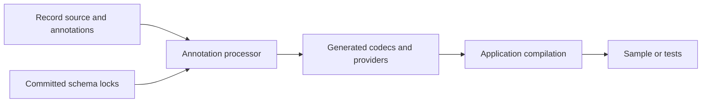

# Getting Started

[Onboarding index](README.md) | [Architecture](ARCHITECTURE.md) | [Testing](TESTING-AND-CONTRIBUTING.md)

## Prerequisites

| Component | Requirement and reason |
|---|---|
| Java | **JDK 21**, not just a JRE. Source uses Java 21 preview features; the conventions compile for release 21 and enable preview for tests/application tasks. Do not assume a later JVM can load preview bytecode from 21. |
| Gradle | Use the checked-in wrapper. [Wrapper properties](../../gradle/wrapper/gradle-wrapper.properties) pin the distribution and its checksum. No global Gradle install is required. |
| Git | Needed to inspect changes and to capture research provenance. |
| Network | First build may fetch the wrapper, toolchain, plugins and Maven dependencies. An offline build only works with a populated compatible cache. |
| Disk | Leave room for Gradle caches, Java artifacts and temporary test stores. Storage admission tests and experiments can reject writes under disk pressure. |
| Python | Optional for engine-only development. The [client package](../../clients/python/pyproject.toml) requires Python >=3.10; research workloads have additional pinned dependencies. |

Build conventions live in [aether.java-base](../../build-logic/src/main/kotlin/aether.java-base.gradle.kts).
They enable `--enable-preview`, `-Xlint:all` and `-Werror`; a warning can therefore
be a build failure. Set the IDE's project SDK and Gradle JVM consistently.

## First Build: No Dataset or Credentials

From a checkout root, use the command block for your shell. These commands do not
start a persistent service or write a user database.

### Linux or macOS

```bash
java -version
./gradlew --version
./gradlew :examples:aether-sample-app:run
./gradlew :examples:aether-sample-app:test
```

### Windows PowerShell

```powershell
java -version
.\gradlew.bat --version
.\gradlew.bat :examples:aether-sample-app:run
.\gradlew.bat :examples:aether-sample-app:test
```

If Java selection is wrong, point `JAVA_HOME` at your **JDK 21 installation** and
restart the terminal/IDE. Do not copy a machine-specific path from someone else's
configuration. Wrapper toolchain resolution and the runtime used for manually
launched `java` processes are distinct; check both when diagnosing preview errors.

The [sample main](../../examples/aether-sample-app/src/main/java/io/aetherdb/examples/social/SocialNetworkApplication.java)
uses `AetherEmbedded.openInMemory()` when no arguments are provided. Expected
output includes profiles, posts, a joined feed, and `Deleted draft exists: false`.
The relational checks and joins are application code, not SQL or a query optimizer.

## Learn Persistence Deliberately

Passing an argument changes the sample to `AetherEmbedded.open(path)`. Choose a
new, disposable directory and run the same command twice:

```bash
./gradlew :examples:aether-sample-app:run --args="./build/onboarding-social-db"
```

PowerShell uses the same arguments with `.\gradlew.bat`. The sample seeds only if
empty, and then performs its demo updates. Database state remains after process
exit. Do not choose a benchmark store or an existing application's database.
Persistence tests may refuse to run on a nearly full disk; resolve capacity rather
than disable safeguards to make a tutorial pass.

The desktop notes and Workbench examples are optional, interactive applications:

```bash
./gradlew :examples:aether-persistent-notes:run
./gradlew :modules:aether-workbench:run --args="./build/onboarding-social-db"
```

Close any current database owner first. Headless CI should not launch Swing UIs.
Workbench may treat collections as read-only when the appropriate definitions and
codecs are unavailable. See [operations](OPERATIONS-AND-DEBUGGING.md).

## IDE Setup and Source Navigation

Import the root as a Gradle project, including the `build-logic` included build.
Keep annotation processing enabled or delegate builds to Gradle. Generated codec
sources are under each module's `build/generated/` tree; their inputs are Java
records and committed `aether-schemas/` locks. Never edit generated output.



Start with the sample's [repository](../../examples/aether-sample-app/src/main/java/io/aetherdb/examples/social/SocialNetworkRepository.java),
follow `AetherEmbedded` into the typed adapter, then follow its byte database call.
This is a smaller and more useful first reading exercise than opening every module.

The [guided code tour](CODE-TOUR.md) walks that request through the concrete
classes, then continues through writes, snapshots, flush and recovery. Keep the
[module guide](MODULE-GUIDE.md) beside the IDE when choosing where a change belongs.

## Optional Python Environment

Create an environment only if you do not already have a suitable one. An explicit
interpreter path avoids shell activation-policy issues.

```bash
python3 -m venv .venv
.venv/bin/python -m pip install -e ./clients/python
.venv/bin/python -m pip install pytest
```

```powershell
py -3.11 -m venv .venv
.venv\Scripts\python.exe -m pip install -e ./clients/python
.venv\Scripts\python.exe -m pip install pytest
```

The Windows example selects 3.11 if installed; it is not an additional package
minimum. Editable installation exposes Python code from this checkout but does
not compile Java. The base package already brings NumPy, Pillow and tokenizer
dependencies; PyTorch/MONAI are optional extras. The research lockfiles are
separate from the package's broad dependency ranges.

Follow [training cache and Python](TRAINING-CACHE-AND-PYTHON.md) to build the Java
runtime classpath and run a local cache example. Follow [experiments](EXPERIMENTS-AND-PROFILING.md)
for the larger pinned environment; do not install every research dependency just
to contribute an engine unit test.

## Where Output Goes

| Location | Meaning |
|---|---|
| `modules/<name>/build/classes/`, `build/generated/`, `build/libs/` | Compiled classes, generated sources and jars |
| `modules/<name>/build/reports/tests/test/` | Human-readable Java test reports |
| `modules/<name>/build/test-results/test/` | JUnit XML for automation |
| Root `build/` | Local exports, disposable stores, prepared snapshots and tool output; inspect before cleaning |
| `results/` | Experiment/profiling evidence; not a blanket cleanup target |
| `aether-schemas/` under a project | Committed durable identities, not generated scratch data |

The full Java suite is `./gradlew test`; use [focused test commands](TESTING-AND-CONTRIBUTING.md)
for normal edit cycles. The complete suite, research campaigns, publication tasks
and remote uploads are not required for a first successful build.

## Common Setup Failures

| Symptom | Check first |
|---|---|
| Preview class/version mismatch | Java 21 runtime and preview flags; let Gradle launch Java tasks |
| Wrapper cannot download | Network/proxy/sandbox permissions and the wrapper cache, not application source |
| Generated codec missing | Annotation processor dependency, schema locks and Gradle compilation |
| Unknown/mismatched schema | Read [schema workflow](TYPED-API-AND-SCHEMAS.md); never accept a proposal without reviewing it |
| Database already locked | Existing daemon, sample or Workbench process owns that exact directory |
| Disk admission rejection | Free space and configured reserve; avoid benchmarking on a near-full disk |
| Python import failure | Interpreter selection, editable install, optional extras and `PYTHONPATH` for script tests |
| Stale Java runtime export | Rebuild `:modules:aether-training-cache:paperRuntimeClasspath` after Java source changes |

During this guide's verification the in-memory sample ran successfully on Windows
with JDK 21. Platform-specific file durability and permissions still need the
corresponding tests on each deployment platform.
