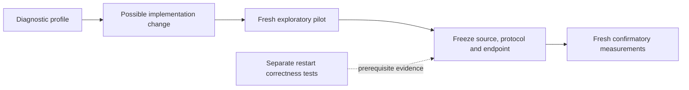

# Glossary and Mental Models

[Onboarding index](README.md) | [Architecture](ARCHITECTURE.md)

These definitions describe how terms are used in this checkout. Follow the linked
guide for implementation details and limitations; similarly named concepts in a
specification may have a broader intended scope.

## Storage and Ownership

| Term | Meaning here |
|---|---|
| Embedded | Runs inside the owning Java process against a local directory, without requiring a remote server |
| Sequence number | Orders engine mutations and bounds snapshot visibility; not a wall-clock timestamp |
| Write batch | A group of mutations submitted atomically; does not make preceding application reads transactional |
| WAL | Write-ahead log used by the online persistent write/recovery path |
| Durability barrier | Required persistence operation before the relevant durable acknowledgement; distinct from making bytes visible in memory |
| Group commit | Several requests share commit processing and, when required, a force operation |
| Memtable | Mutable ordered in-memory state; this engine uses native memory for its main memtable |
| FFM / arena / region | Java foreign-memory APIs and scoped ownership used for native allocations; a view cannot outlive its owner |
| SSTable | Immutable sorted table file containing encoded entries, index/filter information and integrity metadata |
| L0, L1, ... | LSM levels; flush creates L0 files and compaction moves/merges data according to the implemented policy |
| Flush | Converts mutable data to an immutable table and publishes the associated metadata; not the same as compaction |
| Compaction | Builds replacement immutable files from selected existing files, then publishes a version change |
| Manifest / VersionEdit | Durable file-inventory history and its edits; publication controls which files are authoritative |
| `CURRENT` | Pointer used to locate the active manifest; not a copy of all database contents |
| Tombstone | Deletion marker that participates in visibility and compaction; do not substitute an empty value for a delete |
| Snapshot | A bounded historical read view that must be closed; can constrain reclamation |
| Cursor | Resource-owning iteration handle, not a detached Java collection |
| Backpressure | Admission delay/rejection when resource or lifecycle constraints prevent safe progress |
| Quiescence | The required work has drained according to the measured policy; not a general claim that every possible maintenance task has run |
| Checkpoint / backup / salvage | Respectively a consistent file set, an archived recoverable representation, and recovery of readable data with possible loss |

Read [Storage engine](STORAGE-ENGINE.md) and
[Operations and debugging](OPERATIONS-AND-DEBUGGING.md).

## Schemas and Cache Identity

| Term | Meaning here |
|---|---|
| Codec | A defined encoding/decoding contract, not arbitrary language-object serialization |
| Collection ID | Stable namespace for typed data; the convenience named-collection API derives it from the name |
| Schema UUID / version / fingerprint | Record-family identity, an evolution number, and the concrete schema descriptor identity |
| Schema lock | Committed generated schema metadata reviewed with record changes; not a runtime mutex |
| Artifact | Immutable derived data, such as a preprocessed tensor dictionary, identified independently of a training epoch |
| Transform fingerprint | Identity of preprocessing semantics/settings; changes can invalidate otherwise unchanged input artifacts |
| Source hash | Content identity of an input or source snapshot; distinguish those two uses in provenance fields |
| Admission | Preparing and publishing a missing artifact; not the same as a read hit |
| Staged / published | Volatile staging versus the completed publication boundary; inspect the specific API acknowledgement |
| Inline / segment | Artifact bytes in the database envelope versus an external artifact segment referenced by metadata |
| `putMany` | Online batched artifact publication request; not automatically an offline bulk import |
| Bulk writer | Experimental empty-store path that builds immutable files directly, with separate correctness/publication constraints |
| Packed response | Batched artifact bytes with shared response-buffer ownership; not unrestricted zero-copy through every layer |
| PersistentDataset / LMDBDataset | MONAI cache backends used by research adapters; their representation and durability differ from Aether's |

Read [Typed API and schemas](TYPED-API-AND-SCHEMAS.md) and
[Training cache and Python](TRAINING-CACHE-AND-PYTHON.md).

## Research Terms

| Term | Meaning here |
|---|---|
| Paired block | Matched backend measurements under the same inputs/configuration and block seed; the statistical comparison uses within-block ratios |
| Randomized backend order | Controls order effects; it does not turn different preprocessing or durability scopes into matched work |
| Pilot | Exploratory measurements used to understand effects and variance; not reusable confirmatory samples |
| Confirmatory campaign | Fresh measurements collected under a prospectively frozen implementation, endpoint, hypotheses and sample size |
| Population / V0 | Initial cache construction, before later updates; must be charged when claiming full lifecycle cost |
| Incremental update | Preparation of the defined missing/changed set while retaining valid artifacts |
| Lifecycle endpoint | Explicit sum of measured stages; a field named `fullLifecycleMs` is not enough to establish identical scopes across runners |
| Persistent service | Keeps the service available across updates; distinct from close/reopen measurements and restart-correctness tests |
| Throughput ratio | Aether throughput divided by baseline throughput for matched work; above 1 favors Aether |
| Time speedup | Baseline elapsed time divided by Aether elapsed time; above 1 favors Aether, but the underlying endpoint must still match |
| Equivalence / superiority | Different hypotheses: containment within predefined bounds versus a predefined directional comparison |
| JFR | Java Flight Recorder event/sample capture for diagnosis; profiling overhead and event coverage must be reported |
| Input-wait proxy | Measured loader wait time, not a direct hardware GPU-idle measurement |
| Receipt / provenance | Verifiable completion metadata and the source/configuration/data identity needed to attribute a measurement |

The graph is a research workflow, not permission to launch a campaign. A diagnostic
without training has no training epochs; a population speedup alone does not prove
an end-to-end training gain. Read [Experiments and profiling](EXPERIMENTS-AND-PROFILING.md)
before interpreting or collecting measurements.
