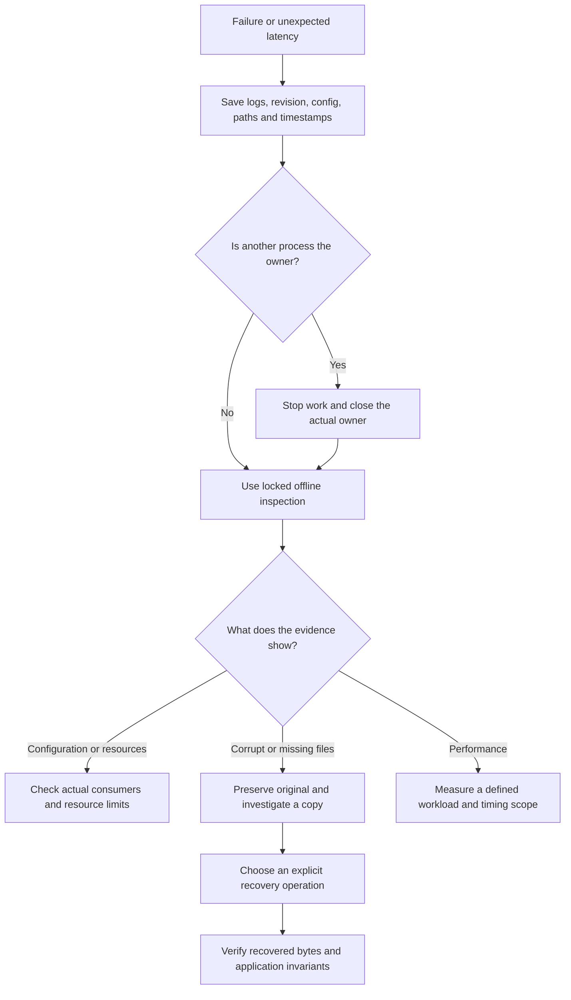
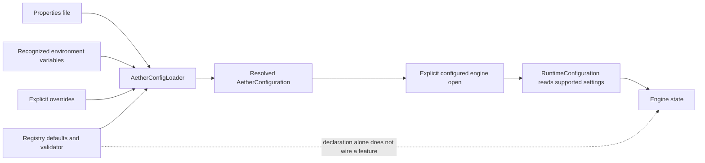

# Operations and Debugging

[Onboarding index](README.md) | [Storage engine](STORAGE-ENGINE.md) | [Tests](TESTING-AND-CONTRIBUTING.md)

This is a development runbook for the current pre-production implementation, not
a production deployment guide. Practice on disposable stores. Keep the original
bytes and logs when diagnosing corruption; a successful repair is not proof that
every acknowledged application record was recovered.

## Ownership and Shutdown

The embedded engine owns an exclusive database-directory lock. A sample,
Workbench, training-cache daemon, bulk importer, or offline tool must not operate
as a second owner of that directory. The presence of a lock file alone does not
prove a process is alive, and deleting the file is not a safe way to evict an owner.
Find the owning process and its logs, then close it normally.

Keep cursors and snapshots inside the database lifetime, and close them promptly.
Close releases native resources and file handles as well as the lock. For the
cache, staged acknowledgement is not durable admission: drain and publish using
the matching cache API before relying on restart survival. See
[training-cache lifetimes](TRAINING-CACHE-AND-PYTHON.md).



## Offline CLI

The implementation is [AetherCli](../../modules/aether-tools/src/main/java/io/aetherdb/tools/AetherCli.java).
From the repository root:

```powershell
.\gradlew.bat :modules:aether-tools:run --args="--help" --console=plain
```

Use `./gradlew` on Bash. The following examples assume you intentionally created
the disposable `build/onboarding-social-db` store using the
[persistent sample instructions](GETTING-STARTED.md) and the sample has exited:

```powershell
.\gradlew.bat :modules:aether-tools:run --args="inspect build/onboarding-social-db --json" --console=plain
.\gradlew.bat :modules:aether-tools:run --args="verify build/onboarding-social-db --level FULL --json" --console=plain
```

Do not substitute a production directory while learning. Do not combine several
application `run` tasks with a single `--args`: each application may interpret
the same string differently.

| Command | Purpose and important boundary |
|---|---|
| `inspect <directory>` | Inventory/metadata inspection; acquires the database lock by default |
| `verify <directory> --level METADATA\|CHECKSUMS\|FULL` | Verification at the selected depth; not an application-level correctness proof |
| `checkpoint <source> <destination>` | Creates a separate checkpoint with the source locked; use a fresh destination |
| `restore-verify <checkpoint>` | Verifies checkpoint metadata and contents |
| `backup-create <checkpoint> <archive>` | Creates a backup from a checkpoint, not a live hot-backup API |
| `backup-restore-preflight <archive> <target>` | Validates a restore plan before performing it |
| `backup-restore <archive> <target>` | Executes an admitted restore plan; review identity, mode and destination first |
| `backup-restore-drill <archive> <target>` | Exercises restore and verification on a disposable target |
| `diagnostics <bundle.zip> [--config <properties>]` | Writes environment/configuration diagnostics; not a database-file or JFR bundle |
| `config-validate <properties> [--set name=value] [--json]` | Loads and validates configuration; currently implemented even though omitted from top-level help |
| `command-schema [command]` | Machine-readable command metadata; inspect the parser too when extending a command |
| `release-certify <manifest>` | Evaluates supplied release evidence; does not run all tests or certify a deployment by itself |

For data-changing repair commands, inspect their source and
[CLI tests](../../modules/aether-tools/src/test/java/io/aetherdb/tools/AetherCliTest.java)
before use:

- `repair-tail` proposes trimming an eligible invalid WAL tail; without `--yes` it does not perform the truncation. Keep the default backup behavior.
- `rebuild-current` can reconstruct the current manifest pointer; it is not arbitrary repair of a damaged manifest or missing SSTable.
- `salvage` writes to a separate destination. Its modes differ in which recoverable versions are retained; successful salvage does not establish losslessness.

`--unsafe-no-lock` is explicitly forensic read-only inspection with potentially
inconsistent results. It is not the normal workaround for a running service.
Do not normalize `--no-backup`, manual file edits, or guessed repair flags into
an automated recovery script.

At the CLI level, common statuses are 0 for success, 2 for warnings/failed
validation or an unperformed proposal, 3 for invalid arguments/data caught as
`IllegalArgumentException`, 4 for lock/I/O failures, and 64 for an unknown command.
Individual commands have their own reports. When invoking through Gradle, a
nonzero application exit becomes a failed Gradle task; read the application report
rather than treating the wrapper's exit code as the full diagnosis.

## Configuration: Declaration Versus Consumption



[AetherConfigLoader](../../modules/aether-config/src/main/java/io/aetherdb/config/AetherConfigLoader.java)
applies properties, then recognized environment values, then explicit overrides;
registry defaults fill missing settings when read. Environment names are the
uppercase dotted key with dots replaced by underscores, for example
`AETHER_MEMTABLE_NATIVE_BYTES`. Unknown environment names are not automatically
forwarded as configuration.

The application must call the loader and pass the result into
[Aether.open(path, configuration)](../../modules/aether-engine/src/main/java/io/aetherdb/engine/Aether.java).
The convenience `open(path)` instead supplies a development-profile configuration;
it does not automatically locate your properties file or import every environment
variable. A notebook, daemon or script can have its own explicit flags and
environment handling, which must be traced separately.

The current persistent engine's `RuntimeConfiguration.from` in
[PersistentAetherDatabase](../../modules/aether-engine/src/main/java/io/aetherdb/engine/PersistentAetherDatabase.java)
reads these settings:

| Setting | Runtime use |
|---|---|
| `aether.memtable.native_bytes` | Native memtable capacity |
| `aether.wal.segment_bytes` | WAL threshold for the integrated flush/rotation path |
| `aether.snapshots.max_open` | Maximum open snapshot count |
| `aether.compaction.enabled` | Enablement of the integrated compaction worker |
| `aether.storage.disk_pressure.enabled` | Disk-pressure admission checks |
| `aether.memtable.immutable_limit` | Input to the write-pressure policy |
| `aether.wal.durability_mode` | Engine's default write options; explicit call options still matter |

This is not the whole registry. In particular, the engine constructs
`LevelCompactionConfig.defaults()` and has its own single-worker implementation;
declaring a background-job count in the registry does not make that many workers
run. Likewise, a block-cache size, security flag or hot-reload declaration is not
proof of a connected runtime feature. Review the actual consumer before documenting
or benchmarking a configuration change.

Sources: [registry](../../modules/aether-config/src/main/java/io/aetherdb/config/AetherConfigRegistry.java),
[validator](../../modules/aether-config/src/main/java/io/aetherdb/config/AetherConfigValidator.java),
and [loader tests](../../modules/aether-config/src/test/java/io/aetherdb/config/AetherConfigLoaderTest.java).

## Metrics and Profiling

`Aether.openWithMetrics(path)` and `Aether.instrument(database)` return an owning
[MeteredAetherDatabase](../../modules/aether-engine/src/main/java/io/aetherdb/engine/MeteredAetherDatabase.java).
The [decorator](../../modules/aether-engine/src/main/java/io/aetherdb/engine/DefaultMeteredAetherDatabase.java)
measures calls at that API boundary. Scan timing measures obtaining the cursor,
not a complete later iteration; encoding, preprocessing, startup and model work
outside the wrapper require their own measurements. Report the measurement scope
with each number.

`Aether.compactionDiagnostics(database)` and `awaitCompactionIdle(database)` work
on a direct persistent implementation. The helper checks the concrete instance;
passing a metered decorator does not automatically unwrap it. The diagnostic
helper returns `UNAVAILABLE` for other implementations. Preserve access to the
correct handle when integrating diagnostics instead of assuming an empty report
means no compaction exists.

Use [Experiments and profiling](EXPERIMENTS-AND-PROFILING.md) for bounded server
traces, population-stage timing, JFR artifacts, and what each diagnostic excludes.
Do not sum nested trace spans as though they were disjoint wall time. CPU samples
are not an exact allocation/copy count, and synchronous input-wait measurements
are not direct hardware GPU idle-time measurements.

## Troubleshooting Map

| Symptom | First checks | Avoid |
|---|---|---|
| Lock unavailable | Owning process, normalized path, service/Workbench lifetime | Deleting a lock file to force concurrent access |
| Open/recovery failure | `CURRENT`, manifest inventory, referenced WAL/SSTable, exact first error | Silently rebuilding a store or ignoring corruption |
| Writes stall/reject | Admission limits, free space, flush/compaction state, snapshot lifetime | Disabling durability or bounds before understanding the cause |
| Unexpected heap use on open | SSTableReader's eager verify/decode and retained block entries | Assuming an open file channel means values stay off-heap |
| Native-memory or closed-region error | Region owner, use-after-close, outstanding cursor/snapshot | Retaining a borrowed view beyond its owner |
| Cache is unexpectedly cold | Source/transform/schema identity and preprocessing count | Changing cache keys just to make a benchmark pass |
| Bad restart results | Publication/acknowledgement boundary and referenced files | Treating a staged response as a durable receipt |
| Slow initial population | Separate preprocessing, encoding, transport, storage and quiescence | Comparing unmatched representations or omitted work |
| Python cannot connect | Daemon log, actual port, matching protocol/source snapshot | Confusing the training-cache and general RPC protocols |
| A test reports success without work | Task actions, test count, skip conditions, reports | Treating an empty task or skipped test as coverage |

See [Storage engine](STORAGE-ENGINE.md) for current implementation limitations,
including persistent empty-value handling, instead of assuming every public
byte-API input already has a fully validated durable round trip.

## Security and Incident Evidence

The training-cache service is local infrastructure. The general
[development RPC transport](../../modules/aether-rpc-transport/src/main/java/io/aetherdb/rpc/transport/PlaintextDevelopmentRpc.java)
is plaintext and explicitly not a production TLS transport. The existence of
crypto, security, cluster and configuration modules does not establish end-to-end
encryption, authenticated remote administration or replicated durability.
Do not expose these development endpoints to untrusted networks.

Before reporting a defect, collect the source revision and dirty status, exact
command, JDK/Python/dependency versions, first failure and relevant preceding logs,
normalized resource paths, free disk/memory information, and the smallest safe
reproducer. For corruption, retain original file checksums and an immutable copy
before an approved repair. For experiments, also retain protocol/manifests, stage
receipts and runtime provenance.

Review logs and bundles before sharing. `diagnostics` filters environment variables
to `AETHER_` names and redacts names matching sensitive patterns; the loader's
diagnostic view separately uses registry sensitivity metadata. Neither is a
guarantee that an arbitrary path, dataset identifier or secret embedded in an
innocently named value is safe to publish. JFR and heap dumps can expose paths,
arguments and application data. Never attach credentials or raw medical inputs to
a public issue.
