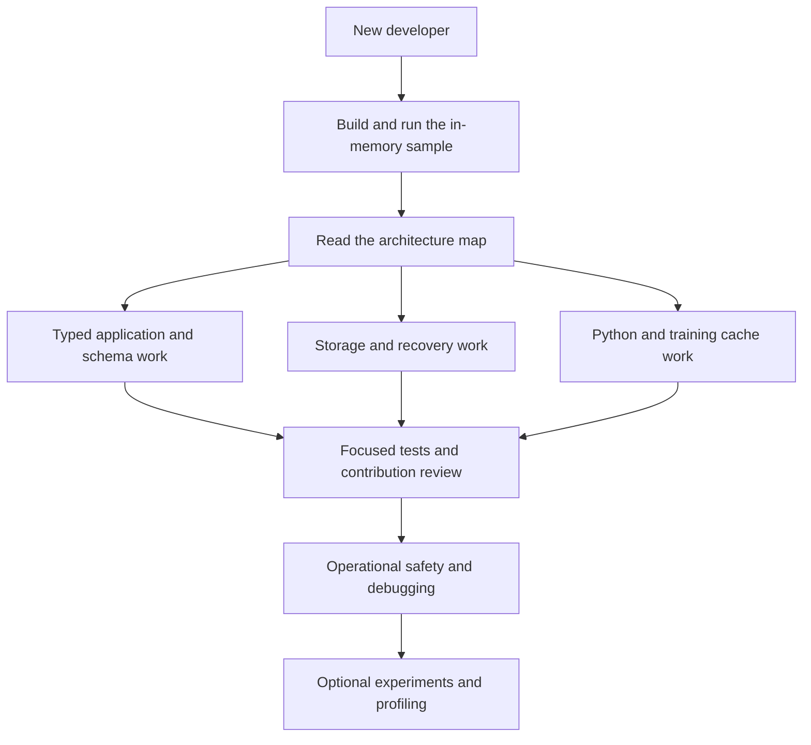

# Developer Onboarding

This guide explains the **current source checkout**, including its experimental ML
cache tooling. It is an implementation guide, not a production-readiness certificate
or a promise about a published artifact. Aether is pre-production: use disposable
data while learning and keep irreplaceable data elsewhere.

## Start Here

1. [Get a working checkout](GETTING-STARTED.md): JDK, wrapper, first sample, IDE and optional Python setup.
2. [Understand the architecture](ARCHITECTURE.md): module map, real runtime boundaries, and where to make changes.
3. Follow the [guided code tour](CODE-TOUR.md): application, write, read, recovery and optional Python call chains.
4. Use the [module guide](MODULE-GUIDE.md) to locate the owning implementation, then [make a tested contribution](TESTING-AND-CONTRIBUTING.md).



The graph is a reading path, not a dependency graph.

## Reading Paths

| Your work | Read next | First code to inspect |
|---|---|---|
| Embedded application | [Typed API and schemas](TYPED-API-AND-SCHEMAS.md) | [SocialNetworkRepository](../../examples/aether-sample-app/src/main/java/io/aetherdb/examples/social/SocialNetworkRepository.java) |
| Engine correctness or performance | [Storage engine](STORAGE-ENGINE.md) | [PersistentAetherDatabase](../../modules/aether-engine/src/main/java/io/aetherdb/engine/PersistentAetherDatabase.java) |
| PyTorch/MONAI integration | [Training cache and Python](TRAINING-CACHE-AND-PYTHON.md) | [TransformCache](../../clients/python/aether_ml/transform_cache.py) |
| Reproduction and profiling | [Experiments and profiling](EXPERIMENTS-AND-PROFILING.md) | [reproduce.py](../../scripts/reproduce.py) |
| Reliability and operational tooling | [Operations and debugging](OPERATIONS-AND-DEBUGGING.md) | [AetherCli](../../modules/aether-tools/src/main/java/io/aetherdb/tools/AetherCli.java) |
| RPC, client, replication or Raft foundations | [Architecture](ARCHITECTURE.md) | [RemoteAetherClient](../../modules/aether-client/src/main/java/io/aetherdb/client/RemoteAetherClient.java) |

Use the [glossary](GLOSSARY.md) when terminology is unfamiliar. All paths in these
documents are relative to the repository unless a command says otherwise.

## A Practical First Week

| Stage | Exercise | Completion evidence |
|---|---|---|
| First session | Run the in-memory social sample and its tests | Sample prints `Deleted draft exists: false`; tests pass |
| Storage orientation | Trace one `put` through admission, WAL, publication and subsequent `get` | Explain what changes before and after the durable acknowledgement |
| API orientation | Read a generated codec, its record and committed schema lock | Explain why a collection name, field ID and schema UUID are not interchangeable |
| Integration orientation | Read one Python batch lookup and the matching Java protocol branch | Identify cache identity, miss preparation, publication and buffer ownership |
| First change | Add a regression test for a small behavior before editing it | Focused tests fail before the change and pass afterward |
| Review | Explain ownership, failure states and format impact | Review links to source/tests, not only a benchmark chart |

These exercises do not require a GPU, Kaggle credentials, production data, a
cluster, or a full paper campaign.

## Rules That Prevent Expensive Mistakes

- One persistent directory has one process owner. Close the application before opening it in Workbench or offline tooling.
- Never infer durable success from a volatile stage acknowledgement or an indeterminate result.
- Keep readers, cursors, snapshots, native regions and packed responses within their documented lifetimes.
- Do not edit a manifest, WAL, schema lock or generated codec as a shortcut around a failing check.
- Do not remove checksums, barriers, locks or admission guards merely to improve a timing.
- A configuration key, module name, specification chapter or empty task is not evidence of an integrated production feature.
- Diagnostics, pilot measurements and fresh confirmatory measurements have different roles. Do not pool them.
- Build outputs and benchmark stores are disposable only when you have verified their identity and ownership. Never use an unverified recursive cleanup path.

## Documentation Authority

Source and tests are the authority for behavior. These onboarding pages link to
both. [Historical specifications](../Aether_Engine_Documentation_Index.md) explain
design intent, but several describe future or only partially integrated behavior.
[Website documentation](../../website/docs/index.html) and the root README are
additional entry points, not replacements for source verification.

The repository can contain uncommitted experiments. Record `git status --short`
and the revision when comparing behavior. A clean research snapshot in `build/`
can be intentionally different from the active worktree.

## Verification Record

The documentation was checked against this worktree on 2026-09-30. This records
the scope of the documentation review, not a release certification:

| Check | Result |
|---|---|
| Repository coverage | All 49 Java modules in `settings.gradle.kts` are represented in the architecture inventory; Python integration, research tooling, build and operations have dedicated guides |
| Documentation structure | Local links and heading targets checked; code fences balanced; all 22 Mermaid diagrams rendered successfully |
| First-run commands | In-memory social sample and offline CLI help succeeded on Windows/JDK 21 |
| Focused Java tests | 83 tests executed across the sample, typed adapter, codec processor, tools and configuration: 69 passed, 14 failed with `RESOURCE_EXHAUSTED: write pressure: DISK_SPACE` |
| Focused Python tests | 70 passed and 2 opt-in real-JFR tests skipped across JFR orchestration, system campaign, confirmatory and Kaggle preparation tests |

The Java command was:

```powershell
.\gradlew.bat :examples:aether-sample-app:test :modules:aether-embedded-typed:test :modules:aether-codec-processor:test :modules:aether-tools:test :modules:aether-config:test --console=plain
```

The Python subset used `PYTHONPATH=scripts;clients/python` and `AETHER_JAVA_TEST=0`:

```powershell
.venv/Scripts/python.exe -m pytest scripts/tests/test_bulk_jfr.py scripts/tests/test_system_campaign.py scripts/tests/test_confirmatory.py scripts/tests/test_kaggle_remote.py -q
```

The disk-space failures affect persistence/recovery checks and are not passing
coverage. Safeguards were not disabled, and no existing stores were deleted.
The full Java/Python suites, real-JFR runs, GPU campaigns and remote submissions
were not part of this documentation verification. Runtime code was not changed
to make this guide's checks pass.

## Maintaining This Guide

### Contributor Navigation Check: 2026-10-07

The module guide and code tour were checked against the active worktree, not the
separately frozen research checkout. All 49 module declarations were matched to
the guide; named module entry symbols were checked against `src/main` Java files.
All 406 local links/heading targets across the 13 onboarding pages resolved and
code fences were balanced. No new Mermaid diagrams were added in this update.

The in-memory social sample ran and printed `Deleted draft exists: false`.
`InMemoryAetherDatabaseTest` executed 9 tests with no failures, errors or skips:

```powershell
.\gradlew.bat :examples:aether-sample-app:run :modules:aether-engine:test --tests io.aetherdb.engine.InMemoryAetherDatabaseTest --console=plain
```

These checks verify the first source-reading/semantic exercise, not persistence,
all distributed foundations, optional Python integration or a production release.
The earlier verification record above remains separate, including its failures.

### Ongoing Maintenance

Update the relevant page when changing public APIs, configuration consumers,
durability boundaries, CLI arguments, source layout or experiment protocols.
Keep graph edges honest: label conceptual relationships, and do not draw a
production cluster path where only independent foundations exist. Test commands
against disposable fixtures and check local links after moving files.
