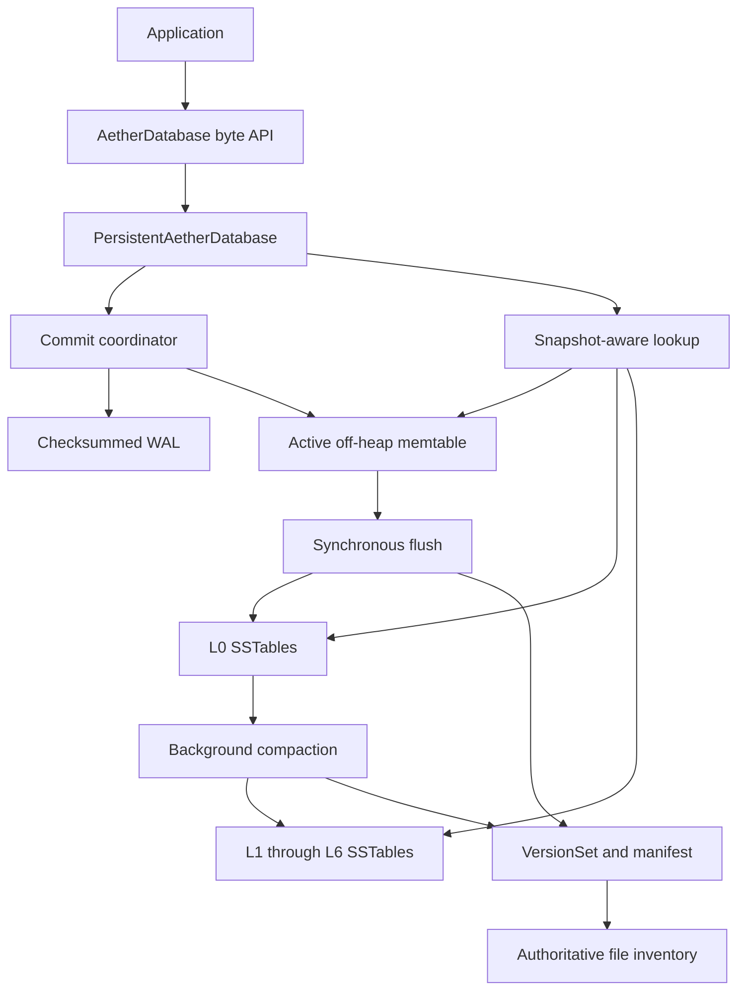
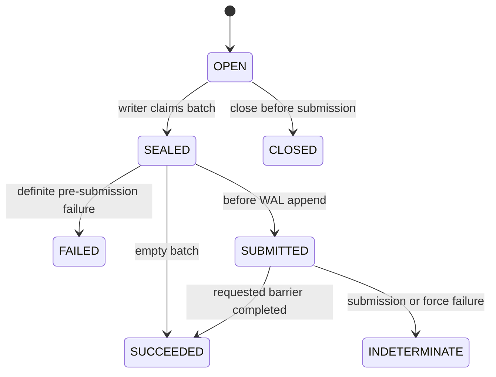
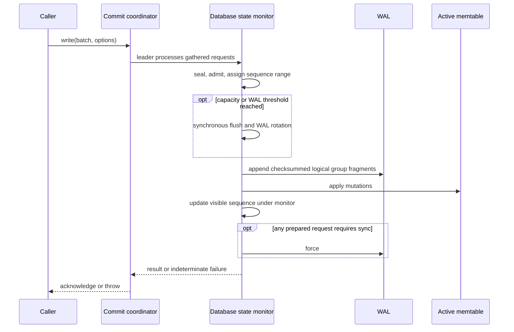
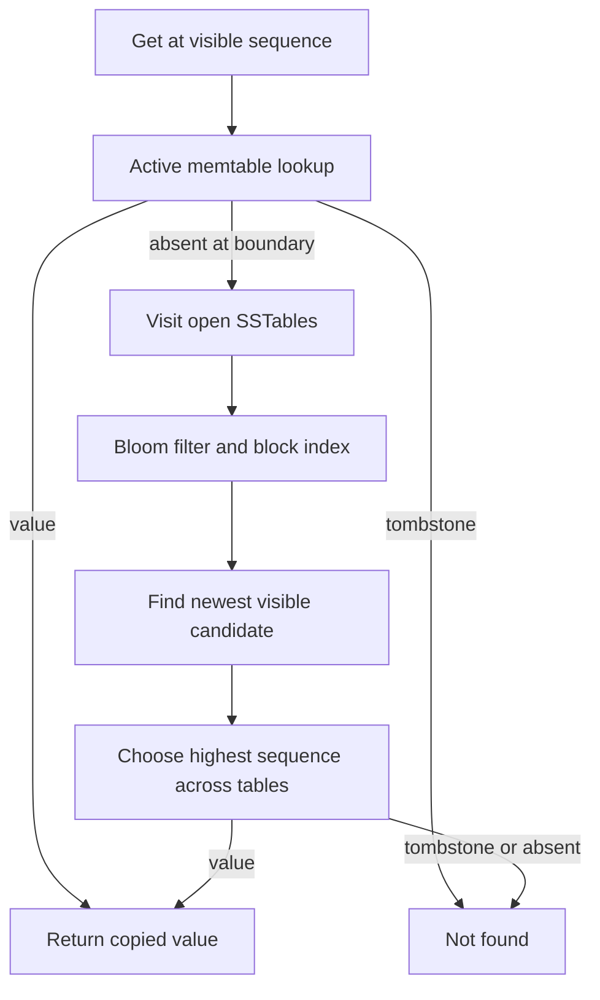
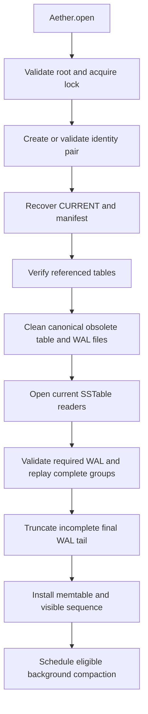
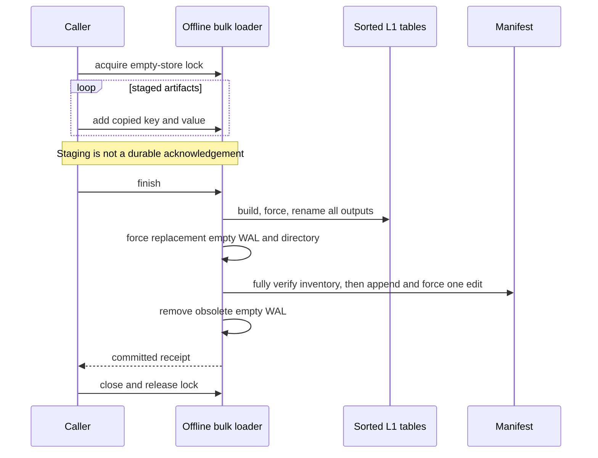

# Storage Engine Internals

[Onboarding index](README.md) | [Architecture](ARCHITECTURE.md) | [Operations](OPERATIONS-AND-DEBUGGING.md)

This guide explains the current Java implementation, not a future LSM design. Start here when changing persistence, reads, recovery, compaction, or bulk loading. Paths are relative to this document and point to the implementation or its tests.

Jump to [ownership](#2-public-contract-and-ownership), [writes](#3-online-write-path),
[reads](#5-read-and-scan-paths), [files](#6-files-and-authority),
[recovery](#8-recovery-and-close), [compaction](#9-background-compaction-and-concurrency),
[bulk loading](#10-experimental-empty-store-bulk-loading), or [tests](#12-tests-and-safe-extension-workflow).

## 1. The Mental Model

Aether is an embedded, byte-oriented, versioned key/value database. A persistent database owns a local directory exclusively. Its online write path appends a complete logical batch to the write-ahead log (WAL), inserts its mutations into an off-heap memtable, and acknowledges according to the requested durability mode. A flush checkpoints the active memtable into an immutable sorted-string table (SSTable). The manifest determines which tables and WAL are authoritative.

Do not infer current behavior from a generic LSM diagram:

- There is one active native memtable in `PersistentAetherDatabase`, not an asynchronous queue of immutable memtables.
- Flushes run synchronously in the foreground write/close path. They happen on memtable capacity, WAL size pressure, and close, not only at close.
- Flushes rotate the required WAL segment. Recovery opens the segment named by the manifest; it does not replay every WAL file it finds.
- Compaction is integrated and asynchronous, with one worker and coalesced scheduling requests.
- Persistent scans materialize their result rows. They are not streaming merge iterators over pinned SSTable files.
- The empty-store bulk loader is a separate, explicitly experimental offline path.



### Source Map

| Concern | Start reading here |
| --- | --- |
| Supported construction entry points | [Aether](../../modules/aether-engine/src/main/java/io/aetherdb/engine/Aether.java) |
| Byte API and ownership contract | [AetherDatabase](../../modules/aether-api/src/main/java/io/aetherdb/api/AetherDatabase.java), [WriteBatch](../../modules/aether-api/src/main/java/io/aetherdb/api/WriteBatch.java) |
| Persistent composition, locking, reads, writes, flush, recovery | [PersistentAetherDatabase](../../modules/aether-engine/src/main/java/io/aetherdb/engine/PersistentAetherDatabase.java) |
| In-memory semantic reference | [InMemoryAetherDatabase](../../modules/aether-engine/src/main/java/io/aetherdb/engine/InMemoryAetherDatabase.java) |
| Native allocation and record lifetime | [NativeMemoryBudget](../../modules/aether-memory/src/main/java/io/aetherdb/memory/NativeMemoryBudget.java), [FfmNativeRegion](../../modules/aether-memory/src/main/java/io/aetherdb/memory/FfmNativeRegion.java), [NativeRecordFormatV1](../../modules/aether-memory/src/main/java/io/aetherdb/memory/NativeRecordFormatV1.java) |
| Memtable representation | [NativeSkipListMemTable](../../modules/aether-memtable/src/main/java/io/aetherdb/memtable/skiplist/NativeSkipListMemTable.java) |
| WAL encoding and validation | [WalLogicalGroupCodec](../../modules/aether-wal/src/main/java/io/aetherdb/wal/format/WalLogicalGroupCodec.java), [WalFragmentCodec](../../modules/aether-wal/src/main/java/io/aetherdb/wal/format/WalFragmentCodec.java) |
| Immutable table construction and lookup | [SSTableBuilder](../../modules/aether-sstable/src/main/java/io/aetherdb/sstable/SSTableBuilder.java), [SSTableReader](../../modules/aether-sstable/src/main/java/io/aetherdb/sstable/SSTableReader.java) |
| Durable inventory and publication | [VersionSet](../../modules/aether-sstable/src/main/java/io/aetherdb/sstable/manifest/VersionSet.java), [Version](../../modules/aether-sstable/src/main/java/io/aetherdb/sstable/manifest/Version.java) |
| Compaction scheduling and retention | [CompactionCoordinator](../../modules/aether-engine/src/main/java/io/aetherdb/engine/CompactionCoordinator.java), [CompactionDroppingIterator](../../modules/aether-lsm/src/main/java/io/aetherdb/lsm/compaction/CompactionDroppingIterator.java) |
| Offline initial ingestion prototype | [EmptyStoreBulkLoader](../../modules/aether-engine/src/main/java/io/aetherdb/engine/EmptyStoreBulkLoader.java) |

## 2. Public Contract and Ownership

Use `Aether.open(path, configuration)` for a persistent database or `Aether.openInMemory()` for an ephemeral implementation. The no-configuration persistent overload constructs a development-profile configuration; do not describe it as a production security preset. The persistent implementation class is package-private, so callers should normally depend on `AetherDatabase` and the `Aether` composition root.

The byte API protects mutable-array ownership: `WriteBatch` copies incoming arrays, its mutation accessors return copies, and `LookupResult.value()` returns a copy. The explicit `LookupResult.readOnlyValue()` alternative exposes a read-only buffer over privately owned immutable bytes, not a mutable array. Resident SSTable lookups can reuse that immutable result. This is not end-to-end zero-copy storage; performance work must preserve each boundary unless a new API explicitly documents different ownership.

Keys use unsigned lexicographic byte ordering. The byte API accepts empty keys and empty values; `null` is not. The current batch limits are 10,000 mutations, 32 MiB estimated encoded bytes, 65,536 bytes per key, and 16 MiB per value. Persistent admission adds another constraint: the complete batch must fit one configured memtable. Meeting the API byte limit alone therefore does not guarantee admission.

Known implementation limitation: `SSTableReader.DataBlockEntry` currently classifies a zero-length value as a tombstone instead of checking its internal-key type. Do not rely on persistent empty-value round trips as a working guarantee. The table round-trip test includes an empty value but does not assert its lookup result; such an assertion is needed before claiming this edge case is covered.

Close the database, snapshots, cursors, and write batches with try-with-resources. A snapshot belongs to one database instance and records a sequence boundary, not a timestamp or a durable checkpoint. Reopening a directory creates a different owner; handles from the old instance cannot be reused. Closing the database invalidates its snapshots.

### Write Outcomes

The one-shot batch state is useful when diagnosing failures:



An exception after submission does not prove that the write was absent. The engine can fence subsequent writes and report an indeterminate outcome. Recover the store and inspect state before deciding whether an application-level operation can be retried. Do not retry the same `WriteBatch` instance; it is one-shot even after failure.

The in-memory reference cannot perform a disk barrier. `WriteResult` reports the requested durability mode and whether a barrier actually occurred; a mode name alone is not evidence of persistence.

## 3. Online Write Path

Read `CommitCoordinator.submit`, `processCommitGroup`, `admitWrite`, and `applyBatch` in [PersistentAetherDatabase](../../modules/aether-engine/src/main/java/io/aetherdb/engine/PersistentAetherDatabase.java) together.

1. Each caller enqueues a request. A caller becomes the leader when there is no active leader.
2. The leader uses a nominal 200-microsecond gather delay and takes at most 64 queued requests. Actual scheduling delay is not guaranteed. This is caller-thread coordination, not a dedicated WAL writer thread.
3. `processCommitGroup` holds the database state monitor. It seals each batch, calculates native-space requirements, flushes if necessary, and applies write-pressure admission.
4. A nonempty batch receives a contiguous sequence range. Each mutation receives one increasing sequence number, in batch order.
5. `WalLogicalGroupCodec` encodes the batch; `WalFragmentCodec` encodes its physical fragments. The batch is marked submitted immediately before the physical WAL write.
6. The WAL bytes are appended before mutations enter the active memtable. `lastVisibleSequence` advances under the same state monitor.
7. If any successfully prepared request requires synchronization, the group forces the WAL. Successful requests are marked succeeded and their waiting callers are released.



Public reads also hold the state monitor. They cannot observe the intermediate mutations of a group while the writer is inside this critical section. Do not move visibility or lock boundaries casually when optimizing WAL construction or memtable insertion.

### Durability Modes: Contract Versus Current Implementation

| Mode | Current persistent write behavior |
| --- | --- |
| `ASYNC_WAL` | Does not itself request a force before acknowledgement. It can share a force requested by another member of the gathered group. |
| `GROUP_SYNC` | Requests a WAL force before a successful return; concurrently gathered requests can share it. This is the default `WriteOptions` mode. |
| `SYNC` | Currently follows the same `forceRequested` group path as `GROUP_SYNC`. The enum Javadoc says dedicated barrier, but `CommitCoordinator` does not split it into a dedicated group. Do not assume a separate fsync per `SYNC` request. |

See [WriteOptions](../../modules/aether-api/src/main/java/io/aetherdb/api/WriteOptions.java), [DurabilityMode](../../modules/aether-api/src/main/java/io/aetherdb/api/DurabilityMode.java), and the implementation before changing any guarantee. A successful Java `force` call is not, by itself, evidence about every filesystem, device, or physical power-loss scenario.

### Backpressure Is Part of Correctness

The engine uses [WritePressureController](../../modules/aether-lsm/src/main/java/io/aetherdb/lsm/pressure/WritePressureController.java) to combine native capacity, WAL size, L0 file count, level debt, and available disk information. Current persistent pressure input has zero queued immutable memtables because flushes are synchronous.

`NORMAL` admits. `SLOWDOWN` can delay when the caller allows it and the delay fits the admission timeout. Stopped or failed admission rejects. The timeout is not a general queue-until-capacity guarantee: inspect `admitWrite` before assuming a rejected write will wait for background compaction. Disk-pressure rejections are not a reason to disable safety limits to obtain a passing test.

## 4. Memtable and Visibility

[NativeSkipListMemTable](../../modules/aether-memtable/src/main/java/io/aetherdb/memtable/skiplist/NativeSkipListMemTable.java) stores versioned records off-heap. Its own writers are serialized with a `ReentrantLock`; linked-node publication uses acquire/release operations. The persistent engine additionally serializes its public read/write state with its monitor. Do not equate the skip list's publication primitives with a lock-free public database API.

An internal record contains a user key, sequence, and value-or-tombstone type. Newer versions sort first for the same key. A tombstone is a deletion record; an absent lookup and a tombstone cannot be treated interchangeably when merging storage layers.

The memtable lifecycle is `ACTIVE -> FROZEN -> RETIRED -> CLOSED`. Flush iteration requires the table to be frozen. The table starts with an owning reference; leases increment its reference count, retirement drops the owner, and native storage is released when the retired table's remaining references reach zero. The current persistent flush replaces the active table after publishing its durable replacement.

Internal-key ordering must agree across memtables, SSTables, and compaction:

1. User key: unsigned lexicographic ascending.
2. Sequence: descending.
3. Type byte: ascending for otherwise equal identities.

Use [InternalKey](../../modules/aether-sstable/src/main/java/io/aetherdb/sstable/InternalKey.java), not a raw byte-array comparator, for encoded SSTable internal keys. Their sequence trailer is little-endian; raw lexicographic ordering of the encoded bytes is not the semantic ordering.

## 5. Read and Scan Paths

Point lookup first queries the active memtable at the requested visible sequence. A visible value is returned immediately; a visible tombstone terminates the lookup as not found. If the memtable has no visible record, the engine checks its open SSTables and chooses the candidate with the highest visible sequence, including tombstones.

Within one SSTable, the reader checks the Bloom filter, locates a candidate indexed data block, searches the user key, and selects a version no newer than the visibility boundary. `SSTableReader.open` performs complete structural and metadata validation, so opening a table is not merely opening a channel and deferring all validation until lookup.

That open-time verification loads every data block into its `DataBlock.entries` list, and the current reader retains those decoded entries without eviction. Normal lookups therefore usually visit heap-resident decoded values even though a file channel remains open. This is not a bounded block cache or a disk-I/O benchmark on every lookup. Account for startup work and heap growth when scaling the store; a configured block-cache budget does not bound these lists.



Scans gather all candidate user keys from the active memtable and table entries, sort/deduplicate them, and call the same visibility lookup for each key in the requested range. The range is half-open: `[startInclusive, endExclusive)`. The returned [PersistentListCursor](../../modules/aether-engine/src/main/java/io/aetherdb/engine/PersistentListCursor.java) owns materialized rows, not live table readers. Consequences:

- Scan construction can consume substantial memory and time before the first row is returned.
- A cursor does not pin obsolete SSTable channels across compaction installation.
- A scalable streaming scan implementation would require a new lifetime/pinning design, not just replacing the returned list with an iterator.

Snapshots retain older logical versions for compaction. They are not copies of all database data and should not be held indefinitely without understanding retention cost.

## 6. Files and Authority

| File family | Role |
| --- | --- |
| `LOCK` | Process-exclusion lock for the local store. |
| `DB-IDENTITY` | Database UUID and identity metadata; cross-database files must not be accepted silently. |
| `FORMAT-OPTIONS` | Persisted format/identity companion validated at open. |
| `CURRENT` | Checksummed pointer to the authoritative manifest generation. |
| `MANIFEST-<20 digits>.aeman` | Initial snapshot followed by contiguous inventory edits. |
| `SST-<20 digits>.aess` | Immutable SSTable with identity, ordering, metadata, and integrity checks. |
| `WAL-<20 digits>.aewal` | Complete logical mutation groups beyond the persisted watermark. |
| Canonical temporary SSTables | Unpublished construction output; not part of the live store merely because they exist. |
| Manifest repair backups | Pre-truncation evidence retained by manifest recovery when repairing an incomplete final record. |

Do not reconstruct the live database by choosing the newest-looking filenames. `CURRENT`, the validated manifest, and its sequence/watermark fields are the authority. An SSTable can be fully written but still uncommitted. Conversely, after publication, an old input file can still exist physically without being live.

Keep the counters distinct. `lastVisibleSequence` is the running engine's read boundary. A manifest's `lastAssignedSequence` records sequence progress at a publication point and can lag later WAL-only writes. `persistedSequenceWatermark` marks the portion represented by tables; WAL recovery fills in later complete groups. `nextFileNumber` is a file-allocation counter, not a mutation sequence. `Version` rejects backwards counters, reused live file numbers, missing deletions, and overlapping or touching key ranges within levels above L0.

### WAL Format

[WalFormatV1](../../modules/aether-wal/src/main/java/io/aetherdb/wal/format/WalFormatV1.java) uses 32 KiB physical blocks and a full header block. Logical groups encode complete batches and their first/last sequence. Fragment framing handles groups spanning blocks and validates masked CRC32C checksums. Recovery distinguishes an incomplete final tail from an integrity failure inside a complete record; it must not turn arbitrary corruption into a silent successful prefix.

### SSTable Format

The [builder](../../modules/aether-sstable/src/main/java/io/aetherdb/sstable/SSTableBuilder.java) accepts strictly ordered internal entries. It emits the table header, data blocks, Bloom filter, properties, metaindex, index, and footer with the existing block envelope checks. It currently buffers entries and constructs the output through heap buffers; it is not a streaming, bounded-memory external sorter.

The [reader](../../modules/aether-sstable/src/main/java/io/aetherdb/sstable/SSTableReader.java) verifies database identity, file identity/size, handles, block checksums, entry order, counts, key/sequence bounds, and declared properties. A manifest reference to a missing or corrupt table is fatal during normal recovery. Do not remove validation to speed up open without a replacement integrity argument and targeted failure tests.

## 7. Flush and Manifest Publication

A flush is an ordered checkpoint transaction across several files:

1. Freeze the active memtable.
2. Write its sorted entries to a temporary SSTable and finish/force the file.
3. Atomically rename the output to its canonical table name and synchronize the directory where supported.
4. Create and force a replacement empty WAL segment whose first sequence follows `lastVisibleSequence`.
5. Append and force one manifest delta adding the new L0 table, advancing the persisted watermark, and selecting the replacement WAL.
6. Switch to the replacement WAL, close/delete the old segment, and synchronize the directory.
7. Open the new table reader, retire the old memtable, create its replacement, and request compaction if needed.

The key ordering rule is **durable output before authoritative publication, publication before removal of the old recoverable representation**. This is why deleting a WAL or compaction input early is unsafe even when the replacement data file appears complete.

`VersionSet.logAndApply` first validates the candidate version and new table inventory, then appends/forces the manifest record, then replaces its in-memory `current` version. A routine delta is an append to the existing manifest, not a rewrite/rename of `CURRENT`. Initial manifest creation has a separate temporary-file/rename/`CURRENT` publication protocol.

Directory synchronization is platform-sensitive. Ordinary helper implementations tolerate some unsupported/access-denied cases; the bulk loader specifically tolerates Windows directory access denial. Tests on one OS do not establish identical crash-durability guarantees on another OS or filesystem.

## 8. Recovery and Close



Manifest recovery checks contiguous record numbers and version transitions. It truncates an incomplete last record only after creating a repair backup. Complete malformed records and invalid transitions fail. It verifies every referenced table before cleaning obsolete canonical SSTable files.

WAL recovery validates the segment header and fragment checksums, skips groups entirely at or below the persisted watermark, and requires contiguous sequences above that watermark. A group straddling the watermark or a sequence discontinuity fails. The active memtable must have sufficient capacity for the replayed content; recovery is not an unlimited-memory salvage process.

Open can repair tails and remove known obsolete files. It is therefore not a read-only forensic operation. Copy a store before investigating damage. `VersionSet.inspect` provides manifest inspection without truncation/deletion; `inspectMetadata` deliberately omits table verification for explicit forensic workflows. Neither is a replacement for normal recovery validation.

Close first marks the database as closing, stops the compaction coordinator without holding the database state monitor while waiting, then forces the WAL and flushes the active memtable when safe. It invalidates snapshots and closes the native table, SSTable readers, manifest writer, WAL, and lock. A manifest-publication failure can suppress the normal close-time flush so recovery can decide the authoritative outcome. Close failures must not be swallowed by applications that depend on persistence.

## 9. Background Compaction and Concurrency

The integrated policy starts compaction when L0 contains at least four files, or when a level from L1 through L5 exceeds its configured byte target. L0 compacts into L1; oversized higher levels compact into the next level, through L6. Input selection expands overlapping key ranges until selected input/output-level files form a consistent range.

The worker captures inputs, a version, and the oldest retained snapshot boundary under the database monitor. It then reads, sorts, deduplicates, applies retention rules, partitions, and builds outputs outside that monitor. The current merge implementation materializes entry lists; it is not an external-memory streaming compactor.

Retention must preserve versions required by snapshots. A tombstone can be dropped only when the retention policy and lower-level coverage allow it; otherwise an older value could become visible again. Read [CompactionDroppingIterator](../../modules/aether-lsm/src/main/java/io/aetherdb/lsm/compaction/CompactionDroppingIterator.java) before changing the dropping rules.

Before installation, outputs are fully verified. Under the database monitor the worker rechecks that the inputs are still current, appends/forces a manifest edit based on the current state, and swaps readers. Only afterward are obsolete readers closed and input files deleted. This allows foreground writes/flushes while outputs are being built without publishing a stale manifest snapshot that loses a newer flush.

| Resource | Ownership and synchronization |
| --- | --- |
| Directory lock | One persistent database or offline bulk loader owns the store. |
| Commit queue | A separate coordinator monitor protects queue/leader state. |
| Visible sequence, active table, snapshot set, installed readers | Database state monitor. |
| Background construction | Single compaction worker, outside the state monitor for expensive build work. |
| File-number allocation and manifest installation | Coordinated with the database state monitor. |
| Memtable native lifetime | Owning reference plus leases; retirement precedes final free. |
| Persistent scan rows | Cursor-owned materialized copies. |

The coordinator holds at most one pending wakeup rather than a queue of stale compaction plans. A worker failure ends the current loop; another scheduling event is needed for a later attempt. An uncertain compaction manifest publication also fences the writer and retains possible file dependencies for recovery.

`Aether.awaitCompactionIdle` waits for scheduled activity, with a bounded timeout; it does not alter policy or by itself prove zero debt or no failures. For benchmark quiescence, inspect `Aether.compactionDiagnostics` as well: `state`, `debtBytes`, `failed`, and `lastFailure` matter. Closing stops pending work; it is not equivalent to explicitly draining all policy-eligible debt before measurement ends.

## 10. Experimental Empty-Store Bulk Loading

[EmptyStoreBulkLoader](../../modules/aether-engine/src/main/java/io/aetherdb/engine/EmptyStoreBulkLoader.java) is deliberately separate from `AetherDatabase.write`. It is for a never-populated store, not a faster flag on arbitrary online writes.

The constructor bootstraps canonical metadata if necessary, takes the exclusive directory lock, recovers the manifest, and rejects any store with tables, assigned sequences, a persisted watermark, or WAL content beyond its header. Deleting all logical keys from an old store does not make it eligible.

`add` copies keys/values into an unsigned-key-ordered `TreeMap`, rejects duplicates, and poisons the writer after a staging validation failure. Defaults cap staged key/value bytes at 512 MiB and entries at 100,000, with a 32 MiB target table size. These are prototype limits, not a hard JVM heap bound: map overhead, defensive copies, SSTable buffers, and verification can consume additional memory. The target is a partitioning threshold, not an exact encoded file-size cap.



`finish` assigns sequences in sorted-key order and builds nonoverlapping L1 tables. It writes no artifact payload to the WAL and inserts no artifact into a memtable. It still creates and forces the replacement empty WAL header and synchronizes publication metadata. One manifest edit publishes the complete inventory and watermark. Closing without `finish` does not commit.

Bulk Verification v2 defers the bulk builder's check to this inventory boundary and
removes its redundant post-rename reader open. Ordinary builder finishes retain
immediate verification. Bulk receipts count actual full verifications over the
entire finish scope; see [Phase-1 protocol](../../kaggle/BULK-VERIFICATION-V2.md).
The current inventory path calls
[SSTableVerifier](../../modules/aether-sstable/src/main/java/io/aetherdb/sstable/SSTableVerifier.java),
which uses [RestartBlockScanner](../../modules/aether-sstable/src/main/java/io/aetherdb/sstable/block/RestartBlockScanner.java)
to inspect DATA-entry metadata and reconstruct keys without materializing DATA
values. Checksummed block-envelope reads still occur. The scanner rejects restart
offsets inside entries and shared prefixes at restart points more strictly than
the older decoder; normal read behavior is unchanged. See
[StreamingVerifierTest](../../modules/aether-sstable/src/test/java/io/aetherdb/sstable/StreamingVerifierTest.java)
for equivalence and corruption coverage. This is a structural table verifier,
not a decoder of application-specific tensor payloads.

Any uncertain finish failure requires closing and reopening with ordinary recovery, followed by validation. The loader intentionally does not delete files that might have become manifest dependencies. Do not assume an exception means no artifacts were committed.

[BulkArtifactWriter](../../modules/aether-training-cache/src/main/java/io/aetherdb/training/cache/BulkArtifactWriter.java) is the training-cache wrapper. It preserves artifact SHA/integrity envelopes and currently accepts inline-sized artifacts; it is not a general segmented-payload import tool. Its local pipe staging acknowledgements are not online durable RPC acknowledgements. Consult [the prototype protocol notes](../../kaggle/BULK-POPULATION-PROTOTYPE.md) before comparing its timing with ordinary `putMany`.

The current loader and table/manifest code expose bulk phase timing and [BulkPhaseEvent](../../modules/aether-sstable/src/main/java/io/aetherdb/sstable/jfr/BulkPhaseEvent.java) JFR events. Instrumentation is evidence about where time was spent, not proof that bypassing WAL accounts for all end-to-end speed differences. There is still heap copying, encoding, verification, and publication work. Profiling controls and bulk benchmark semantics belong to the research harness, not to the online database's public contract.

## 11. Debugging by Symptom

| Symptom | Start here; preserve the relevant evidence |
| --- | --- |
| Open fails before reads | Inspect root safety, `LOCK`, identity pair, `CURRENT`, manifest record checks, referenced table validation, then required WAL. Keep the full exception chain. |
| Writes stop with pressure errors | Inspect reason strings, usable disk, L0 count, native capacity, compaction debt/failure. Check resolved configuration before changing limits. |
| A small write has a latency spike | Check whether its admission triggered a synchronous flush or WAL rotation. WAL force alone is not the whole write cost. |
| Warm reads remain slow | Inspect table count, Bloom/index/data-block work, returned-value copies, and wrapper-level serialization/checksum costs separately. |
| Delete appears to resurrect after compaction | Inspect tombstone retention, snapshot boundary, lower-level coverage, and internal-key ordering. |
| Process restart loses acknowledged data | Preserve WAL/manifest/table inventory and durability mode/result; use existing crash points to reproduce the exact publication window. |
| Bulk import rejects an apparently empty store | Check sequence/watermark and WAL history, not only logical key count. |
| Compaction is idle but benchmark drain fails | Check debt and recorded failure. Worker inactivity alone does not mean successful quiescence. |

[ReadDiagnostics](../../modules/aether-api/src/main/java/io/aetherdb/api/ReadDiagnostics.java) measures read-path stages/counters. [FlushDiagnostics](../../modules/aether-engine/src/main/java/io/aetherdb/engine/FlushDiagnostics.java) captures opt-in write/flush/compaction stages. Parent totals and nested stages overlap; do not sum all reported timings as if they were mutually exclusive. Background work can also outlive the foreground request that scheduled it.

## 12. Tests and Safe Extension Workflow

| Behavior to preserve | Focused source-backed tests |
| --- | --- |
| Byte API, ordering, snapshots, model equivalence | [InMemoryAetherDatabaseTest](../../modules/aether-engine/src/test/java/io/aetherdb/engine/InMemoryAetherDatabaseTest.java), [RandomizedSemanticModelTest](../../modules/aether-engine/src/test/java/io/aetherdb/engine/RandomizedSemanticModelTest.java) |
| WAL recovery, tails, corruption, group commit, checkpoint rotation | [PersistentAetherDatabaseTest](../../modules/aether-engine/src/test/java/io/aetherdb/engine/PersistentAetherDatabaseTest.java), [WalFormatV1Test](../../modules/aether-wal/src/test/java/io/aetherdb/wal/format/WalFormatV1Test.java) |
| Native publication and lifetime | [NativeSkipListMemTableTest](../../modules/aether-memtable/src/test/java/io/aetherdb/memtable/skiplist/NativeSkipListMemTableTest.java) |
| On-disk table and manifest validation | [SSTableFormatV1Test](../../modules/aether-sstable/src/test/java/io/aetherdb/sstable/SSTableFormatV1Test.java), [ManifestFormatV1Test](../../modules/aether-sstable/src/test/java/io/aetherdb/sstable/manifest/ManifestFormatV1Test.java) |
| Foreground progress during compaction, failure windows, shutdown, L0 rejection | [BackgroundCompactionTest](../../modules/aether-engine/src/test/java/io/aetherdb/engine/BackgroundCompactionTest.java) |
| Bulk all-or-nothing recovery, duplicate/limit rejection, ordinary writes afterward | [EmptyStoreBulkLoaderTest](../../modules/aether-engine/src/test/java/io/aetherdb/engine/EmptyStoreBulkLoaderTest.java), [BulkArtifactWriterTest](../../modules/aether-training-cache/src/test/java/io/aetherdb/training/cache/BulkArtifactWriterTest.java) |

Run these from the repository root using the checked-in wrapper. On POSIX replace `.\gradlew.bat` with `./gradlew`:

```powershell
.\gradlew.bat :modules:aether-api:test :modules:aether-wal:test :modules:aether-memtable:test :modules:aether-sstable:test :modules:aether-lsm:test
.\gradlew.bat :modules:aether-engine:test
.\gradlew.bat :modules:aether-engine:test --tests io.aetherdb.engine.BackgroundCompactionTest --tests io.aetherdb.engine.EmptyStoreBulkLoaderTest
```

These are test entry points, not a statement that every suite passed on the machine reading this guide. Consult current reports and available disk before interpreting a failure. Fault injection and process termination tests exercise specific crash boundaries; they do not automatically prove behavior under physical power loss.

For a storage change, work in this order:

1. Identify the API invariant, ownership boundary, and persistence boundary affected.
2. Trace the same data through write, recovery, lookup, and compaction. A format change is not complete when only the writer understands it.
3. Add a focused test for normal behavior and the relevant before/after-publication failure window.
4. Test reopen, old-version visibility, tombstones, duplicate identity handling, and subsequent ordinary writes when applicable.
5. Run affected codec/format tests and the integrated engine tests. Use the semantic reference for logical behavior, not as evidence of durability.
6. Profile before changing copies or checksums. Preserve format/integrity semantics and report any intentional contract changes explicitly.

Do not add an online bulk flag by bypassing `processCommitGroup`; do not let a streaming cursor retain reader channels without a lifetime protocol; do not delete files after a possibly successful manifest append merely because the caller received an exception. These are the boundaries that keep a local optimization from becoming a recovery bug.
