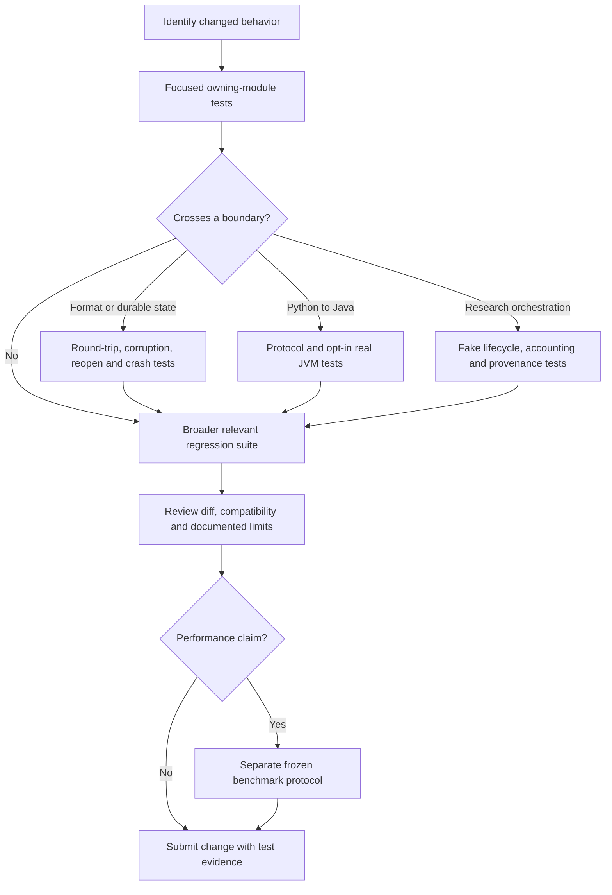

# Testing And Contributing

[Onboarding index](README.md) | [Getting started](GETTING-STARTED.md) | [Experiments and profiling](EXPERIMENTS-AND-PROFILING.md)

This guide describes the checks wired into the current source tree. A task name, version-catalog entry, or design specification is not proof that a test suite runs. Start with the module you changed, then expand to its callers and persistence boundaries.

## Build And Test Contract

The [Java convention](../../build-logic/src/main/kotlin/aether.java-base.gradle.kts) selects Java 21, compiles with `--enable-preview`, `-Xlint:all`, and `-Werror`, and passes preview support to tests and Java application tasks. Warnings can fail compilation. Use the checked-in Gradle wrapper, not an unrelated system Gradle installation. When launching Java manually, use a compatible JDK and the same preview flag.

The [testing convention](../../build-logic/src/main/kotlin/aether.testing.gradle.kts) uses JUnit Jupiter through JUnit Platform, JUnit BOM 6.0.1, and AssertJ 3.27.7. The [library convention](../../build-logic/src/main/kotlin/aether.java-library.gradle.kts) applies both Java and testing conventions. Module tests normally live in `modules/<module>/src/test/java` beside the package they test; there is no separate, generally wired `src/integrationTest` source set.



## Choose A Check

Commands below run from the repository root. PowerShell examples use `./gradlew.bat`; use `./gradlew` on POSIX systems. Timings depend heavily on dependency downloads, local storage, and which JVM tests are enabled.

| Check | Command or entrypoint | Scope and cost |
| --- | --- | --- |
| One test class | `./gradlew.bat :modules:aether-engine:test --tests io.aetherdb.engine.InMemoryAetherDatabaseTest` | Smallest useful Java regression loop; may compile dependencies first. |
| Owning module | `./gradlew.bat :modules:aether-engine:test` | Includes durable engine tests, not just in-memory tests. Needs scratch space and real filesystem behavior. |
| Java-wide verification | `./gradlew.bat check` | Gradle's matching project verification tasks. Not Python tests, not a remote campaign, and not every standalone crash harness. |
| Training cache plus Python runtime metadata | `./gradlew.bat :modules:aether-training-cache:test :modules:aether-training-cache:paperRuntimeClasspath` | Compiles the actual Java runtime and records its identity for Python integration. |
| Python regression | `python -m pytest clients/python/tests scripts/tests -q` | Requires the Python environment and import path below; expensive real-JVM tests are opt-in. |
| Artifact wrapper | `python scripts/reproduce.py test` | Runs training-cache Java tests, regenerates runtime metadata, then both Python suites. Broader than a pure Python test command. |
| End-to-end smoke | `python scripts/reproduce.py smoke --output results/local-smoke` | Runs Java and Python tests, CPU training fixtures, transform evolution, process fault injection and a small concurrency matrix. This is not a zero-work health check. |
| Website consistency | `python scripts/check-website-docs.py` | Checks published website documentation; not a complete Markdown link or correctness check for this onboarding directory. |

Use a new output directory for smoke/campaign work. To place generated training stores on another filesystem, the wrapper accepts `--scratch-root`; result files still go to `--output`.

Java test reports normally appear under each module's `build/reports/tests/test/index.html`, with XML in `build/test-results/test`. The training-cache module also provides `trainingCacheTestReport`, which depends on `test` and writes `build/reports/training-cache-test.json` in that module.

### Tasks That Are Not Full Gates

Check [root task definitions](../../build.gradle.kts) before relying on their labels:

- Root `integrationTest` currently depends on the included `build-logic` build's `check`; it does not collect a separate suite from every module.
- Root `crashTest` and `crashTestSmoke` are registered placeholders with no attached suites in the current tree.
- The [quality convention](../../build-logic/src/main/kotlin/aether.quality.gradle.kts) is an attachment point, not an enabled formatter/static-analysis pipeline.
- The [JMH convention](../../build-logic/src/main/kotlin/aether.jmh.gradle.kts) applies the Java base convention but does not itself wire a JMH runner. Pinned JMH, JCStress, Spotless, SpotBugs and Error Prone versions in the catalog do not establish that those checks execute.

The executable benchmark runner and real crash campaigns are described in [Experiments and profiling](EXPERIMENTS-AND-PROFILING.md), not implied by these placeholder tasks.

## Python Environments And Optional Tests

Use an isolated interpreter. The normal installable client is defined by [clients/python/pyproject.toml](../../clients/python/pyproject.toml); its base requirements are different from the pinned scientific environment. Torch and MONAI are optional client extras. The research environment uses [env/requirements.lock](../../env/requirements.lock), with Torch installed separately for the intended accelerator. MONAI/LMDB comparisons additionally use [env/requirements-monai.lock](../../env/requirements-monai.lock); its install comment specifies `--no-deps` to preserve the existing Torch build. Keep Kaggle CLI dependencies in their separate [Kaggle lock](../../env/requirements-kaggle.lock).

Direct pytest invocations need both source roots on the import path:

```powershell
$env:PYTHONPATH = 'scripts;clients/python'
$env:AETHER_JAVA_TEST = '0'
.venv/Scripts/python.exe -m pytest clients/python/tests scripts/tests -q
```

POSIX equivalent, using the same virtual environment layout:

```bash
PYTHONPATH=scripts:clients/python AETHER_JAVA_TEST=0 \
  .venv/bin/python -m pytest clients/python/tests scripts/tests -q
```

`AETHER_JAVA_TEST=0` only disables tests explicitly guarded by that variable. It does not remove import-time Python dependencies or guarantee that every remaining test is purely in-memory. Tests such as `test_monai_comparison.py` skip when MONAI/LMDB are absent; a green run with skipped optional tests does not verify those integrations. Record skips when reporting coverage.

### Real Java Integration

First build both the runtime and test classes used by crash helpers:

```powershell
./gradlew.bat :modules:aether-training-cache:test :modules:aether-training-cache:paperRuntimeClasspath
$env:PYTHONPATH = 'scripts;clients/python'
$env:AETHER_JAVA_TEST = '1'
.venv/Scripts/python.exe -m pytest scripts/tests/test_bulk_population.py -q
```

Other opt-in targets include:

| Test file | What the real-process tests establish |
| --- | --- |
| [test_monai_comparison.py](../../scripts/tests/test_monai_comparison.py) | Existing adapters and real Aether daemon use the same prepared data. |
| [test_profile_population.py](../../scripts/tests/test_profile_population.py) | Every original population arm preserves tensors and does not create a model. |
| [test_longitudinal_comparison.py](../../scripts/tests/test_longitudinal_comparison.py) | Five-version reuse across actual process restarts with tiny CPU fixtures. |
| [test_persistent_service.py](../../scripts/tests/test_persistent_service.py) | Persistent-service accounting and the same Aether process through V4. |
| [test_bulk_population.py](../../scripts/tests/test_bulk_population.py) | Offline bulk publication, ordinary-reader restart validation, abrupt process failures and supported table layouts. |
| [test_bulk_jfr.py](../../scripts/tests/test_bulk_jfr.py) | Real JFR events, intact pipe protocol, and retained control/profile/control recording; requires the JDK's `jfr` executable on PATH. |

The five-version restart test starts many subprocesses despite its small dataset. Bulk crash tests deliberately halt child JVMs. These tests prove specified software behavior, not survival of physical power loss, disk-controller failure, or a full-scale workload's performance.

### Why A Stale Build Fails

[paper_common.java_classpath](../../scripts/paper_common.py) compares current Java/build sources, the exported classpath, classes/resources and dependency JARs against `paper-runtime-build.json`. A valid-looking classpath file is insufficient. Changing Java source or build inputs can require:

```powershell
./gradlew.bat :modules:aether-training-cache:paperRuntimeClasspath
```

Do not edit the manifest to silence a mismatch. Do not change source files while a provenance-sensitive campaign is running: campaign resume additionally binds Python scripts, protocol and host environment.

## Where To Add Tests

| Change | Existing examples and ownership |
| --- | --- |
| Embedded read/write semantics | [engine tests](../../modules/aether-engine/src/test/java/io/aetherdb/engine), especially `RandomizedSemanticModelTest`, `PersistentAetherDatabaseTest`, and `BackgroundCompactionTest`. |
| WAL, SSTable, manifest or memory lifetime | Tests in the corresponding [WAL](../../modules/aether-wal/src/test), [SSTable](../../modules/aether-sstable/src/test), [LSM](../../modules/aether-lsm/src/test), or [memory](../../modules/aether-memory/src/test) module, plus affected engine reopen tests. |
| Offline publication | [EmptyStoreBulkLoaderTest](../../modules/aether-engine/src/test/java/io/aetherdb/engine/EmptyStoreBulkLoaderTest.java), [BulkArtifactWriterTest](../../modules/aether-training-cache/src/test/java/io/aetherdb/training/cache/BulkArtifactWriterTest.java), and Python abrupt-process tests. |
| Python protocol, keys, prepared data or batching | [clients/python/tests](../../clients/python/tests), especially request tracing, prefetch and `aether_ml` tests. |
| Research accounting, statistics or provenance | [scripts/tests](../../scripts/tests): confirmatory guards, Java provenance, system campaigns, receipts, Kaggle preparation and result packaging. |
| Fault orchestration | [aether-reliability](../../modules/aether-reliability/src/main/java/io/aetherdb/reliability) provides scoped crash points and corruption helpers; assert recovered state rather than only checking that an exception occurred. |
| Typed schema changes | Codec/processor/typed module tests and [schema workflow](TYPED-API-AND-SCHEMAS.md); generated proposals are not automatically accepted schema locks. |

Use JUnit temporary directories or pytest's `tmp_path` for disposable stores. Follow the existing package structure, close resources explicitly, and avoid timing assertions that merely encode one machine's speed. For asynchronous code, test completion/failure invariants with bounded waits rather than assuming a fixed sleep is enough.

For a cross-language or persisted-format change, test more than a successful round trip: malformed input, truncation/corruption, size limits, ownership after caller mutation, compatibility with existing readers, partial failure and restart behavior are distinct contracts. A deliberate format change must update its compatibility documentation and fixtures, not just the implementation.

## Working On A Change

1. Read the owning API and its tests before editing. Follow the dependency direction in [Architecture](ARCHITECTURE.md); a test helper must not become an accidental production dependency.
2. Keep engine behavior, integration behavior and benchmark orchestration separate. Changes to transforms, batching, durability or timing scope can invalidate performance comparisons even when all tests pass.
3. Use a focused branch and descriptive commit subject. Review generated files and unrelated work before staging; do not remove someone else's uncommitted changes to obtain a clean benchmark snapshot.
4. Add a failing regression or a focused invariant test, implement the change, then run the smallest relevant suite and expand as needed.
5. Explain ownership, lifecycle, failure behavior, compatibility and verification in the PR. Mention skipped tests, platform limits and any benchmark not run.

The top-level [contribution policy](../../CONTRIBUTING.md) requires focused branch names and Conventional Commit subjects, and reserves FFM allocation for `aether-memory` and raw storage NIO for `aether-io`. These are review expectations; do not interpret every historical call site as a new architecture precedent.

For schema evolution, `aetherSchemaInit` and `aetherSchemaUpdate` generate proposals under build directories; `aetherSchemaAccept` copies proposals into source-controlled schema directories. Acceptance is a source edit, so inspect and review it. `aetherSchemaCheck` depends on compilation with the processor and committed locks. See [Typed API and schemas](TYPED-API-AND-SCHEMAS.md) for the complete workflow.

## Failures Worth Investigating

| Symptom | First checks |
| --- | --- |
| Java preview or class-version error | JDK 21 selection, the runtime `java` on PATH, and `--enable-preview` on manual launches. |
| `Java build provenance validation failed` | Regenerate runtime metadata after verifying intended source changes; do not substitute stale classes. |
| MONAI import skip or version rejection | The scientific interpreter, installed optional packages and the campaign's pinned versions. |
| `DISK_SPACE` or capacity preflight failure | Available space on the actual scratch filesystem and retained failed stores. Do not disable admission safeguards to claim a passing test. |
| Store lock / interrupted worker still alive | Identify the owning process before cleanup or restart; a lock filename alone does not prove a live owner. |
| Resume provenance mismatch | Changed source, protocol, package set or host. Preserve the old evidence and use a new campaign output where required. |
| Gradle download/network failure | Wrapper/dependency availability; distinguish setup failure from a source test failure. |

## What CI Currently Covers

The checked-in workflows are [website deployment](../../.github/workflows/pages.yml) and [Maven Central publication](../../.github/workflows/maven-central.yml). Website deployment runs `check-website-docs.py` for its selected changes. The manually dispatched release workflow runs Gradle `check`, release-version validation, publication staging and artifact checks before signing/publishing.

There is no general pull-request workflow in this tree that automatically runs all Java, Python, real-process, GPU or research suites. A successful Pages deployment or release build must not be reported as that broader assurance. Run and report the checks appropriate to the change.

## Review Checklist

- Behavior and failure semantics are described, with tests at the actual boundary changed.
- Native buffers, files, sockets, background tasks and subprocesses have clear owners and bounded cleanup.
- Persisted formats and cross-language protocols remain compatible or have an explicit migration/version policy.
- Optional tests and platform-specific checks are identified, including skips and unrun checks.
- Scratch paths are disposable and owned; no user dataset or preserved campaign is a cleanup target.
- Results retain their measurement role. A correctness fixture is not performance evidence, and a pilot is not a confirmatory result.
- Relevant onboarding, API or experiment documentation is updated alongside changed behavior.
