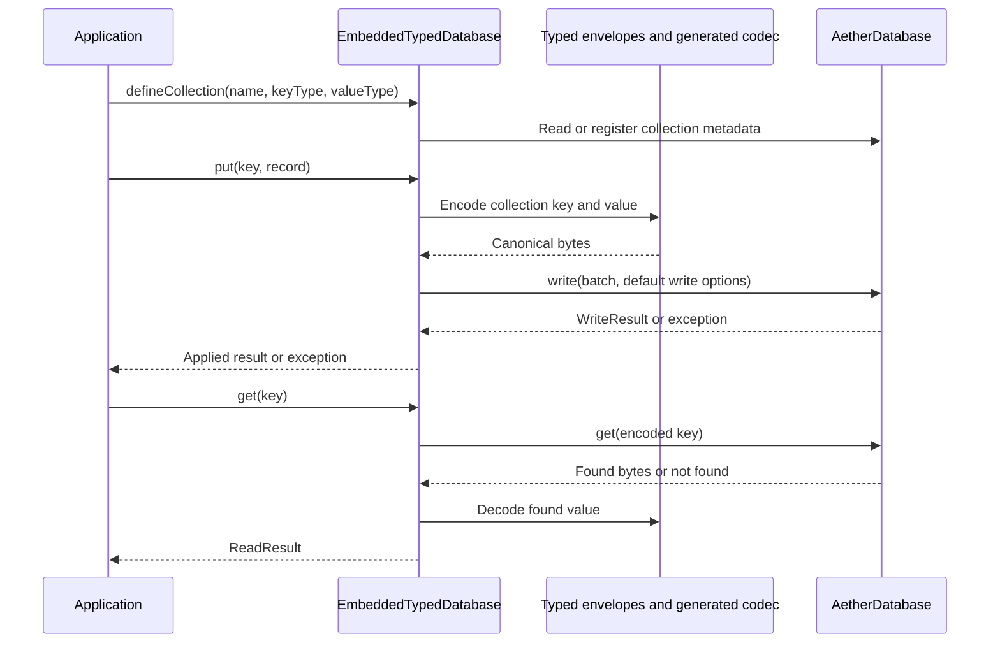
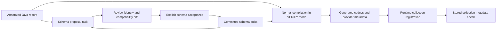

# Typed API and Schemas

[Onboarding index](README.md) | [Architecture](ARCHITECTURE.md) | [Storage engine](STORAGE-ENGINE.md)

Use the typed facade when application keys and values have stable Java types.
It encodes typed collections into the same byte-oriented embedded engine; it is
not a separate database, query planner, ORM, or transaction manager.

## Start with the Working Example

Read these in order:

1. [UserProfile](../../examples/aether-sample-app/src/main/java/io/aetherdb/examples/social/UserProfile.java): an annotated record with explicit field bounds and application validation.
2. [SocialNetworkRepository](../../examples/aether-sample-app/src/main/java/io/aetherdb/examples/social/SocialNetworkRepository.java): named collections, CRUD, batches, and application-side joins.
3. [SocialNetworkApplication](../../examples/aether-sample-app/src/main/java/io/aetherdb/examples/social/SocialNetworkApplication.java): database lifetime and sample output.
4. [Example build](../../examples/aether-sample-app/build.gradle.kts): runtime dependencies and annotation processor wiring.

Run the sample and its tests from the repository root:

```powershell
.\gradlew.bat :examples:aether-sample-app:run :examples:aether-sample-app:test --console=plain
```

On Bash, use `./gradlew`. With no application arguments the sample uses an
in-memory database. See [Getting started](GETTING-STARTED.md) before giving it a
persistent directory.

## Call Path



Source: [AetherEmbedded](../../modules/aether-embedded-typed/src/main/java/io/aetherdb/embedded/typed/AetherEmbedded.java)
and [EmbeddedTypedDatabase](../../modules/aether-embedded-typed/src/main/java/io/aetherdb/embedded/typed/EmbeddedTypedDatabase.java).
`openInMemory()` and `open(Path)` return owned, closeable typed databases.
`adapt(raw)` also transfers close ownership: closing the typed adapter closes its
underlying byte database. Do not let two independently managed owners close the
same resource.

## Identity Is Part of the Data Format

| Identity | Meaning | Change consequence |
|---|---|---|
| Collection ID | Namespace for encoded keys and durable metadata | A new ID identifies different data |
| Collection name | Human-readable name; the convenience overload derives its ID from this name | Renaming with that overload creates another collection |
| Key codec ID, version, fingerprint | Encoding and ordering of logical keys | Cannot silently change for an existing collection |
| Record schema UUID | Durable family of value schemas | A different UUID is not a version upgrade |
| Schema version and fingerprint | Concrete descriptor in that family | Same version with a different fingerprint is a conflict |
| Field ID | Stable identity within the record, independent of Java position | Preserve it across a supported rename |

Use the explicit `CollectionId` overload of
[TypedAetherDatabase](../../modules/aether-api/src/main/java/io/aetherdb/api/typed/TypedAetherDatabase.java)
when identity must survive a display-name change. Do not invent new IDs to silence
a compatibility error on an existing store.

[CollectionDefinition](../../modules/aether-api/src/main/java/io/aetherdb/api/typed/CollectionDefinition.java)
binds these codecs and capabilities together. Range scans require an ordered key
codec. See [BuiltInKeyCodecs](../../modules/aether-codec/src/main/java/io/aetherdb/codec/BuiltInKeyCodecs.java)
for the actual supported Java key types, rather than assuming arbitrary classes
can be serialized as keys.

## Reads, Writes, Batches, and Snapshots

| Operation | Current embedded behavior | Caller responsibility |
|---|---|---|
| `collection.get(key)` | Returns `ReadResult.Found` or `NotFound` | Use `value()` for an optional result or `requireValue()` when absence is an error |
| `put` / `delete` | Encodes one operation and submits a batch | Validate application invariants and inspect failure/result |
| `database.batch()` / `write(batch)` | Atomic byte-engine batch, optionally spanning collections | Use handles from the same writable database; submit only once |
| `scanAll()` | Exhausts a raw cursor into an immutable Java list | Budget heap for the whole collection; this is not pagination |
| `database.snapshot()` | Captures a raw read snapshot | Close it promptly; its collection handles are read-only |
| `close()` | Closes the owned engine and invalidates use | Scope it with try-with-resources; keep snapshots inside the database lifetime |

The current adapter submits with [WriteOptions.defaults()](../../modules/aether-api/src/main/java/io/aetherdb/api/WriteOptions.java):
`GROUP_SYNC`, a 30-second admission timeout, and no fail-fast backpressure. It does
not expose a typed per-call durability override. In-memory execution cannot make
data durable; persistent acknowledgements depend on the storage path described
in [Storage engine](STORAGE-ENGINE.md).

[TypedWriteResult](../../modules/aether-api/src/main/java/io/aetherdb/api/typed/TypedWriteResult.java)
defines `Applied`, `Rejected`, and `Indeterminate`. Distinguish that public
contract from the current embedded adapter: it returns `Rejected` for an empty
batch and `Applied` after a successful raw write, but does **not** convert every
engine exception into a result variant. Handle exceptions too. Its generated
command UUID is not a durable deduplication mechanism or permission to retry any
failed write blindly.

An atomic batch does not make earlier reads transactional. In the sample,
`follow()` reads a follower count and then batches two writes. Concurrent callers
can race those reads; the example does not establish serializable isolation,
compare-and-set, uniqueness constraints, or an automatic foreign-key system.
Similarly, `feedFor()` performs Java-side scans and filtering, not an indexed join.

## Generated Codec Workflow

The [record processor](../../modules/aether-codec-processor/src/main/java/io/aetherdb/codec/processor/AetherRecordProcessor.java)
generates codecs and provider metadata at compilation. Variable-size fields need
appropriate bounds; inspect the annotations in
[aether-codec-annotations](../../modules/aether-codec-annotations/src/main/java/io/aetherdb/codec/annotation).
The processor validates supported record shapes. Do not substitute general Java
serialization or manually edit generated output to bypass it.



There are two gates: the compile-time schema lock and the existing store's
runtime collection metadata. Passing one does not bypass the other.

The [root Gradle schema tasks](../../build.gradle.kts) are project-scoped:

| Task | Effect |
|---|---|
| `aetherSchemaInit` | Runs proposal generation for initial schemas |
| `aetherSchemaUpdate` | Runs proposal generation for a changed schema |
| `aetherSchemaAccept` | Regenerates proposals and copies accepted files into the project's `aether-schemas/` directory |
| `aetherSchemaCheck` | Depends on normal compilation, which verifies committed locks |

For an intentional edit in the sample project:

```powershell
.\gradlew.bat :examples:aether-sample-app:aetherSchemaUpdate
git diff -- examples/aether-sample-app
```

Also inspect `examples/aether-sample-app/build/aether-schema/proposal/`: proposals
are generated files and may not appear in `git diff`. Only after reviewing the
proposal and deciding the evolution is supported:

```powershell
.\gradlew.bat :examples:aether-sample-app:aetherSchemaAccept
git diff -- examples/aether-sample-app/aether-schemas
.\gradlew.bat :examples:aether-sample-app:aetherSchemaCheck :examples:aether-sample-app:test
```

Replace that project path with the project you actually changed. Commit the
record change and accepted locks together. Do not run acceptance as routine
build troubleshooting: it changes durable schema definitions. Normal generated
Java output under `build/` is not the source to commit.

## Schema Evolution

[SchemaCompatibilityChecker](../../modules/aether-codec/src/main/java/io/aetherdb/codec/SchemaCompatibilityChecker.java)
requires the same schema UUID and a strictly increasing version for an upgrade.
The supported path includes stable-ID field renames, relaxed bounds,
required-to-optional changes, and adding optional fields. It rejects field
removal, changed wire types or nested/enum identities, tightened bounds,
optional-to-required changes, and new required fields without a generated default.

The runtime stores the compatible newer descriptor and minimum writer version.
An older codec may still be registered, but its writes are rejected with
`OLDER_WRITER_REJECTED` once the newer version is registered. This does not promise
that every old reader can decode every newer value. Incompatible evolution needs
an explicitly designed migration, not simply a version-number increment. The
compatibility checker does not rewrite existing records for you.

Use these tests as executable examples:

- [GeneratedSchemaEvolutionTest](../../modules/aether-embedded-typed/src/test/java/io/aetherdb/embedded/typed/GeneratedSchemaEvolutionTest.java): V1 data read by V2, restart, and durable old-writer rejection.
- [GeneratedRecordPersistenceTest](../../modules/aether-embedded-typed/src/test/java/io/aetherdb/embedded/typed/GeneratedRecordPersistenceTest.java): generated records in a persistent store.
- [PersistentTypedDatabaseTest](../../modules/aether-embedded-typed/src/test/java/io/aetherdb/embedded/typed/PersistentTypedDatabaseTest.java): typed persistence and metadata checks.
- [AetherRecordProcessorTest](../../modules/aether-codec-processor/src/test/java/io/aetherdb/codec/processor/AetherRecordProcessorTest.java): accepted and rejected compile-time schemas.

## Debugging and First Changes

| Symptom | Inspect first |
|---|---|
| Generated codec cannot be resolved | Annotation processor dependency, generated provider resources, runtime classpath |
| Compile requests a schema proposal | Existing lock, record annotations, version and field IDs; review rather than auto-accept |
| `COLLECTION_SCHEMA_CONFLICT` | Collection ID and codec/schema family in stored metadata |
| `SCHEMA_DESCRIPTOR_CONFLICT` | Same schema version but differing fingerprints |
| `SCHEMA_MIGRATION_REQUIRED` | Descriptor diff and the compatibility rules above |
| `OLDER_WRITER_REJECTED` | Which newer writer registered this collection, including after reopen |
| Large scan allocates heavily | `scanAll()` materialization and application-side joins |

A good first contribution adds a regression test to an existing typed test class,
traces the exact encoding or registration path, and changes only that behavior.
For format changes, include old-data decode/reopen tests and rejected-change tests,
not just a same-process round trip. See [Testing and contributing](TESTING-AND-CONTRIBUTING.md).
