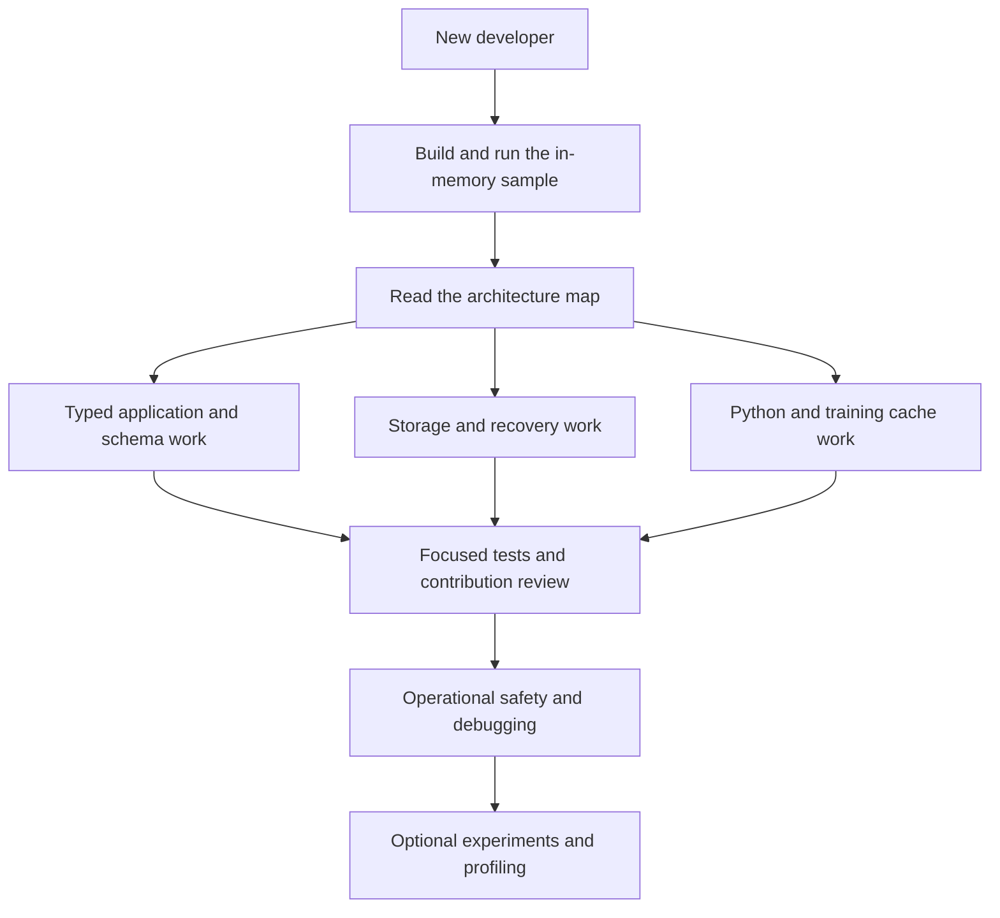

# Developer Onboarding

This guide explains the **current source checkout**, including its experimental ML
cache tooling. It is an implementation guide, not a production-readiness certificate
or a promise about a published artifact. Aether is pre-production: use disposable
data while learning and keep irreplaceable data elsewhere.

## Start Here

1. [Get a working checkout](GETTING-STARTED.md): JDK, wrapper, first sample, IDE and optional Python setup.
2. [Understand the architecture](ARCHITECTURE.md): module map, real runtime boundaries, and where to make changes.
3. Follow the [guided code tour](CODE-TOUR.md): application, write, read, recovery and optional Python call chains.
4. Use the [module guide](MODULE-GUIDE.md) to locate the owning implementation, then [make a tested contribution](TESTING-AND-CONTRIBUTING.md).



The graph is a reading path, not a dependency graph.

## Reading Paths

The [function reference index](FUNCTION-INDEX.md) groups detailed source-backed
references by subsystem and distinguishes their exact coverage from broader guides.

The [Engine function reference](ENGINE-FUNCTIONS.md) describes database factory,
write-batch, read, snapshot, cursor and result functions individually, including
private helpers and overload differences.

The [SSTable block function reference](SSTABLE-BLOCK-FUNCTIONS.md) follows internal
keys, restart compression, streaming scanning, checksums and Bloom membership,
with explicit ownership and validation boundaries.

| Your work | Read next | First code to inspect |
|---|---|---|
| Embedded application | [Typed API and schemas](TYPED-API-AND-SCHEMAS.md) | [SocialNetworkRepository](../../examples/aether-sample-app/src/main/java/io/aetherdb/examples/social/SocialNetworkRepository.java) |
| Engine correctness or performance | [Storage engine](STORAGE-ENGINE.md) | [PersistentAetherDatabase](../../modules/aether-engine/src/main/java/io/aetherdb/engine/PersistentAetherDatabase.java) |
| PyTorch/MONAI integration | [Training cache and Python](TRAINING-CACHE-AND-PYTHON.md) | [TransformCache](../../clients/python/aether_ml/transform_cache.py) |
| Reproduction and profiling | [Experiments and profiling](EXPERIMENTS-AND-PROFILING.md) | [reproduce.py](../../scripts/reproduce.py) |
| Reliability and operational tooling | [Operations and debugging](OPERATIONS-AND-DEBUGGING.md) | [AetherCli](../../modules/aether-tools/src/main/java/io/aetherdb/tools/AetherCli.java) |
| RPC, client, replication or Raft foundations | [Architecture](ARCHITECTURE.md) | [RemoteAetherClient](../../modules/aether-client/src/main/java/io/aetherdb/client/RemoteAetherClient.java) |

Use the [glossary](GLOSSARY.md) when terminology is unfamiliar. All paths in these
documents are relative to the repository unless a command says otherwise.

## A Practical First Week

| Stage | Exercise | Completion evidence |
|---|---|---|
| First session | Run the in-memory social sample and its tests | Sample prints `Deleted draft exists: false`; tests pass |
| Storage orientation | Trace one `put` through admission, WAL, publication and subsequent `get` | Explain what changes before and after the durable acknowledgement |
| API orientation | Read a generated codec, its record and committed schema lock | Explain why a collection name, field ID and schema UUID are not interchangeable |
| Integration orientation | Read one Python batch lookup and the matching Java protocol branch | Identify cache identity, miss preparation, publication and buffer ownership |
| First change | Add a regression test for a small behavior before editing it | Focused tests fail before the change and pass afterward |
| Review | Explain ownership, failure states and format impact | Review links to source/tests, not only a benchmark chart |

These exercises do not require a GPU, Kaggle credentials, production data, a
cluster, or a full paper campaign.

## Rules That Prevent Expensive Mistakes

- One persistent directory has one process owner. Close the application before opening it in Workbench or offline tooling.
- Never infer durable success from a volatile stage acknowledgement or an indeterminate result.
- Keep readers, cursors, snapshots, native regions and packed responses within their documented lifetimes.
- Do not edit a manifest, WAL, schema lock or generated codec as a shortcut around a failing check.
- Do not remove checksums, barriers, locks or admission guards merely to improve a timing.
- A configuration key, module name, specification chapter or empty task is not evidence of an integrated production feature.
- Diagnostics, pilot measurements and fresh confirmatory measurements have different roles. Do not pool them.
- Build outputs and benchmark stores are disposable only when you have verified their identity and ownership. Never use an unverified recursive cleanup path.

## Documentation Authority

Source and tests are the authority for behavior. These onboarding pages link to
both. [Historical specifications](../Aether_Engine_Documentation_Index.md) explain
design intent, but several describe future or only partially integrated behavior.
[Website documentation](../../website/docs/index.html) and the root README are
additional entry points, not replacements for source verification.

The repository can contain uncommitted experiments. Record `git status --short`
and the revision when comparing behavior. A clean research snapshot in `build/`
can be intentionally different from the active worktree.

## Verification Record

The documentation was checked against this worktree on 2026-09-30. This records
the scope of the documentation review, not a release certification:

| Check | Result |
|---|---|
| Repository coverage | All 49 Java modules in `settings.gradle.kts` are represented in the architecture inventory; Python integration, research tooling, build and operations have dedicated guides |
| Documentation structure | Local links and heading targets checked; code fences balanced; all 22 Mermaid diagrams rendered successfully |
| First-run commands | In-memory social sample and offline CLI help succeeded on Windows/JDK 21 |
| Focused Java tests | 83 tests executed across the sample, typed adapter, codec processor, tools and configuration: 69 passed, 14 failed with `RESOURCE_EXHAUSTED: write pressure: DISK_SPACE` |
| Focused Python tests | 70 passed and 2 opt-in real-JFR tests skipped across JFR orchestration, system campaign, confirmatory and Kaggle preparation tests |

The Java command was:

```powershell
.\gradlew.bat :examples:aether-sample-app:test :modules:aether-embedded-typed:test :modules:aether-codec-processor:test :modules:aether-tools:test :modules:aether-config:test --console=plain
```

The Python subset used `PYTHONPATH=scripts;clients/python` and `AETHER_JAVA_TEST=0`:

```powershell
.venv/Scripts/python.exe -m pytest scripts/tests/test_bulk_jfr.py scripts/tests/test_system_campaign.py scripts/tests/test_confirmatory.py scripts/tests/test_kaggle_remote.py -q
```

The disk-space failures affect persistence/recovery checks and are not passing
coverage. Safeguards were not disabled, and no existing stores were deleted.
The full Java/Python suites, real-JFR runs, GPU campaigns and remote submissions
were not part of this documentation verification. Runtime code was not changed
to make this guide's checks pass.

## Maintaining This Guide

### Contributor Navigation Check: 2026-10-07

The module guide and code tour were checked against the active worktree, not the
separately frozen research checkout. All 49 module declarations were matched to
the guide; named module entry symbols were checked against `src/main` Java files.
All 406 local links/heading targets across the 13 onboarding pages resolved and
code fences were balanced. No new Mermaid diagrams were added in this update.

The in-memory social sample ran and printed `Deleted draft exists: false`.
`InMemoryAetherDatabaseTest` executed 9 tests with no failures, errors or skips:

```powershell
.\gradlew.bat :examples:aether-sample-app:run :modules:aether-engine:test --tests io.aetherdb.engine.InMemoryAetherDatabaseTest --console=plain
```

These checks verify the first source-reading/semantic exercise, not persistence,
all distributed foundations, optional Python integration or a production release.
The earlier verification record above remains separate, including its failures.

### ML Function Reference Expansion: 2026-10-08

The [transform-cache reference](PYTHON-TRANSFORM-FUNCTIONS.md) and
[dataset reference](PYTHON-DATASET-FUNCTIONS.md) describe all 50 explicit function
declarations in transform_cache.py, identity.py, codecs.py, and dataset.py,
including nested helpers. Contracts were read from the active source; qualified
function-entry checks prevent an unrelated method with the same name from hiding
an omission. Architecture, copy boundaries, mode differences, identity limitations,
and failure/counter behavior are documented separately from the frozen H2 worker.

Verification: 49 contributor-documentation tests and 19 ML-wrapper tests passed.
The website audit passed across 58 HTML pages. Both new references were checked
with a local headless browser at 1440, 1024, and 390 pixels, including code contrast,
table containment, navigation selection, and screenshots. No runtime implementation,
GPU experiment, or daemon configuration changed for this documentation expansion.

This completes these four files' reference coverage, not the whole repository's
function-level overview. Lifecycle/framework adapters, research drivers, operational
commands, schema Gradle tooling, offline bulk publication, and distributed
foundations remain for further detailed coverage. The function index records scope;
name/entry checks do not independently prove semantic accuracy or runtime correctness.

### ML Lifecycle and Framework Expansion: 2026-10-08

The [lifecycle/operations reference](PYTHON-LIFECYCLE-FUNCTIONS.md) and
[framework reference](PYTHON-FRAMEWORK-FUNCTIONS.md) complete the aether_ml package's
explicit-function entry coverage: **63 of 63 declarations**, including private and
nested functions. Inherited Torch dataset behavior, configuration's implicit
dataclass contract, package import boundaries, and custom exception types are
explained alongside those declarations. The inventory test scans the whole package
so a new file containing functions cannot silently escape the coverage mapping.

The latest checks passed: 52 contributor-documentation tests, 10 local
documented-contract tests, and 19 ML-wrapper tests. The website audit passed across
60 HTML pages. All four ML references rendered with contained tables and readable
code at 1440, 1024, and 390 pixels in the local headless browser. This is engineering
and documentation evidence, not a Java/GPU experiment or a production certification.

Remaining detailed work includes lower-level prefetch/loader/provenance APIs,
research drivers, operational commands, schema Gradle tooling, offline bulk
publication, and distributed foundations. Completing aether_ml's declaration
coverage does not mark the repository-wide overview complete.

### Offline Bulk Function Expansion: 2026-10-08

The [offline bulk reference](BULK-PUBLICATION-FUNCTIONS.md) covers **27 of 27
explicit declarations** across BulkArtifactWriter, EmptyStoreBulkLoader and
scripts/bulk_population.py, including its stdout reader and preprocessing capture
helpers. It follows ownership from Python pipe batches through sorted staging,
deferred table construction, the authoritative inventory pass, append/force
manifest publication, receipt delivery and ordinary-reader validation.

The reference distinguishes volatile STAGED responses from durable acknowledgements,
post-commit cleanup failure from prepublication failure, process death from power
loss, a soft SSTable target from a hard file-size limit, and encoded-byte accounting
from peak heap. It documents the prototype's development/pressure settings without
changing them and keeps V0-only diagnostic timing separate from H2 lifecycle cost.

Verification: 54 contributor-documentation tests and 10 documented ML-contract
tests passed. Java executed eight loader tests and two artifact-writer tests with
no failures, errors or skips. The website audit passed across 61 HTML pages.
All 17 bulk-population Python tests also passed with `AETHER_JAVA_TEST=1`, using
real local Java subprocesses, ordinary-reader reopening and disposable CPU image
fixtures. Those include process-death/abort and layout/update checks, not GPU
measurements or simulated storage power loss. Two Torch deprecation warnings
were emitted; no tests were skipped.
The bulk reference and four ML references were checked at 1440, 1024 and 390
pixels, with readable code, contained tables, correct selected navigation and
screenshots. Runtime implementations and frozen GPU experiments were not changed.

This completes these three files' explicit-function reference entries, not the
repository-wide goal. Remaining work includes lower-level Python pipeline and
provenance helpers, research orchestration/analysis, operational commands, Gradle
schema tooling and distributed foundations. Entry/signature checks prevent
omissions; they do not independently prove every documented contract.

### Python Pipeline and Store Adapter Expansion: 2026-10-08

The [loading/worker/prefetch reference](PYTHON-PIPELINE-FUNCTIONS.md) and
[store adapter/resource reference](PYTHON-STORE-ADAPTER-FUNCTIONS.md) cover
**54 of 54 explicit functions** in six complete source files: dataset.py,
loader_workers.py, prefetch.py, java_store.py, persistent_mmap.py and resources.py.
They also cover both functions in the benchmark's prepared_batches subtree;
the rest of that benchmark is not claimed as complete. Qualified AST entry checks
include private, property and nested declarations.

Architecture and behavior are separated by actual ownership: segment-reference
loading, the ordered one-producer queue, spawned benchmark workers, Java RPC
batching, append-journal mmap publication and Linux process observations. The
references explain missing values, pinned copies, schedule/queue bounds,
cancellation and join, response-view lifetime, partial multi-chunk publication,
indeterminate baseline publication, worker aggregation and resource-counter limits.

Verification: **57 contributor-documentation tests**, 10 ML documented-contract
tests and 17 pipeline/store documented-contract tests passed (84 total).
The existing prefetch/storage suites passed 31 tests and 21 subtests. Contract
fixtures use fake transport/framework responses, modeled /proc observations and
real disposable mmap files; they do not launch Torch worker processes or establish
Java/GPU performance, cross-process locking or storage power-loss guarantees.

The site audit passed across 63 HTML pages (61 contributor guides). Seven recent
function references were checked with headless Edge at 1440, 1024 and 390 pixels:
21 page/viewport combinations with contained tables, readable code, selected
navigation and no page script errors. Desktop/mobile screenshots were inspected.
The in-app browser connection was unavailable; the existing local headless browser
was used instead. Runtime implementations and frozen GPU experiments were unchanged.

This completes the selected six files' function entries, not the repository-wide
goal. Further detail remains for the separate filesystem provenance API, research
orchestration/analysis, operational commands, Gradle schema tooling and distributed
foundations. Per-file entry coverage is measurable; no overall completion percentage
is inferred from these narrowly scoped checks.

### Filesystem Provenance Expansion: 2026-10-08

The separate aetherml implementation now has **79 of 79 explicit function
entries** across three references: [artifact publication](PYTHON-PROVENANCE-STORE-FUNCTIONS.md)
(31), [dataset/lineage workflows](PYTHON-PROVENANCE-WORKFLOW-FUNCTIONS.md) (29),
and [validation/diagnostics](PYTHON-PROVENANCE-DIAGNOSTIC-FUNCTIONS.md) (19).
AST checks partition the whole ml.py declaration inventory, including nested
helpers and properties, so a duplicate name cannot conceal an omitted function.

These references distinguish local Python files/pickle from the Java cache,
content identity from provenance nodes, replaceable cache pointers from immutable
admission, file fsync/replace from multi-file transactions, snapshot membership
from model reproducibility and destructive cleanup from repair. They document
per-instance locking, trusted-path limits, None cache behavior, metadata reuse,
partial publication, direct-only snapshot verification and diagnostic blind spots.
No runtime implementation or frozen experiment was changed.

Verification: 58 contributor-documentation tests and 23 focused provenance
contract tests passed. All 17 existing core provenance tests in test_aetherml.py
(the source's first 17 tests, through environment-report fields) also passed.
Those use real local disposable files and selected probe/framework doubles, not
cross-process crash tests, power-loss experiments or GPU measurements. Research
benchmark tests later in that file were not included in this scoped run.

The site audit passed across 66 HTML pages (64 contributor guides). Ten recent
references passed headless Edge checks at 1440, 1024 and 390 pixels, 30 combinations,
with contained tables, readable code, selected navigation and no script errors.
Desktop/mobile screenshots of the new references were inspected. The existing
local browser fallback was used because the in-app browser connection was unavailable.

This completes ml.py's function-reference coverage, not the repository-wide goal.
Remaining detail includes research orchestration/analysis, Python workload helpers,
operational commands, Gradle schema tooling and distributed foundations. Coverage
checks establish entries; source review and scoped contracts support their meaning,
without claiming exhaustive runtime correctness.

### H2 Harness Expansion: 2026-10-08

Three references cover **42 of 42 explicit functions in five complete H2 harness
files**: [protocol and freeze](H2-PROTOCOL-FUNCTIONS.md) (13),
[execution, worker and input binding](H2-EXECUTION-FUNCTIONS.md) (24), and
[analysis and figures](H2-ANALYSIS-FUNCTIONS.md) (5). Qualified AST table checks
include nested callbacks and distinguish both main entry points, preventing a
duplicate name from masking an omission.

The architecture follows candidate/harness identity, audited pilot evidence,
runtime freeze, full excluded preflight, backend-major lifecycles, same-JVM
V0-V4 persistence, whole-block retries, leases, seals, checkpoints and archived
analysis. It explains the fixed 24-block endpoint, same-host resume restriction,
ratio direction, geometric intervals, degenerate variance, exact ties and observed
break-even semantics. Direct arithmetic helpers are not the complete receipt gate.

Verification: **153 tests passed**, comprising 61 contributor-documentation tests,
24 focused H2 documentation-contract checks and 68 existing H2 execution/input
tests. Disposable synthetic timing/file fixtures and injected worker/service
doubles establish selected contracts, not real CUDA performance or platform
restart guarantees. The nested-mount suite uses the preserved pilot parser.
No live experiment, runtime implementation, frozen source or result was changed.

The site audit passed across **69 HTML pages (67 contributor guides)**. Thirteen
recent references passed headless Edge checks at 1440, 1024 and 390 pixels,
39 page/viewport combinations, with contained tables, readable code, selected
navigation and no page script errors. Desktop/mobile screenshots of H2 references
were inspected. The local browser fallback was used after the in-app browser
connection failed.

Mobile H2 guide filtering, navigation, no-match state and Escape dismissal also
passed after waiting for destination-page loading in the browser check.

This completes the selected H2 harness files' function entries, not the full
repository overview. Shared campaign/service infrastructure, original training
workloads, operational commands, Gradle schema tooling and distributed foundations
still need further detailed coverage. No repository-wide percentage is inferred
from this selected subsystem's 100% entry coverage.

### Shared Research Infrastructure Expansion: 2026-10-08

Four references cover **38 of 38 explicit functions in six complete files**:
[campaign identity and evidence](RESEARCH-CAMPAIGN-FUNCTIONS.md) (9),
[build, environment and process ownership](RESEARCH-PROCESS-FUNCTIONS.md) (9),
[stage checkpoints and persistent service](RESEARCH-LIFECYCLE-FUNCTIONS.md) (16),
and [dataset version manifests](RESEARCH-MANIFEST-FUNCTIONS.md) (4).
Qualified AST table checks match each reference's entries to its source inventory.

The architecture distinguishes kernel locks from persistent marker files,
source/runtime identity from descriptive probes, closed-store stage recovery from
same-JVM whole-block execution, and manifest membership from raw-input validation.
Function entries explain ownership, timing, return values, mutations and failure
boundaries. They document nested identity aliasing, matching absent runtime entries,
non-transactional multi-file receipts, post-commit cleanup failures, direct-helper
numeric limitations and the external authority required to trust manifest receipts.

Verification: **149 tests passed, two skipped**: 65 contributor-documentation
checks, 32 infrastructure contracts, 15 manifest contracts and 37 passing existing
campaign/provenance/evidence/longitudinal/service tests. The two skips are opt-in
real-Java lifecycle tests. Disposable local files, CSV generation, a real child
process exiting during stage work, and selected process/client/framework doubles
support these contracts. No live JVM/GPU experiment, frozen source, implementation
or scientific result was changed. The child crash test ran with the scripts
directory exported through PYTHONPATH; it is not a power-loss test.

The site audit passed across **73 HTML pages (71 contributor guides)**. Seventeen
recent references passed headless Edge checks at 1440, 1024 and 390 pixels,
51 page/viewport combinations, plus mobile guide filtering, navigation, no-match
state and Escape dismissal. New mobile screenshots were inspected; tables and
code remain contained and readable. The existing local browser fallback was used
because the in-app browser connection was unavailable.

This completes the selected helpers' function entries, not the repository-wide
overview. Original training workloads, remaining research drivers/analysis,
operational commands, Gradle schema tooling and distributed foundations still
need detailed coverage. No global completion percentage is inferred from this
subsystem's 100% entry coverage.

### Longitudinal Workload Expansion: 2026-10-09

Three references cover **35 of 35 explicit functions in four complete files**,
plus the Aether source-identity lambda:
[MONAI comparison and adapters](RESEARCH-ADAPTER-FUNCTIONS.md) (16 functions),
[longitudinal stage worker](LONGITUDINAL-WORKER-FUNCTIONS.md) (8), and
[pilot runner and analysis](LONGITUDINAL-RUNNER-FUNCTIONS.md) (11).
Qualified AST entries match each selected file; the callback has a separate check.

The architecture distinguishes the older two-version update endpoint, V0
population-only longitudinal worker, interleaved persistent-service pilot, and
separately preserved H2 V0-training workload. The model explanation follows the
actual convolution blocks, output head, BCE loss, AdamW and post-warmup hashes;
the SmallUNet name does not imply pooling, a decoder or skip connections.
Entries explain admitted versus cached tensors, synchronous training, excluded
validation, sampled occupancy, stage/paired receipts, fresh versus completed-block
checks, common-cost arithmetic, descriptive intervals and first-observed ties.

Verification: **110 tests passed, three skipped**: 69 contributor-documentation
checks, 25 new workload contracts and 16 passing existing longitudinal/service/
MONAI tests. The skips are opt-in real-Java campaigns. A tiny real CPU/mmap V0-V1
fixture confirmed initial admission without V0 training, one incremental admission,
V1 training, readback and phase sums. Existing tests exercised actual local MONAI
PersistentDataset and LMDB caches. Injected workers, local receipts and generated
PNG fixtures test selected orchestration/analysis limits, not CUDA performance,
power-loss behavior or clinical segmentation quality. This documentation work did
not change runtime implementations or the frozen candidate.

The site audit passed across **76 HTML pages (74 contributor guides)**. Twenty
recent references passed headless Edge checks at 1440, 1024 and 390 pixels,
60 page/viewport combinations, plus mobile filtering/navigation/empty-state/Escape
checks. Desktop/mobile screenshots of the new references were inspected. The
in-app browser connection failed, so the existing local fallback was used.

Selected function-entry coverage is complete; the repository-wide overview is not.
The main benchmark workload still has 138 explicit declarations, with only selected
loading/model contracts described so far. Remaining research drivers/profilers,
operational commands, Gradle schema tooling and distributed foundations also need
individual-function detail and verification. No overall percentage is inferred
from this selected subsystem's 100% entry coverage.

### Benchmark Data Expansion: 2026-10-09

The [benchmark data reference](BENCHMARK-DATA-FUNCTIONS.md) covers **27 explicit
functions** in benchmark_gpu_segmentation.py: source selection, manifest checks,
deterministic preparation, payload packing/unpacking, checksums, batch plans and
descriptive configuration. Together with the two existing loading/prefetch
entries, this documents **29 of 138 declarations (about 21%)**, leaving **109
entries (about 79%)** in this module. This is not repository-wide coverage.

Entries distinguish trusted declared hashes from actual file verification,
selected-row validation from whole-manifest validation, binary semantic masks
from visualizations, float16 artifact quantization from float32 preprocessing,
and descriptive version/storage labels from authoritative cache identity. They
also explain payload length/decompression checks and the limits of those checks;
metadata parsing does not establish authentication or a resource quota.

Verification: **112 tests passed**: 70 contributor-documentation checks, 30 new
data-contract checks, and 12 existing storage/manifest tests. Tiny actual PNG/CSV
fixtures, NumPy arrays, payload corruption and isolated filesystem doubles
exercise the documented boundaries. No GPU/JVM campaign or frozen implementation
was changed. Qualified AST checks establish this selected function partition,
not full coverage of the benchmark or proof of performance.

The site audit passed across **77 HTML pages (75 contributor guides)**. Twenty-one
recent references passed headless Edge checks at 1440, 1024 and 390 pixels,
63 page/viewport combinations, plus mobile navigation/filter/empty-state/Escape
checks. Desktop and mobile screenshots of the data reference were inspected.
The existing local browser fallback was used because the in-app connection was
unavailable.

Training execution, backend ownership, timing/accounting and statistical helpers
in the main benchmark still need individual entries. Remaining research tools,
operational commands, Gradle tooling and distributed foundations also remain in
the original documentation scope.

### Benchmark Training Expansion: 2026-10-09

The [model, training and device reference](BENCHMARK-TRAINING-FUNCTIONS.md)
covers **25 explicit declarations**, including the four nested model methods.
The main benchmark now has **54 of 138 declarations documented (about 39%)**,
leaving **84 (about 61%)**. This counts function entries in this module, not
repository-wide completion or runtime correctness.

The architecture follows the actual padded convolution stack rather than
inferring a U-Net encoder/decoder from its name. Entries explain state-changing
optimizer warmup, deterministic seed policy, augmentation outside cached values,
blocking transfers, synchronized training phases, iterator/sampler cleanup and
excluded sanity/model-hash work. They distinguish canonical CPU strides from
generic contiguity and pooled first-batch overlap from held-out segmentation
evaluation. Reported precision and GPU-name matching are not enforcement of
every device/model property.

Verification: **125 tests passed**: 71 contributor-documentation checks, 24 new
training contracts and 30 data contracts. Actual local CPU torch exercised all
three model tiers, warmup, inline/prepared optimizer steps, tensor sharing/strides
and reference sanity checks. Injected factories, accelerator fields and backend
sampling/resource boundaries exercised routing and failure cleanup. These tests
do not establish CUDA/ROCm throughput, multi-GPU execution or clinical accuracy.
No runtime implementation, frozen H2 source or GPU job was changed.

The site audit passed across **78 HTML pages (76 contributor guides)**. Twenty-two
recent references passed headless Edge checks at 1440, 1024 and 390 pixels,
66 page/viewport combinations, plus mobile navigation/filter/empty-state/Escape
checks. New desktop/mobile screenshots were inspected using the existing local
browser fallback.

The overall goal remains incomplete. Main-benchmark backend ownership,
utilization sampling, orchestration and result accounting are next, alongside
the remaining research tools, operations, Gradle tooling and distributed
foundations in the original scope.

### Benchmark Backend Expansion: 2026-10-09

The [backend ownership reference](BENCHMARK-BACKEND-FUNCTIONS.md) covers all
**24 BackendContext methods and two helpers**. Main-benchmark entry coverage is
now **80 of 138 declarations (about 58%)**, leaving **58 (about 42%)**. This is
not a repository-wide percentage.

The architecture distinguishes a local Python artifact root from a Java daemon
namespace, incremental keyed mmap from its historical static label, and encoded
RAM payloads from ready tensors. Entries document destructive fresh directories,
partial-construction/close failure boundaries, actual versus simulated prefix
reuse, reset behavior, ordinary batched publication versus offline bulk import,
and logical counters versus transport/physical I/O. Population reports do not
all include seed/discovery work; Aether population lookup/publish times are
cumulative while its entry/hit/miss fields use call deltas.

Verification: **97 tests passed**: 72 contributor-documentation checks, 16 new
backend contracts and nine existing storage tests. Disposable real Python
artifact/mmap stores exercised cold/warm batches against raw/RAM, prefix reuse,
reopening, changed deterministic identity, population accounting and cleanup.
Injected Java clients exercised engine/durability rejection, counter-only reset,
worker transport merging and observation ownership. A cold-start test confirms
count comparison is not exact initial-index-set validation. No live daemon,
GPU campaign, frozen implementation or scientific result was changed.

The site audit passed across **79 HTML pages (77 contributor guides)**. Twenty-three
recent references passed headless Edge checks at 1440, 1024 and 390 pixels,
69 page/viewport combinations, plus mobile navigation/filter/empty-state/Escape
checks. New desktop/mobile screenshots were inspected with the existing local
browser fallback.

Utilization sampling, benchmark orchestration, validity checks and result
accounting remain to expand. The broader research/operations/Gradle/distributed
documentation scope remains active and incomplete.

### Benchmark Observation Expansion: 2026-10-09

The [utilization/process reference](BENCHMARK-METRICS-FUNCTIONS.md) covers all
**seven sampler methods and eight parsing/process helpers**. Main-benchmark entry
coverage is **95 of 138 declarations (about 69%)**, leaving **43 (about 31%)**.
This is a scoped function-entry count, not overall repository completion.

Entries explain command fallback and sticky errors, device averaging without
selected-device filtering, permissive numeric/unit extraction, sample-list
ownership, bounded shutdown and retry behavior. They distinguish a sample being
present from valid percentage measurements, allocated VRAM from activity,
host-core-normalized CPU usage from one-core utilization, process-lifetime RSS
peaks from interval memory, and Linux process I/O from artifact byte counters.

Verification: **164 tests passed**: 73 contributor-documentation checks, 21 new
observation contracts, and 70 earlier benchmark data/training/backend contracts.
Injected vendor outputs, missing/failing commands, proc-file fixtures, resource
values and stop/join doubles exercise parsing and lifecycle limits. Earlier
contracts include real local CPU torch and disposable artifact/mmap stores.
No vendor command, GPU run, live daemon or frozen implementation was changed.

The site audit passed across **80 HTML pages (78 contributor guides)**. Twenty-four
recent references passed headless Edge checks at 1440, 1024 and 390 pixels,
72 page/viewport combinations, plus mobile navigation/filter/empty-state/Escape
checks. New desktop/mobile screenshots were inspected using the existing local
browser fallback.

Main-benchmark orchestration, validity policy and result/statistical accounting
remain. Other research tooling, operational commands, Gradle tooling and
distributed foundations remain in the original goal's scope.

### Benchmark Control Expansion: 2026-10-09

The [entry-point/run-control reference](BENCHMARK-RUNNER-FUNCTIONS.md) covers
**13 declarations**, including all three lazy-reference methods. Main-benchmark
entry coverage is **108 of 138 (about 78%)**, leaving **30 (about 22%)**. This
does not establish repository-wide completion.

Entries trace CLI normalization/guard limits, population-only success versus
accelerator-gated training, repeated lazy preparation, shared initial model
state/fresh optimizers, separate prefix validation, seeded backend shuffling,
Java background-drain accounting and later run-level invariants. They document
descriptor-only invalidation checks, at-most-eight-sample tensor equivalence,
non-atomic report writing and the measured-context cleanup gap before its later
training finally. The original controller is explicitly distinct from frozen H2.

Verification: **186 tests passed**: 74 contributor-documentation checks, 21 new
runner contracts and 91 earlier benchmark contracts. A tiny actual CPU-only call
to run_training_once used four backends and disposable local stores, confirming
final model-state parity, backend tensor equivalence and cache invariants.
Controlled reports/accelerator doubles checked unsupported skips, population-only
success and GPU-count rejection without executing a GPU job. CLI/lazy/checksum
fixtures exercise selected boundaries, not all hardware or workload combinations.
No production CPU fallback, runtime change, frozen-source change or GPU campaign
action was introduced.

The site audit passed across **81 HTML pages (79 contributor guides)**. Twenty-five
recent references passed headless Edge checks at 1440, 1024 and 390 pixels,
75 page/viewport combinations, plus mobile navigation/filter/empty-state/Escape
checks. New desktop/mobile screenshots were inspected using the existing local
browser fallback.

Result aggregation, lifecycle/break-even ratios, cache accounting and statistics
remain in the main benchmark. The broader research/operations/Gradle/distributed
documentation scope remains incomplete and active.

### Benchmark Accounting Completion: 2026-10-09

The [lifecycle/cache/comparison reference](BENCHMARK-ACCOUNTING-FUNCTIONS.md)
adds **18 declarations**, and [aggregation/statistics](BENCHMARK-AGGREGATION-FUNCTIONS.md)
adds **12**. A joint qualified AST check confirms **138 of 138 explicit declarations
(100% entry coverage, 0% remaining in this module)** across seven benchmark
references and the two existing prefetch entries, with no omissions or duplicate
entries. This does not complete the repository-wide objective or establish all
runtime/hardware behavior.

Entries distinguish step-wall throughput from whole-backend throughput, supplied
epoch accumulation from measured lifecycle total, logical cache counts from I/O,
strict descriptive outcome signals from significance, and constant-mean epoch
projections from observed longitudinal crossover. Aggregation documents first-run
representative fields, missing-field zeros/omissions, unweighted run summaries,
conditional crossover distributions, flag denominators and normal-approximation
half-widths. Earlier benchmark pages now link the complete partition inventory
instead of retaining stale unfinished-module counts.

Verification: **201 tests passed**: 77 contributor-documentation checks, 12 new
accounting/aggregation contracts and 112 earlier benchmark contracts. Arithmetic
fixtures exercise fixed-grid/equality boundaries, denominators, missing/censored
fields, checksum shape omissions and representative-field retention. Earlier
contracts include real local CPU training and disposable artifact/mmap stores.
The checks establish selected source behavior and documentation coverage, not a
new performance result, inferential guarantee or clinical validation. No runtime
implementation, frozen source or GPU campaign was changed.

The site audit passed across **83 HTML pages (81 contributor guides)**. Twenty-seven
recent references passed headless Edge checks at 1440, 1024 and 390 pixels,
81 page/viewport combinations, plus mobile navigation/filter/empty-state/Escape
checks. New desktop/mobile screenshots were inspected using the existing local
browser fallback.

This closes the main benchmark's explicit function inventory. Other research
drivers/profilers, operational commands, Gradle tooling and distributed foundations
remain in the original repository-wide documentation scope; no overall completion
percentage is inferred from one module's 100% entry coverage.

### Ongoing Maintenance

Experiment output/scratch ownership reference added on 2026-10-09: **4/4
declarations** across cache_workspace.py and experiment_output.py now document
capacity floors, OS locking, interruption retention, checked cleanup and metadata
resume boundaries. Verification: **97 passed** across documentation, existing local
workspace/output checks and seven focused contracts, including partial metadata
write failure. The site audit passed **90 HTML pages / 88 contributor guides**.
Thirty-four recent references passed three-width headless Edge checks (102
page/viewport combinations) and mobile navigation; the new desktop screenshot was
inspected. No runtime or frozen experiment changes were made. Other operational,
build and distributed-system functions remain in the original documentation scope.

Steady-state hit-path reference added on 2026-10-09: **19/19 declarations** in
hit_path_profile.py now describe hit-only validity, preparation/byte parity,
Java/RPC/mmap layers, CPU tensor preparation, prefetch, trace reconciliation and
descriptive comparisons. Verification: **99 passed** across documentation, existing
hit-path tests and six focused contracts. Fixtures check percentiles, epoch-wall
throughput, seeded job inventories, binary workload encoding and comparison limits;
they do not claim live JVM/GPU throughput. The site audit passed **89 HTML pages /
87 contributor guides**. Thirty-three recent references passed three-width headless
Edge checks (99 page/viewport combinations) and mobile navigation; the new desktop
screenshot was inspected. Runtime/frozen experiments remain unchanged. Operational,
build and distributed-system code remain in the broader documentation goal.

Bulk verification campaign reference added on 2026-10-09: **8/8 declarations**
in profile_bulk_verification.py are documented, including nested statistics,
baseline source inventory, isolated worker imports and distinct population/streaming
endpoints. Verification: **102 passed** across documentation, existing campaign
tests and five focused contracts. Fixtures expose receipt limits, negative timing
residuals and direct-summary assumptions; they do not establish a new performance
result. The site audit passed **88 HTML pages / 86 contributor guides**. Thirty-two
recent references passed three-width headless Edge checks (96 page/viewport
combinations) plus mobile navigation; the new desktop screenshot was inspected.
Runtime/frozen experiments were not changed. Other drivers, operational tooling
and distributed foundations remain in the repository-wide documentation scope.

Bulk JFR/background-compaction driver reference added on 2026-10-09: **3/3
declarations** across profile_bulk_jfr.py and profile_background_compaction.py are
documented with recording, drain/reopen, cleanup and failure boundaries. Verification:
**89 passed, 2 skipped** across documentation, focused driver contracts and existing
bulk JFR tests. The skips require live JVM/JFR runs. Doubles check candidate/smoke
CLI rejection, missing-tool failure, durable-reopen control flow and the limits of
empty foreground trace evidence; they do not prove real compaction or performance.
The site audit passed **87 HTML pages / 85 contributor guides**. Thirty-one recent
references passed three-width headless Edge checks (93 page/viewport combinations)
and mobile navigation; the new desktop screenshot was inspected. Runtime and frozen
experiments remain unchanged. Other profiling and repository subsystems remain in scope.

Cache/bulk JFR analysis reference added on 2026-10-09: **6/6 declarations** across
analyze_cache_jfr.py and bulk_jfr_analyze.py now have source-backed behavior and
boundary entries. The reference distinguishes whole-export cache summaries from
population intervals and verifier-thread attribution, documents inclusive sample
counts, first-allocation sensitivity, export provenance limits and DataLoss handling.
Verification: **94 passed, 2 skipped** across documentation, focused synthetic
contracts and existing bulk JFR tests. The skips require live JVM/JFR execution;
no real recording or performance result is claimed. The site audit passed
**86 HTML pages / 84 contributor guides**. Thirty recent references passed headless
Edge at three widths (90 page/viewport combinations), plus mobile navigation.
New desktop/mobile screenshots were inspected. Runtime and frozen campaigns
remain unchanged; other profiling drivers and repository subsystems remain in scope.

Cache request/JFR diagnostic reference added on 2026-10-09: **7/7 explicit
declarations** across profile_cache_requests.py and profile_cache_jfr.py are
documented, including their nested callbacks. The guide distinguishes shared-store
request windows from fresh-daemon recordings, warmup trace clearing from protocol
counter scope, and descriptive overhead from independent experiment evidence.
Verification: **89 passed** across documentation and ten focused contracts, using
client/daemon doubles rather than live JVM recordings. The site audit passed
**85 HTML pages / 83 contributor guides**. Headless Edge checked 29 recent references
at three widths (87 page/viewport combinations), plus mobile navigation; the new
desktop/mobile screenshots were inspected. Runtime and frozen campaigns were not
changed. Other profilers and repository subsystems remain in scope.

Population diagnostic reference added on 2026-10-09: all **18/18 explicit
declarations** in profile_population.py now have behavior and boundary entries,
including its nested callback. The guide separates population from readback,
describes partial publication failures and trace reconciliation, and explains why
these arms are not a persistent-daemon H2 experiment. This is file-local 100%
declaration coverage, not repository-wide completion.

Verification: **85 passed, 1 skipped** across documentation and existing population
tests, plus **5 passed** focused documented-contract tests. The skipped test is
the opt-in real-Java all-backend test; no GPU or daemon result is claimed. The site
audit passed **84 HTML pages / 82 contributor guides**. Headless Edge checked 28
recent references at 1440, 1024 and 390 pixels (84 page/viewport combinations),
including table containment, code contrast and mobile navigation. The new desktop
screenshot was inspected. Runtime and frozen experiment implementations were not
changed.

RPC frame/handshake reference added on 2026-10-09: **28/28 explicit declarations**
across six codec files describe wire layout, defensive payload copies, incremental
decoding, negotiated allocation guards, HELLO compatibility and validation limits.
This is 100% coverage of those six files, not the entire RPC subsystem. Fragment
assembly, stream allocation, transport and distributed foundations remain in scope.
Verification: **85 documentation tests passed**; a fresh Gradle rerun executed all
22 tasks and **9 RPC codec tests passed**, with no failures, errors or skips. The
site audit passed **91 HTML pages / 89 contributor guides**. Thirty-five recent
references passed three-width headless Edge checks (105 page/viewport combinations)
and mobile navigation; the new desktop screenshot was inspected. Runtime and
frozen experiment implementations were not changed.

RPC codec reference expanded on 2026-10-09 to **38/38 explicit declarations**
across all ten implementation files. Added fragmentation, assembly, stream-ID
allocation and exception contracts, including retained state after protocol
failures, defensive copies, negotiated versus global bounds and exhaustion.
The compiler-tree test now rejects undocumented source-file additions. Verification:
**85 documentation tests passed**; the site audit passed **91 HTML pages / 89
contributor guides**. Thirty-five references passed all three browser widths
(105 page/viewport combinations), code contrast and mobile navigation. The updated
mobile screenshot was inspected. Existing nine codec tests passed in the preceding
fresh Gradle run; this expansion changes documentation only. Codec declaration
coverage is 100% (0% remaining); RPC API, transport/client and other repository
subsystems remain in the broader goal.

RPC API/admission reference added on 2026-10-09: **33/33 explicit declarations**
across all 17 API implementation files, including abstract interface methods and
both inbound-admission overloads. The guide separates interface promises from
constructor validation, defensive copies, policy labels and resource charges;
it records timeout mismatch, formatting limits and cancellation/retry boundaries.
Verification: **86 documentation tests passed**, and a fresh Gradle rerun executed
14 tasks with **5 API tests passed**, no failures/errors/skips. The site audit
passed **92 HTML pages / 90 contributor guides**. Thirty-six recent references
passed three-width headless Edge checks (108 page/viewport combinations) and mobile
navigation; the new desktop screenshot was inspected. API declaration coverage
is 100% (0% remaining), not transport/client or repository-wide completion.
Runtime and frozen experiment implementations were not changed.

RPC transport-support reference added on 2026-10-09: **11/11 explicit
declarations** in configuration, identity and flow-control files, plus the
method-free connection-state enum. Documents registry/HELLO conversion limits,
permit rounding, different client/server inbound budgets and standalone foundations
not wired into plaintext transport. Verification: **87 documentation tests passed**;
a fresh Gradle run executed 26 tasks and the selected **1 flow-controller test
passed** with no failures/errors/skips. This is not the full transport test suite.
The site audit passed **93 HTML pages / 91 contributor guides**. Thirty-seven
references passed three-width headless Edge checks (111 page/viewport combinations)
and mobile navigation; the new mobile screenshot was inspected. This four-file
partition is 100% covered (0% remaining), while PlaintextDevelopmentRpc and broader
repository subsystems remain in scope. Runtime/frozen experiments are unchanged.

Development RPC server reference added on 2026-10-09: **32/32 declarations** in
the server/shared-socket/cancellation partition of PlaintextDevelopmentRpc. Maps
listener ownership, HELLO, assembly/admission, handler dispatch, responder attempts
and shutdown, including non-draining close, post-assembly deadlines and callback
failure boundaries. This is **32/54 (59.3%)** of that file; its remaining client
and admission internals are **22/54 (40.7%)**, not a repository-wide percentage.
Verification: **88 documentation tests passed**; fresh Gradle executed 26 tasks
and **14 full transport-suite tests passed** with no failures/errors/skips. The
site audit passed **94 HTML pages / 92 contributor guides**. Thirty-eight references
passed three-width headless Edge checks (114 page/viewport combinations) and mobile
navigation; the new desktop screenshot was inspected. Runtime and frozen experiments
are unchanged. The broader documentation goal remains open.

Development RPC client reference added on 2026-10-09: **22/22 declarations** for
connection caching, single retry, synchronous submission, timeout/cancellation,
response cleanup and admission snapshots. Server/client partition checks prove
disjoint **54/54** coverage for PlaintextDevelopmentRpc and **65/65** declarations
across all transport main-source files. With API (33) and codec (38), the three
RPC modules have **136/136 explicit declarations documented (100%; 0% remaining)**.
Generated methods and lambda bodies are excluded; this is not repository-wide
completion or production-readiness certification. Verification: **89 documentation
tests passed**, site audit passed **95 HTML pages / 93 contributor guides** and
39 references passed three-width headless Edge checks (117 page/viewport combinations)
plus mobile navigation. New desktop screenshot inspected. The preceding fresh full
transport run passed 14 tests; this documentation-only batch did not rerun it.
Runtime/frozen experiments remain unchanged; client application integration,
distributed foundations and other repository subsystems remain in scope.

Remote client routing reference added on 2026-10-09: **19/19 explicit
declarations** across six selected files cover resolver snapshots, inflight pool
ownership, retry decision ordering and principal metadata. Documents leader
tie-breaking, dependent-future cancellation limits, identity versus authentication
and uncertainty handling. Verification: **90 documentation tests passed** and
**11 selected Java tests passed** across resolver/pool/retry classes with no
failures/errors/skips; Gradle executed the test task (29 other tasks up-to-date).
The site audit passed **96 HTML pages / 94 contributor guides**. Forty references
passed three-width headless Edge checks (120 page/viewport combinations) plus
mobile navigation; new desktop screenshot inspected. This six-file partition is
100% covered (0% remaining), not the entire client stack. Higher-level remote
client, typed collections, API/codec and broader subsystems remain in scope.
Runtime and frozen experiment implementations were not changed.

Client protocol contract reference added on 2026-10-09: **22/22 explicit
declarations across all 11 API files** document physical-byte ownership, request
bounds, command identity, scan pages, application outcomes and redirect hints.
The preceding remote facade reference completes **46/46 declarations** in
aether-client together with routing. Neither reference promises server-side
deduplication or an integrated production cluster. Verification: **92 documentation
tests passed**, website audit passed **98 HTML pages / 96 contributor guides**,
and 42 references passed three-width headless Edge checks (**126 combinations**)
plus mobile filtering/navigation. New desktop screenshot inspected; a mobile
overflow in the remote facade paragraph was corrected. Client API Gradle build
succeeded with all 12 tasks up-to-date: its existing XML reports show four passing
tests, not a fresh execution. Get/scan validation still lacks dedicated API tests.
Runtime and frozen experiment sources remain unchanged. Repository breadth is
approximately **66% covered / 34% remaining** by class/file-reference inventory,
not a verified percentage of semantically documented functions. Client codecs,
security, replication/cluster foundations and auxiliary tooling remain in scope.

Client message codec reference added on 2026-10-09: **27/27 explicit declarations
across all four implementation files** cover wire layouts, header CRC versus body
SHA, status ordinals, byte ownership and rejection paths. Documents unvalidated
padding, replacement UTF-8 decoding, scan detail encode/decode asymmetry and
write-decoder allocation limits without changing runtime behavior. Together with
client API and routing/facade references, the three client modules have complete
explicit-declaration inventories, not a production protocol certification.
Verification: **93 documentation tests passed**, **10 codec Java tests freshly
passed** with no failures/errors/skips (test task rerun; 19 dependencies up-to-date),
website audit passed **99 HTML pages / 97 contributor guides**, and 43 references
passed three-width headless Edge checks (**129 combinations**) plus mobile
navigation. Desktop table screenshot inspected. Broader repository class/file
reference breadth is approximately **67% covered / 33% remaining**; security,
replication, cluster foundations and auxiliary tooling remain open. Test gaps are
listed in the codec reference; runtime/frozen experiment sources are unchanged.

Crypto reference added on 2026-10-09: **25/25 explicit declarations across seven
files** cover AES-GCM, envelope wire fields, backup identity/path AAD, metadata,
key wrapping and destruction. Documents which epochs/IDs are or are not part of
authenticated input, array copying and the absence of an enforced destroyed state.
Verification: **94 documentation tests passed**, **13 crypto Java tests freshly
passed** with no failures/errors/skips (one test task executed; 21 dependencies
up-to-date), website audit passed **100 HTML pages / 98 contributor guides**, and
44 references passed three-width headless Edge checks (**132 combinations**) plus
mobile navigation. Desktop screenshot inspected. Repository class/file-reference
breadth is approximately **68% covered / 32% remaining**, not a semantic
per-function completeness claim. Security API/core, distributed foundations and
auxiliary tooling remain open; no runtime or frozen experiment source was changed.

Security reference added on 2026-10-09: **49/49 explicit declarations across 22
files** complete security API/core inventories (24 API and 25 core declarations).
Covers principal/permission validation, ID-only role binding, wildcard resource
matching, audit contracts/storage/redaction and certificate SAN identity matching.
Documents partial audit fan-out, unchecked failure boundaries and the distinction
between identity matching and certificate trust. Verification: **96 documentation
tests passed**, **14 security Java tests freshly passed** with no failures/errors/
skips (both test tasks executed; 14 dependencies up-to-date), website audit passed
**101 HTML pages / 99 contributor guides**, and 45 references passed three-width
headless Edge checks (**135 combinations**) plus mobile navigation. Desktop
screenshot inspected. Repository class/file-reference breadth is approximately
**72% covered / 28% remaining**, not verified semantic per-function completion.
Replication, Raft, cluster protocols and auxiliary tooling remain open. These
security modules supply no concrete key-provider service and do not automatically
enforce every endpoint; no runtime/frozen experiment source was changed.

Replication contract reference added on 2026-10-09: **34/34 explicit declarations
across eight files**, covering the complete replication API, StateSequencePlanner,
and AppliedState. Documents entry-kind validation, defensive hash/payload copies,
value versus array-identity equality, inclusive sequence planning and overflow,
and abstract append/force/truncate responsibilities. Makes clear that the records
do not authenticate hashes, enforce monotonic application, or publish themselves.
Verification: **97 documentation tests passed**, **seven selected replication-format
Java tests freshly passed** with no failures/errors/skips (one test task executed;
23 dependencies up-to-date), website audit passed **102 HTML pages / 100 contributor
guides**, and 46 references passed three-width headless Edge checks (**138
combinations**) plus mobile navigation. Desktop screenshot inspected. Constructor
validation matrices and AppliedState still lack dedicated tests in this selected
suite. Repository class/file-reference breadth is approximately **73% covered /
27% remaining**, not verified semantic per-function completion. Concrete replicated
formats/store, Raft, cluster protocols and auxiliary tooling remain open; no runtime
or frozen experiment source was changed.

Replicated format reference added on 2026-10-09: **43/43 explicit declarations
across five complete format/codec files** cover identity and segment headers,
command envelope/body/operations, entry records, alignment and name helpers.
Includes exact little-endian offsets, checksum/hash coverage, array ownership,
constructor/decoder asymmetries, untrusted operation-count allocation, and
payload-version narrowing. A record's self-consistent hash does not verify its
actual predecessor or establish consensus commitment. Verification: **98
documentation tests passed**, **seven selected replication-format Java tests
freshly passed** with no failures/errors/skips (one test task executed; 23
dependencies up-to-date), website audit passed **103 HTML pages / 101 contributor
guides**, and 47 references passed three-width headless Edge checks (**141
combinations**) plus mobile navigation. Desktop screenshot inspected. Selected
tests do not exhaust parser fields, size/allocation limits or encode/decode
asymmetries. Repository class/file-reference breadth is approximately **74%
covered / 26% remaining**, not verified semantic per-function completeness.
Concrete replicated-log storage, Raft, cluster protocols and auxiliary tooling
remain open. Runtime/frozen experiment sources remain unchanged.

Concrete replicated-log store reference added on 2026-10-09: **43/43 explicit
declarations in the complete store file**, covering ownership, prevalidated
append, force/rotation, fresh-channel reads, recovery/tail repair, suffix guards,
identity publication and failure cleanup. Together with planner and format
references, aether-replicated-log has **89/89 declarations across all seven files**
inventoried. Documents partial append/truncation boundaries, first-record byte
budget exception, writable-failure latch and close-force cleanup risk without
changing runtime. Verification: **99 documentation tests passed**, website audit
passed **104 HTML pages / 102 contributor guides**, and 48 references passed
three-width headless Edge checks (**144 combinations**) plus mobile navigation.
Desktop screenshot inspected. Fresh full-module Java run: **14 tests, 10 passed,
four failed, none skipped**; all four normal-open store failures were directory
channel AccessDeniedException in syncDirectory during identity publication on
Windows. They do not prove append/reopen, truncation, repair or identity mismatch
behavior. Seven format tests, two golden fixtures and reflective force-hook test
passed; no platform bypass was added. Repository class/file-reference breadth
remains approximately **74% covered / 26% remaining** at whole-percent precision,
not semantic per-function completeness. Raft, cluster protocols and auxiliary
tooling remain open. Runtime and frozen experiment sources remain unchanged.

Raft contract/core reference added on 2026-10-09: **25/25 explicit declarations
across all 11 API/core files** (four API, 21 core), plus every role/vote/append
reason enum value. Covers record validation/ownership, term-first log freshness,
follower mode/progress, majority/current-term commit gating, crash-hook ordering,
and runtime settings. Documents complete-voter-set responsibility, missing
deduplication/joint consensus, overflow partial mutation and the absence of a
running election/AppendEntries/apply loop. Verification: **101 documentation
tests passed**, **four Raft core Java tests freshly passed** with no failures/
errors/skips (one test task executed; 17 dependencies up-to-date), website audit
passed **105 HTML pages / 103 contributor guides**, and 49 references passed
three-width headless Edge checks (**147 combinations**) plus mobile navigation.
Desktop screenshot inspected. Vote validation, freshness, rejection/snapshot
transitions, overflow and voter-set misuse lack dedicated coverage in that suite.
Repository class/file-reference breadth is approximately **76% covered / 24%
remaining**, not verified semantic per-function completion. Raft wire/state slots,
cluster foundations and auxiliary tooling remain open. No runtime or frozen
experiment source was changed.

Raft storage reference added on 2026-10-09: **17/17 explicit declarations across
all three files** complete vote codec, persistent-state record and slot codec
inventories. Documents big-endian vote messages versus little-endian slots,
reason ordinals, unknown kinds decoded to null, CRC versus semantic SHA coverage,
hashed allocation-tail zeros, ignored fields and missing slot-selection/publication
manager. Verification: **102 documentation tests passed**, **six Raft storage Java
tests freshly passed** with no failures/errors/skips (one test task executed; 21
dependencies up-to-date), website audit passed **106 HTML pages / 104 contributor
guides**, and 50 references passed three-width headless Edge checks (**150
combinations**) plus mobile navigation. Desktop screenshot inspected. Existing
format tests do not cover recomputed-CRC ignored fields, unknown kinds or durable
slot publication/restart invariants. Repository class/file-reference breadth is
approximately **77% covered / 23% remaining**, not semantic per-function
completeness. All three Raft modules now have explicit-declaration references;
this does not establish a running consensus service. Cluster membership/codecs,
observability and auxiliary tooling remain open. Runtime/frozen experiment sources
remain unchanged.

Cluster membership reference added on 2026-10-09: **73/73 explicit declarations
across all 12 API/core files** (68 API, five core) cover endpoint parsing and
ordering, identity/member ownership and validation, stable/joint configurations,
and independent-majority/index calculations. Documents wildcard/binary-address
validation gaps, array-identity record equality, supplied rather than verified
hashes, retained interface ownership, and quorum candidates versus actual durable
commit/publication. Verification: **104 documentation tests passed**, **one cluster
core Java test freshly passed** with no failures/errors/skips (one test task
executed; 13 dependencies up-to-date), website audit passed **107 HTML pages / 105
contributor guides**, and 51 references passed three-width headless Edge checks
(**153 combinations**) plus mobile navigation. Desktop screenshot inspected.
The existing quorum example does not cover API constructor/ownership validation,
malformed endpoints, index edge cases or durable membership publication; no
dedicated cluster API test source tree is present. Repository class/file-reference
breadth is approximately **79% covered / 21% remaining**, not verified semantic
per-function completeness. Cluster codecs, observability and auxiliary tooling
remain open. Runtime and frozen experiment sources remain unchanged.

Cluster codec reference added on 2026-10-09: **53/53 explicit declarations across
all four codec files** document identity/stable/joint headers, member/endpoint
records, UUID byte order, SHA/CRC coverage, nested hash ownership, synthetic V1
parsing and encode/decode acceptance differences. Highlights supplied zero nested
hashes, member-flag narrowing, post-parse count caps, UTF-8 replacement,
noncanonical ordering and independently checked rather than matched transition
metadata. Verification: **105 documentation tests passed**, **two cluster codec
Java tests freshly passed** with no failures/errors/skips (one test task executed;
19 dependencies up-to-date), website audit passed **108 HTML pages / 106 contributor
guides**, and 52 references passed three-width headless Edge checks (**156
combinations**) plus mobile navigation. Desktop screenshot inspected. Existing
tests cover basic round-trips and one CRC-corruption case, not exhaustive parser
fields or the documented acceptance asymmetries. All three cluster modules now
have explicit-declaration references, not a verified membership-change service.
Repository class/file-reference breadth is approximately **80% covered / 20%
remaining**, not semantic per-function completeness. Observability and auxiliary
tooling remain open. Runtime and frozen experiment sources remain unchanged.

Observability reference added on 2026-10-09: **50/50 explicit declarations across
14 files** cover all eight API files and six engine telemetry files. Documents
owning decorator boundaries, invocation versus cursor traversal, thrown-error
counts, reset/in-flight ownership, approximate rolling percentiles, immutable
snapshots, label/health validation and append-only registry exports. Exported
percentiles are not histogram buckets; descriptors do not enforce instrument
semantics. Verification: **107 documentation tests passed**, website audit passed
**109 HTML pages / 107 contributor guides**, and 53 references passed three-width
headless Edge checks (**159 combinations**) plus mobile navigation. Desktop
screenshot inspected. **Six API tests freshly passed** (one task executed, 11
dependencies up-to-date); selected engine run had **four tests, three passed,
one failed, none skipped** (one task executed, 37 dependencies up-to-date).
Persistent metering test failed initial put with RESOURCE_EXHAUSTED / DISK_SPACE
admission pressure before reopen assertions; no bypass was added. Existing tests
do not verify ring/reset concurrency, unbounded retention or all exporter cases.
Repository class/file-reference breadth is approximately **82% covered / 18%
remaining**, not verified semantic per-function completeness. Java benchmarks,
build/release/workbench and remaining Python tooling remain open. Runtime and
frozen experiment sources remain unchanged.

Java benchmark runner reference added on 2026-10-09: **41/41 explicit declarations
across six complete profile/runner files** document the registry, plan/CLI,
combined load/read workflow, child halt recovery, deterministic payloads, cache
controls, timing scopes and report provenance. Distinguishes 24 registered profiles
from three executable mappings, hardcoded result identity from selected profile,
record throughput from batch latency, and report heap-residency text from the
current SSTable lookup path. Verification: **108 documentation tests passed**,
**five selected plan/registry Java tests freshly passed** with no failures/errors/
skips (one test task executed, 37 dependencies up-to-date), website audit passed
**110 HTML pages / 108 contributor guides**, and 54 references passed three-width
headless Edge checks (**162 combinations**) plus mobile navigation. Desktop
screenshot inspected. Selected tests do not execute the benchmark, crash workers,
cache purge or report validation; no performance or frozen experiment run launched.
Repository class/file-reference breadth is approximately **83% covered / 17%
remaining**, not verified semantic per-function completeness. Java benchmark
formats/artifacts/comparisons, build/release/workbench and remaining Python tooling
remain open. Runtime and frozen experiment sources remain unchanged.

Java benchmark evidence reference added on 2026-10-09: **27/27 explicit
declarations across eight complete files** document report validation, immutable
ownership, deterministic JSON, artifact-path references, compact baseline entries
and custom text serialization. Documents unchecked counter-sum overflow, incomplete
JSON control escaping, late baseline count bounds and synthetic candidate context
versus historical evidence. Verification: **109 documentation tests passed**,
**seven selected Java tests freshly passed**, no failures/errors/skips (one test
task executed; 37 dependencies up-to-date). Website audit passed **111 HTML pages /
109 contributor guides**; 55 references passed three-width headless Edge checks
(**165 combinations**) and mobile navigation. Desktop screenshot inspected.
Tests do not prove artifact existence, strict JSON parsing for all accepted values
or historical comparison parity. Remaining detailed coverage is approximately
**20-25%**, revised from the earlier optimistic 17% estimate; this is a planning
estimate, not verified per-function semantic completeness. Comparison/gating,
build/release/workbench, remaining Python utilities and a final omission audit
remain open. Runtime and frozen experiment sources remain unchanged.

Java benchmark comparison reference added on 2026-10-09: **14/14 explicit
declarations across eight complete comparison/manifest files** document regression
thresholds, all-percentile policy behavior, median selection, persisted-baseline
context and external comparison blockers/ratios. Together with runner/evidence
references, all 22 production implementation files in aether-benchmarks are covered
(package documentation and generated members are not declaration inventories).
Verification: **110 documentation tests passed**, **nine selected Java tests freshly
passed**, no failures/errors/skips (one task executed; 37 dependencies up-to-date).
Website audit passed **112 HTML pages / 110 contributor guides**; 56 references
passed three-width headless Edge checks (**168 combinations**) and mobile navigation.
Desktop screenshot inspected. Tests do not prove boundary rounding, zero-baseline
behavior, even medians, ratio overflow or actual external-engine equivalence.
Overall remaining detailed coverage stays approximately **20-25%** pending final
omission audit; build/plugin, release/workbench and remaining Python utilities
remain open. Runtime and frozen experiment sources remain unchanged.

Release certification reference added on 2026-10-09: **22/22 explicit declarations
across all nine implementation files** cover evidence/blocker constructors, enum
vocabulary, manifest ownership, properties parser/writer, declared-status evaluator
and JSON report. Documents non-applicability acceptance, unverified artifact URIs,
unbounded/negative count handling, permissive booleans, leading-space round-trip
limits and report/manifest binding. Verification: **111 documentation tests passed**,
**eight release Java tests freshly passed**, no failures/errors/skips (one task
executed; 11 dependencies up-to-date). Website audit passed **113 HTML pages / 111
contributor guides**; 57 references passed three-width headless Edge checks (**171
combinations**) and mobile navigation. Desktop screenshot inspected. Existing tests
do not prove artifact truth/reachability, strict parser bounds, exhaustive escaping
or independently established release readiness. Overall remaining detailed coverage
is approximately **20-25%**, pending final omission audit. Build/plugin, workbench
and remaining Python utilities remain open. Runtime and frozen experiment sources
remain unchanged.

Gradle plugin/convention reference added on 2026-10-09: all **five consumer plugin
methods**, two Kotlin publishing helpers, seven convention scripts and root schema
task registration are documented. Distinguishes consumer dependencies/preview flags
from repository conventions, shared proposal outputs, nonatomic copy acceptance,
root-only aggregate schema check and placeholder JMH/quality conventions. Corrected
the sample-scoped schema-check command in the typed guide. Verification: **112
documentation tests passed**, plugin JAR packaging passed (one task executed; 12
dependencies up-to-date), manifest Implementation-Version inspected. Schema proposal
and root check task graph verified by **dry run only**; no proposals accepted or
published artifacts uploaded. No dedicated plugin test tree is present. Website
audit passed **114 HTML pages / 112 contributor guides**; 58 references passed three
widths (**174 combinations**) and mobile navigation; desktop screenshot inspected.
Packaging/task registration does not verify consumer TestKit behavior or schema-copy
atomicity. Overall remaining coverage remains approximately **20-25%**, pending
omission audit. Workbench, remaining Python utilities, root/module build detail and
other audit gaps remain open. Runtime/frozen experiment sources remain unchanged.

Workbench workspace/inspector reference added on 2026-10-09: **38/38 explicit
declarations across four complete files** cover database ownership, cached display
identity, edits/reloads, byte rendering, table model and local RPC/replication
codec panels. Documents display collisions, binary-key rename limitations, ignored
write outcomes, full materialization and inspector reencode fidelity. Verification:
**113 documentation tests passed**, **12 workbench Java tests freshly passed**, no
failures/errors/skips (one task executed; 49 dependencies up-to-date). Website audit
passed **115 HTML pages / 113 contributor guides**; 59 references passed three-width
checks (**177 combinations**) and mobile navigation; desktop screenshot inspected.
Java tests exercise in-memory workspace/helpers, not desktop inspector controls or
write-failure/collision behavior. Universal typed-value functions, main window and
dialogs remain open. Overall remaining documentation stays approximately **20-25%**
pending final omission audit; runtime/frozen experiment sources remain unchanged.

Workbench typed-value/dialog coverage completed on 2026-10-10: **20/20 explicit
UniversalTypedValue declarations** and **14/14 RecordDialog declarations** now
have complete-file references, architecture, parsing/ownership boundaries and
test limitations. Neither the desktop window nor modal interaction is claimed
complete. Verification: **115 documentation tests passed**; website audit passed
**117 HTML pages / 115 contributor guides**. Browser checks passed 61 references
at three widths (**183 combinations**) plus mobile navigation; new dialog desktop
screenshot inspected. This turn changed documentation and its coverage checks,
not workbench runtime or frozen experiment implementation. Remaining whole-repo
scope still needs omission audit; the **20-25% remaining estimate is provisional**,
not a measured percentage of function semantics. Main window, remaining Python
utilities and root/module build detail remain open.

Workbench window/action reference completed on 2026-10-10: **14/14 explicit
declarations**, including anonymous close/double-click callbacks, now document
startup, borrowed database ownership, toolbar action failures, sorted selection
and grouped rendering. Compiler-tree inventory verifies **86 declarations across
all seven workbench implementation files** against their four references.
Verification: **116 documentation tests passed**, website audit passed **118 HTML
pages / 116 guides**, and 62 references passed three browser widths (**186
combinations**) plus mobile navigation. Desktop table screenshot inspected; no
claim of native Swing interaction tests. Runtime sources remain unchanged.
A preliminary filename/AST omission scan found **24 Python scripts** not named
in onboarding Markdown, including the new H2 session controller, DALI helpers,
data preparation and publication/validation utilities. This is a follow-up list,
not a semantic coverage metric. Remaining build detail and whole-repo omission
audit stay open; the earlier **20-25% estimate remains provisional**.

H2 amended session-controller reference added on 2026-10-10: **8/8 explicit
functions** cover fixed session partitions, original archived receipts, safe
extraction, atomic hash-verified checkpoints, new host identities and dependency
selection. It explicitly distinguishes implemented session 2 from unimplemented
session 3/final aggregation and preserves the original same-host resume fence.
Verification: **117 documentation tests passed**, **5 controller tests passed**,
website audit passed **119 HTML pages / 117 guides**, and 63 references passed
three widths (**189 combinations**) plus mobile navigation after updating the
H2 filter expectation from three to four guides. Desktop screenshot inspected.
No GPU run was monitored or experiment implementation changed in this batch.
The preliminary filename/AST backlog now has **23 Python scripts / 74 named
functions**; build details and whole-repo semantic omission audit remain open.
Overall **20-25% remaining remains provisional**, not a function-coverage result.

DALI workload/comparison reference added on 2026-10-10: **26/26 explicit
declarations across four complete files**, including the nested pipeline graph,
cover canonical artifact identity, direct and cached training, payload/model
parity, restart/resume validation, analysis and fixture smoke boundaries. The
guide distinguishes this secondary RGB workload from H2 and does not assume
Pillow/DALI equivalence. Verification: **118 documentation tests passed**,
**5 CPU contract tests passed**, and website audit passed **120 HTML pages /
118 contributor guides**. Browser checks covered 64 references at three widths
(**192 combinations**) plus mobile navigation; the new desktop table screenshot
was inspected. These checks do not verify actual GPU execution. No runtime or
frozen experiment implementation changed. The preliminary filename/AST backlog
is **20 Python scripts / 58 named declarations**; build detail and whole-repo
semantic omission audit remain open. The **20-25% remaining estimate is
provisional**, not a measured semantic coverage percentage.

Bulk layout regression reference added on 2026-10-10: **6/6 explicit
declarations** cover the sampled Python/Java RSS lifecycle, packed read callback,
activity-fenced warm reads, unchanged-prefix incremental admission, drain and
digest/cardinality checks. It records excluded V0 timing and cleanup/failure
limitations. Verification: **119 documentation tests and 3 CPU sampler contract
tests passed** (122 total); website audit passed **121 HTML pages / 119 guides**.
Browser checks passed 65 references at three widths (**195 combinations**) plus
mobile navigation; desktop table screenshot inspected. No Java/GPU integration
or performance claim follows from these CPU tests. Runtime/frozen sources were
unchanged. The preliminary remaining list is **19 Python scripts / 52 named
declarations**; build detail and whole-repo semantic omission audit remain open.
Overall **20-25% remaining is still provisional**.

Dataset acquisition/preparation reference added on 2026-10-10: **8/8 explicit
functions across four complete files** cover local COCO archive handling, hashed
vision manifest publication, seeded V1/V2 membership and preflight validation.
The guide distinguishes ID overlap from content/transform reuse and documents
nontransactional publication, existing-directory shortcuts and unchecked hashes.
Verification: **140 selected tests passed** (120 documentation tests plus local
vision/evidence/preflight and four offline acquisition contracts); website audit
passed **122 HTML pages / 120 guides**. Browser checks passed 66 references at
three widths (**198 combinations**) plus mobile navigation; desktop screenshot
inspected. No real download, GPU execution or runtime/frozen-source change was
performed. A fresh filename/AST omission scan found **15 Python scripts / 44
named declarations** still absent from onboarding source references. Build detail
and whole-repo semantic omission audit remain open; **20-25% remaining is
provisional**, not measured function-semantic coverage.

Transform evolution reference added on 2026-10-10: **3/3 explicit declarations**
cover the synthetic eight-sample artifact builder, six invalidation scenarios,
isolated Java/mmap stores, stale-byte rejection and per-trial/campaign receipts.
It distinguishes eager correctness preprocessing from avoided-work measurement,
final-artifact reuse from stage reuse, and live-daemon parity from crash recovery.
Verification: **124 selected tests passed** (121 documentation tests and three
CPU evolution contracts using actual preprocessing/mmap with fake Java);
website audit passed **123 HTML pages / 121 guides**. Browser checks passed
67 references at three widths (**201 combinations**) plus mobile navigation;
desktop table screenshot inspected. No Java integration/GPU/crash performance
claim or runtime/frozen-source change was made. The filename/AST follow-up list
now has **14 Python scripts / 41 named declarations**. Build detail and the
whole-repo semantic omission audit remain open; **20-25% remaining is provisional**.

Preflight/smoke utility reference added on 2026-10-10: **4/4 explicit functions
across three complete files** cover recorded-file checksum publication/validation,
CUDA host checks, optional DALI import and CPU backend/optimizer smoke stages.
It documents unrecorded-file acceptance, empty-recording parsing, limited GPU
coverage and temporary-store/report ownership. Verification: **126 selected tests
passed** (122 documentation tests plus four offline checksum/fake-CUDA contracts);
website audit passed **124 HTML pages / 122 guides**. Browser checks passed
68 references at three widths (**204 combinations**) plus mobile navigation;
desktop screenshot inspected. No CUDA, DALI pipeline or real Java smoke campaign
was launched, and runtime/frozen sources were unchanged. The filename/AST list
now has **11 Python scripts / 37 named declarations**; build-system detail and
whole-repo semantic omission audit remain open. **20-25% remaining is provisional**.

Concurrency/fault driver reference added on 2026-10-10: **10/10 explicit
functions across two complete files** cover spawned shared-store clients,
readiness/start barriers, timing/accounting, report validation, instrumented
writer death, recovery verification and interrupted-trial preservation. It
separates client publication attempts from unique commits, partial reports from
complete campaigns, and process crash from power loss. Verification: **130
selected tests passed** (123 documentation tests, five systems-campaign tests
and two offline driver contracts); website audit passed **125 HTML pages / 123
guides**. Browser checks passed 69 references at three widths (**207 combinations**)
plus mobile navigation; desktop screenshot inspected. No real contention/JVM
kill, GPU execution or runtime/frozen-source change occurred. The filename/AST
follow-up list now has **9 Python scripts / 27 named declarations**. Build detail
and whole-repo semantic omission audit remain open; **20-25% remaining is provisional**.

Cache-comparison/systems-export reference added on 2026-10-10: **9/9 explicit
declarations across two complete files** cover frozen classpath copying/checking,
Java CPU sampling, alternating paired request observations, ratio summaries and
training/resource/concurrency/recovery exports. It documents byte scopes,
partial-campaign acceptance, log-Student-t interval assumptions and assertion/
publication limits. Verification: **127 selected tests passed** (124 documentation
tests and three offline inventory/CSV contracts); website audit passed **126 HTML
pages / 124 guides**. Browser checks passed 70 references at three widths (**210
combinations**) plus mobile navigation; desktop screenshot inspected. No JVM
benchmark/GPU run or runtime/frozen-source change occurred. The filename/AST
follow-up list now has **7 Python scripts / 18 named declarations**; build detail
and whole-repo semantic omission audit remain open. **20-25% remaining is provisional**.

Campaign audit/preservation reference added on 2026-10-10: **5/5 explicit
functions across three complete files** cover fault receipt/contract validation,
suite coverage and planned claims, archived V1 configuration checks and
source-bound archive preservation. It distinguishes H2 from legacy steady-state
evidence, automated readiness from human approval, and saved analysis from
recomputed statistics. Verification: **128 selected tests passed** (125
documentation tests and three offline audit contracts); website audit passed
**127 HTML pages / 125 guides**. Browser checks passed 71 references at three
widths (**213 combinations**) plus mobile navigation; desktop screenshot
inspected. No real archive preservation, runtime/frozen-source changes or GPU
execution occurred. The filename/AST list now has **4 Python scripts / 13 named
declarations**: documentation rendering, paper build, Maven publication check
and Windows Kaggle launcher. Build detail and whole-repo semantic omission audit
remain open; **20-25% remaining is provisional**.

Build/documentation utility reference added on 2026-10-10: **13/13 explicit
functions across four complete files** cover Markdown rendering/link routing,
static page generation, staged Maven metadata/artifact checks, draft Tectonic
build receipts and Studio argument forwarding. It separates inspection from
publication and compilation from scientific/submission approval. Verification:
**129 selected tests passed** (126 documentation tests and three offline tooling
contracts); website audit passed **128 HTML pages / 126 guides**. Browser checks
passed 72 references at three widths (**216 combinations**) plus mobile navigation;
desktop screenshot inspected. No Maven upload, TeX compilation, Kaggle invocation
or frozen/runtime implementation change occurred. The script filename omission
scan now has **zero candidates**; this is not proof of complete semantic coverage.
Root/module build configuration detail and whole-repo function/architecture audit
remain open. The earlier **20-25% remaining estimate remains provisional** until
that broader audit supplies stronger evidence.

Root build architecture reference added on 2026-10-10: root configuration and
task actions plus the one explicit local Kotlin helper explain inclusion of
49 modules and two examples, the 15-module publication scope, schema proposal
and acceptance wiring, wrapper/toolchain defaults and verification placeholders.
Static contracts cross-check the publication list against the Maven checker;
they do not execute Gradle publication or schema acceptance. Verification:
**128 documentation tests passed**, website audit passed **129 HTML pages /
127 guides**, and browser checks passed 73 references at three widths
(**219 combinations**) plus mobile navigation; desktop screenshot inspected.
No runtime implementation, frozen source, GPU execution or remote submission
changed. Module-specific build details and the whole-repo semantic coverage
audit remain open; **20-25% remaining is still provisional**, not a measured
percentage of undocumented functions.

Training-cache build detail added on 2026-10-10 to the root build reference:
all six registered module tasks and the local digest helper are explained,
including ordered property defaults, runtime/source inventory selection,
host-specific receipt fields, optional JFR arguments, daemon lifetime ownership
and XML-to-JSON test report limitations. **130 documentation tests passed**;
the website audit passed **129 pages / 127 guides**. Local browser checks passed
73 references at three widths (**219 combinations**) plus mobile navigation;
the new section's desktop screenshot was inspected. These checks do not run
the benchmark, daemon, crash campaign or publishing tasks. Remaining build
files and whole-repo semantic coverage audit are still open; the **20-25%
remaining estimate is provisional**. No frozen/runtime source or remote run
was changed.

Module build topology reference added on 2026-10-10: all **49 module and two
example build files** now have direct project-dependency scope rows, with BOM
constraints, application entry points, annotation processors, fixture plugins,
publication/convention distinctions and specialized launch/packaging actions.
The inventory matches each declared project dependency; publication scope matches
the root public set. Verification: **132 tests passed in the full documentation
run**, followed by **three module-build checks** including the added convention
check. Website audit passed **130 pages / 128 guides**; browser checks passed
74 references at three widths (**222 combinations**) plus mobile navigation;
desktop screenshot inspected. No applications, Gradle publication or remote GPU
runs were launched. Module build inventory is now covered; whole-codebase
function/semantic coverage and implicit/generated declarations still require
the broader audit. **20-25% remaining remains a provisional estimate**, not an
inventory-derived coverage percentage.

Example application reference added on 2026-10-10 after the main-source omission
scan: **44 explicit declarations across eight classes/records**, plus the social
package documentation, cover both complete example main trees. It explains
persistent notes, Swing/database ownership, CRUD and materialized joins, sequential
guard races, partial seeding and implicit record/generated-codec behavior.
Verification: **134 documentation tests passed**; after fixing a mobile unbroken
field list, the declaration/generated-page checks passed again. Website audit
passed **131 pages / 129 guides**; browser checks passed 75 references at three
widths (**225 combinations**) plus mobile navigation, with desktop screenshot
inspection. Existing example tests were read, not executed; no UI/store was opened.
The first filename occurrence audit inspected **468 main Java source files**:
seven missing-name candidates became four. This is only a lead list, not function
or semantic coverage proof; filename mentions can miss overloads and contain false
positives. Whole-repo declaration and implicit/generated/test ownership audit
remain open. The earlier **20-25% remaining estimate is provisional** and cannot
be replaced with the four-candidate ratio.

Main-source omission follow-up added on 2026-10-10: **11 explicit declarations
across four files** now explain the public cursor contract, snapshot-limit
exception, persistent block-kind codes and opt-in training fault hook. Compiler
checks cover all declarations in those files. **138 documentation tests passed**;
website audit passed **131 pages / 129 guides**; targeted browser checks passed
the three updated references at three widths (**nine combinations**), with mobile
screenshot inspection. No engine/crash/GPU workload was run.

The main Java filename occurrence scan now has **zero missing-name candidates
across 468 files**, but the stronger compiler-tree declaration-name pass found
**86 candidates among 2524 explicit declarations**. Independent module checks
locate all 86: API 1, engine diagnostics 14, tools CLI 61, training benchmark/crash
drivers 10. Those names are absent from all onboarding Markdown, even though their
file/class names occur. This is a concrete documentation backlog, not complete
semantic coverage measurement: common names, overloads, implicit/generated
methods, Python, tests and resource/configuration behavior need further review.
The measured absent-name fraction is approximately **3.4% of explicit main Java
declarations**, not percentage of whole-codebase work remaining. The earlier
20-25% estimate remains unvalidated. Next source-review batches should prioritize
these API/diagnostic, CLI and benchmark declarations before claiming completion.

Flush/compaction diagnostic reference added on 2026-10-10: all **46 explicit
declarations** now have function-level contracts covering collector ownership,
timing boundaries, flush/compaction/table links, no-op behavior and evidence limits.
The engine reference also documents both explicit **WriteResult declarations**,
constructor validation limits and implicit record behavior. Existing engine test
assertions were read, not executed. Verification: **140 documentation tests passed**;
website audit passed **132 pages / 130 guides**; targeted browser checks passed
both references at three widths (**six combinations**), with mobile screenshot
inspection. No engine/GPU workload or frozen experiment source was changed.

This batch removes **15 of the 86 identified missing declaration names**. The
independently checked backlog is now **71**: tools CLI 61 and training benchmark/
crash drivers 10; the API and engine missing-name lists are empty. Approximately
**82.6% of that specific backlog remains**, not 82.6% of whole-codebase documentation.
Names appearing in prose are still weaker evidence than complete behavioral
contracts. Whole-repo semantic coverage, overloads, implicit/generated members,
Python, tests and resource/configuration ownership remain to be audited; the older
global 20-25% estimate is not validated.

Java training diagnostic driver reference added on 2026-10-10: **24 explicit
declarations across three complete source files** cover raw get-loop diagnostics,
synthetic cold/warm/mapped cache benchmarks and the forced-halt smoke campaign.
The reference distinguishes timing scopes, encoded metadata versus segment bytes,
destructive path handling, partial failure reports, unbounded worker waits and the
campaign's absence-or-length-only recovery check. No benchmark/crash/GPU driver
was executed or modified. **141 documentation tests passed**; website audit passed
**133 pages / 131 guides**; the new page passed three responsive widths with mobile
screenshot inspection.

The repeated four-module declaration-name audit now finds API 0, engine 0,
training-cache 0 and tools CLI **61** missing names. This removes 10 more of the
original 86 omissions: **25 resolved, 61 remaining**, or approximately **70.9% of
that identified backlog remaining**. It is still not a whole-codebase completion
percentage; semantic, overload, implicit/generated, Python, test and resource
coverage requires stronger evidence. Next focus is complete CLI function
contracts, not merely adding its missing names.

Update the relevant page when changing public APIs, configuration consumers,
durability boundaries, CLI arguments, source layout or experiment protocols.
Keep graph edges honest: label conceptual relationships, and do not draw a
production cluster path where only independent foundations exist. Test commands
against disposable fixtures and check local links after moving files.
