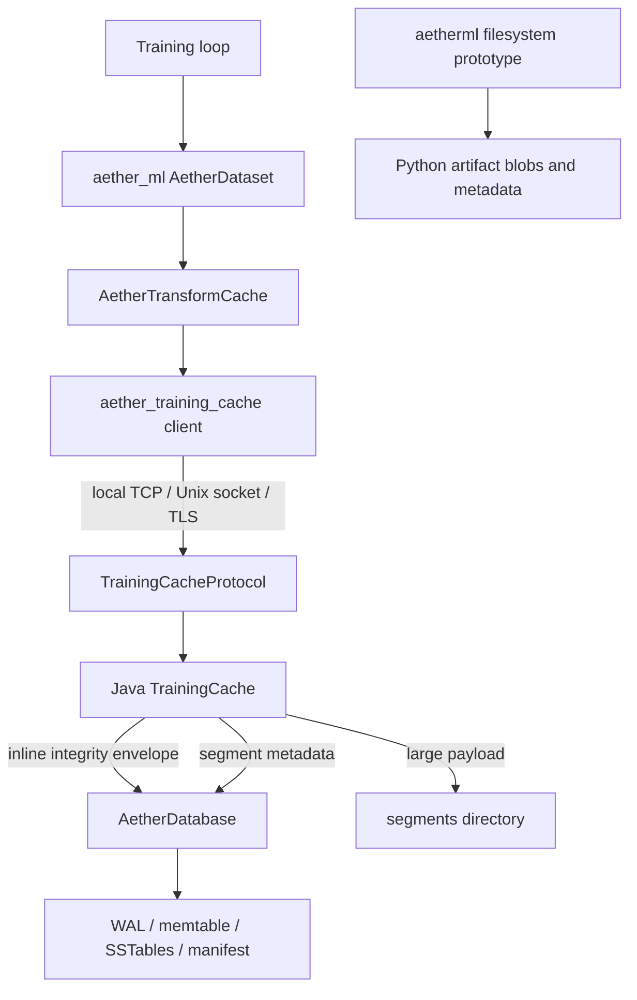
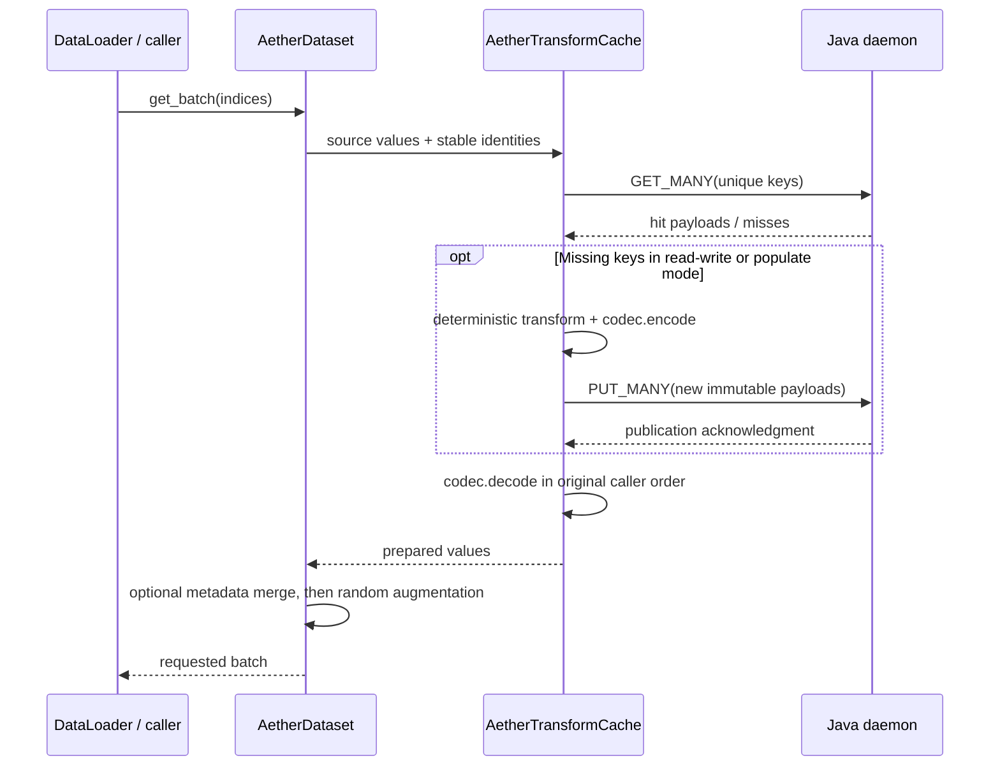
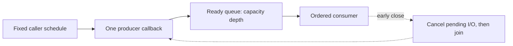

# Training Cache and Python Integration

[Onboarding index](README.md) | [Storage engine](STORAGE-ENGINE.md) | [Experiments](EXPERIMENTS-AND-PROFILING.md)

This guide follows the implemented Java training-cache module and Python packages.
It is an onboarding map, not a promise that every feature in the numbered design
specifications is shipped. Commands below run from the repository root unless
stated otherwise. For storage internals, follow the linked engine classes rather
than treating this adapter as a separate database implementation.

Jump to the [local example](#2-run-a-small-daemon-backed-example),
[identity](#3-identity-is-the-invalidation-mechanism), [dataset flow](#4-dataset-and-transform-flow),
[codecs](#5-codecs-and-ownership), [protocol](#6-protocol-connections-and-trust),
[durability](#7-durability-integrity-and-capacity), [workers](#8-pytorch-workers-and-prefetch),
[MONAI](#9-monai-and-benchmark-backends), or [bulk/JFR](#10-offline-bulk-population-and-jfr).

For individual Java functions, read the [artifact identity and policy reference](TRAINING-IDENTITY-FUNCTIONS.md)
and [cache operations and segment reference](TRAINING-CACHE-FUNCTIONS.md). They
separate identity construction, publication, integrity admission, copy ownership,
eviction and diagnostics. Continue with [daemon lifecycle](TRAINING-DAEMON-FUNCTIONS.md)
and [protocol/tracing functions](TRAINING-PROTOCOL-FUNCTIONS.md) for connection
ownership and wire handling. Python details continue in
[client connections](PYTHON-CLIENT-FUNCTIONS.md),
[value/batch APIs](PYTHON-CACHE-VALUE-FUNCTIONS.md), and
[mapped views/tensors](PYTHON-MAPPING-FUNCTIONS.md). Higher-level paths have separate
[transform-cache/identity/codec](PYTHON-TRANSFORM-FUNCTIONS.md) and
[dataset integration](PYTHON-DATASET-FUNCTIONS.md) references; they do not replace
the low-level client or the separately frozen research worker.
Continue with [ML client lifecycle and operations](PYTHON-LIFECYCLE-FUNCTIONS.md)
and [PyTorch/MONAI integration functions](PYTHON-FRAMEWORK-FUNCTIONS.md) for
environment configuration, capability negotiation, batching, worker startup,
and descriptor-based medical-image identities.
The [offline bulk publication reference](BULK-PUBLICATION-FUNCTIONS.md) follows
the Java artifact wrapper and engine loader through staging, full verification,
manifest publication, failure recovery and receipt/JFR boundaries.
The [loading, worker and prefetch reference](PYTHON-PIPELINE-FUNCTIONS.md) traces
the separate reference loader, ordered queue and spawned benchmark workers.
The [store adapter and resource reference](PYTHON-STORE-ADAPTER-FUNCTIONS.md)
explains Java batching, mmap journal publication, copy ownership and process-counter
limits. These are current-checkout contracts, not changes to the frozen H2 worker.
For the separate aetherml prototype, read [filesystem artifact publication](PYTHON-PROVENANCE-STORE-FUNCTIONS.md),
[dataset/lineage workflows](PYTHON-PROVENANCE-WORKFLOW-FUNCTIONS.md), and
[validation/diagnostics](PYTHON-PROVENANCE-DIAGNOSTIC-FUNCTIONS.md). These distinguish
content deduplication from provenance, per-file replacement from transactions,
snapshot membership from reproducible training, and cleanup from repair.

## 1. Choose the Correct API

| Surface | What it owns | Start here |
| --- | --- | --- |
| Java `TrainingCache` | Immutable preprocessing keys, integrity envelopes, eviction index, segment files, embedded Aether database | [TrainingCache.java](../../modules/aether-training-cache/src/main/java/io/aetherdb/training/cache/TrainingCache.java) |
| Python `aether_training_cache` | Low-level local daemon client, packed values, segment references and pipeline helpers | [client.py](../../clients/python/aether_training_cache/client.py), [exports](../../clients/python/aether_training_cache/__init__.py) |
| Python `aether_cache` | Compatibility import for the low-level client | [exports](../../clients/python/aether_cache/__init__.py) |
| Python `aether_ml` | Daemon-backed deterministic transform cache and indexable datasets | [exports](../../clients/python/aether_ml/__init__.py), [transform_cache.py](../../clients/python/aether_ml/transform_cache.py) |
| Python `aether_ml.monai` | Dictionary-dataset adapter with an explicit deterministic/random transform boundary | [dataset.py](../../clients/python/aether_ml/monai/dataset.py) |
| Python `aetherml` without an underscore | Separate local filesystem artifact/provenance prototype, snapshots and experiment records | [exports](../../clients/python/aetherml/__init__.py), [ml.py](../../clients/python/aether_training_cache/ml.py) |
| Research `JavaArtifactStore` | Adapter used by benchmark workloads to access the real Java daemon | [java_store.py](../../clients/python/aether_training_cache/java_store.py) |

Do not substitute `aetherml.open(...)` for daemon-backed `aether_ml`. The former
stores artifacts through a local Python implementation and defaults to pickle
serialization. It does not measure Java WAL, SSTable or compaction behavior.
Never deserialize untrusted pickle artifacts. The `aether_ml` built-in codecs use
explicit binary/JSON formats instead.

There are also multiple `AetherDataLoader` names. The one in `aether_ml.torch`
delegates to PyTorch. The low-level one in `aether_training_cache.dataset` loads
segment references. The `aetherml` loader belongs to the filesystem prototype.
Imports determine the behavior; the class name alone is not enough.



## 2. Run a Small Daemon-Backed Example

The Python distribution is named `aether-training-cache`, version `0.1.0` in the
current [pyproject.toml](../../clients/python/pyproject.toml). It requires Python
3.10 or newer. Its base dependencies include NumPy, Pillow and tiktoken; optional
`torch` and `monai` extras add those integrations. Use the repository's validated
environment/lock files for experiments, not arbitrary dependency upgrades.

On Windows, with the development virtual environment already created:

```powershell
.venv\Scripts\python.exe -m pip install -e clients/python
```

For PyTorch/MONAI development:

```powershell
.venv\Scripts\python.exe -m pip install -e "clients/python[torch,monai]"
```

Start the Java daemon in a separate terminal using the Gradle task, which supplies
the complete runtime classpath:

```powershell
$cacheDir = Join-Path (Get-Location) 'build/onboarding-cache'
.\gradlew.bat :modules:aether-training-cache:trainingCacheDaemon "-PcacheDir=$cacheDir" -Pport=9484
```

The Unix equivalent is:

```bash
./gradlew :modules:aether-training-cache:trainingCacheDaemon \
  -PcacheDir="$PWD/build/onboarding-cache" -Pport=9484
```

The task's daemon uses `RECOVERABLE`, not `DURABLE`. It binds loopback and prints
the selected port. If 9484 is occupied, select another port in both daemon and
client. Do not run two daemon processes against the same store directory.

This Python example needs no model, dataset download or GPU:

```python
from aether_training_cache import (
    AetherTrainingCache, CacheKey, TransformationFingerprint,
)
from aether_ml import validate_capabilities

transform = TransformationFingerprint.from_descriptor("onboarding-uppercase-v1")
key = CacheKey("onboarding", "sample-content-v1", transform)

with AetherTrainingCache(port=9484) as cache:
    info = validate_capabilities(cache)
    assert info["engine"] == "java-training-cache"
    cache.put_many([(key, b"PREPARED SAMPLE")])
    assert cache.get_many([key])[key] == b"PREPARED SAMPLE"
    print(info["durability"], cache.protocol_metrics())
```

Repeating this example is safe because the same key receives the same bytes.
Publishing different bytes under that key is rejected. Close/reopen the daemon
and repeat the read to exercise persistence, rather than merely creating another
Python client connected to the original process.

For a `DURABLE` daemon, first export the built runtime classpath, then pass the
fourth Java argument explicitly. The Gradle daemon task currently passes only
directory and port; a guessed `-Pdurability` flag would not configure it.

```powershell
.\gradlew.bat :modules:aether-training-cache:paperRuntimeClasspath
$cp = (Get-Content 'modules/aether-training-cache/build/paper-runtime-classpath.txt' -Raw).Trim()
$cacheDir = Join-Path (Get-Location) 'build/onboarding-durable-cache'
java --enable-preview -cp $cp io.aetherdb.training.cache.TrainingCacheDaemon $cacheDir 9485 10737418240 DURABLE
```

Direct launches need Java 21 with `--enable-preview` for the native memtable;
Gradle's JavaExec convention supplies that flag automatically.
The helper also writes a source/runtime hash manifest. Research scripts validate
that manifest and can reject stale builds after Java source changes. Regenerate
the classpath task after such edits; do not hand-edit its generated manifest.
See [build.gradle.kts](../../modules/aether-training-cache/build.gradle.kts).

## 3. Identity Is the Invalidation Mechanism

At the low-level API, a `CacheKey` contains a namespace, sample identity and a
32-byte transformation fingerprint. Java derives a stable storage key from these
fields and retains the namespace prefix for namespace operations. Read
[CacheKey.java](../../modules/aether-training-cache/src/main/java/io/aetherdb/training/cache/CacheKey.java)
and [TransformationFingerprint.java](../../modules/aether-training-cache/src/main/java/io/aetherdb/training/cache/TransformationFingerprint.java)
before changing cross-language identity encoding.

The higher-level [artifact_key](../../clients/python/aether_ml/identity.py) binds:

```text
namespace
  + source_identity
  + canonical transform identity and artifactSchemaVersion
  -> CacheKey
```

Use stable sample/content identities. An array index is not an identity if the
dataset can be reordered. A pathname alone is not a content revision. Include
every deterministic input that can affect the prepared artifact: image content,
mask/label content when cached, relevant metadata, preprocessing version and
parameters, output shape/dtype/schema, and dependencies whose behavior matters.

| Change | Intended identity behavior |
| --- | --- |
| Append new samples | Keep retained sample identities and transform unchanged; only additions miss |
| Correct a cached source or mask | Change that sample's source identity |
| Change deterministic preprocessing | Change the transform identity |
| Change codec/schema incompatibly | Change schema/transform identity; never decode old bytes with a new incompatible codec |
| Change random augmentation | Apply it after the cache; do not store a random realization under a deterministic key |
| Name a new dataset version | Keep the version label outside the artifact key when retained samples should be reusable |

`AetherDataset` requires `identity_fn`. Prefer an explicit `transform_identity`.
Automatic transform fingerprinting only supports selected torchvision/MONAI
objects and rejects unsupported state; it does not hash arbitrary Python code.
`artifact_schema_version` is configurable on `AetherTransformCache`; the dataset
wrapper currently uses its default `"1"`. Include an explicit schema field in the
dataset's transform descriptor when evolving its artifact representation.

The MONAI identity helpers are conveniences, not canonical content preflight:
`monai_dict_identity` hashes an ID field, `dicom_study_identity` hashes available
UIDs, and `nifti_file_identity` hashes resolved path, size and modification time.
They do not hash medical-image bytes or detect every possible label correction.
See [monai/identity.py](../../clients/python/aether_ml/monai/identity.py).

Changing identity makes old entries unreachable by the new pipeline; it does not
delete them. Java exposes `invalidateNamespace`/`deleteNamespace`, but the current
wire protocol has no namespace-delete opcode. Python `normalize_namespace` is an
explicit utility, not an automatic normalization step in dataset construction.

## 4. Dataset and Transform Flow



The implementation deduplicates keys within a request while preserving caller
order in its returned list. It chunks more than 4,096 source entries, performs
one lookup per chunk, and publishes missing entries in a batch. It still accesses
the underlying source dataset before a cache lookup. If that dataset eagerly
decodes images, this access can remain expensive even on a warm hit. A lightweight
manifest/path dataset with decoding inside the deterministic transform gives the
cache the intended boundary.

A small configuration suitable for the `aether-ml` CLI is:

```python
import hashlib
from aether_ml import AetherDataset, BytesCodec

raw_samples = [b"scan-001", b"scan-002"]

def source_identity(sample, index):
    return hashlib.sha256(sample).hexdigest()

def prepare(sample):
    return sample.upper()

dataset = AetherDataset(
    raw_samples,
    deterministic_transform=prepare,
    namespace="onboarding/prepared",
    identity_fn=source_identity,
    transform_identity={"operation": "uppercase", "version": 1, "schema": "bytes-v1"},
    codec=BytesCodec(),
)
```

The CLI imports a trusted Python configuration file and expects a module-level
`dataset`. With this configuration in `training_dataset.py`, supported commands
are:

```text
aether-ml plan training_dataset.py
aether-ml populate training_dataset.py --workers 1
aether-ml stats training_dataset.py
```

`plan()` uses metadata-only `contains_many`; it neither preprocesses nor verifies
every payload. `populate()` does not apply random augmentation. With one worker
it uses the batched transform path; with multiple workers it uses a thread pool
of individual requests. The latter is not automatically faster, since one client
serializes socket exchanges. `stats()` reports this Python object's counters,
not a persistent daemon-wide history: a new CLI process generally starts with
empty counters. For entry count and durability, call `client.engine_info()`.

| Mode | Current behavior |
| --- | --- |
| `read-write` | Fetch hits, compute and publish misses |
| `populate` | Uses the same fetch/compute/publish behavior; not an offline bulk import |
| `read-only` | Raise `CacheMissError` if any requested artifact is absent |
| `disabled` | Run the deterministic transform directly, without cache access |

The default `on_cache_error="raise"` surfaces lookup/publication failures. With
`"fallback"`, lookup failures are logged and trigger uncached computation;
publication failures log and return the computed output. Do not use fallback in
a cache performance experiment that requires zero hidden recomputation. Decode
errors are not covered by this lookup/publication fallback. See
[transform_cache.py](../../clients/python/aether_ml/transform_cache.py).

`cache_selector` can limit the cached value to tensor inputs; pair it with
`merge_cached_artifact` to restore fresh metadata after retrieval. Metadata that
affects preprocessing must still enter the identity. This facility is on
`AetherDataset`; the current MONAI convenience constructor does not expose it.

## 5. Codecs and Ownership

| Codec | Encoded value | Important behavior |
| --- | --- | --- |
| `BytesCodec` | Bytes-like data | Returns materialized bytes |
| `NumPyCodec` | Contiguous array, `AENP1` header, JSON dtype/shape | Decode makes a copy |
| `TensorCodec` | Detached CPU NumPy representation | Decode returns a CPU tensor; device and autograd history are not preserved |
| `TensorDictCodec` | Sorted string-key dictionary, `AETD1` header, dtype/shape/offset/type metadata | Array/tensor values only; tensor entries return as CPU tensors |
| `AutoCodec` | Tagged bytes, array, tensor or tensor dictionary | Does not serialize arbitrary Python objects |

These codecs target plain numeric artifacts, not arbitrary object-dtype arrays,
MONAI metadata graphs, lazy transform history or arbitrary Python classes. Keep
unsupported metadata outside the cached artifact and test dtype/shape round trips
for new workloads. Serialization choices are part of experimental comparability.
See [codecs.py](../../clients/python/aether_ml/codecs.py) and
[test_aether_ml.py](../../clients/python/tests/test_aether_ml.py).

The low-level `get_many_values()` returns one packed response with statuses,
offsets, lengths and memoryviews. `get_many()` materializes per-key bytes.
Neither makes network transfer zero-copy; Python and Java still frame, pack and
copy data. Release packed batches after use. A retained payload view can keep the
immutable response alive; an array or tensor view must not outlive its actual
backing mapping. Do not mutate read-only mapped data through tensor adapters.

For large segment-backed values, `get_ref`/`get_many_refs` return location and SHA
metadata rather than payload bytes. `MappedSegmentRegistry` needs access to the
same local `segments` directory and validates SHA when creating views. `get_ref`
also returns `None` for an inline value, so it is not a general existence check.
This path is distinct from an incremental mmap benchmark store and from the
default `aether_ml` materialized-byte path.

## 6. Protocol, Connections and Trust

The shared [TrainingCacheProtocol.java](../../modules/aether-training-cache/src/main/java/io/aetherdb/training/cache/TrainingCacheProtocol.java)
is used by the TCP, Unix-domain and TLS daemons. The ordinary client is protocol
1; server tracing sends version 2 with a 16-byte correlation ID. Engine INFO
advertises protocol 1 and feature strings, not a separate user-authentication
protocol.

```text
request:  u32 big-endian frame length | u8 version | u8 operation | body
response: u32 big-endian frame length | u8 status | u32 value length | value
key:      u32 namespace bytes | UTF-8 namespace
          u32 sample bytes | UTF-8 sample ID | 32-byte transform digest
```

| Opcode | Operation | Python entry point |
| --- | --- | --- |
| 1 | GET | `get` |
| 2 | PUT | `put` |
| 3 | GET_REF | `get_ref` |
| 4 | GET_MANY_REF | `get_many_refs` |
| 5 | GET_MANY packed payload | `get_many_values`, `get_many` |
| 6 | PUT_MANY | `put_many` |
| 7 | INFO | `engine_info` |
| 8 | CONTAINS_MANY | `contains_many` |
| 9 | DRAIN_TRACES | `drain_completed_server_traces` |

Requests are capped at 64 MiB and batched operations at 4,096 keys. These are
independent limits: 4,096 large artifacts do not fit in one request. The generic
`aether_ml` batching logic chunks by count, not byte budget; choose appropriately
small batches for large tensors. The benchmark `JavaArtifactStore` separately
chunks writes at 64 artifacts and roughly 60 MiB. Do not assume this policy
exists in every client.

Wire limits do not override storage admission limits. Inline envelopes still
enter a Java `WriteBatch`, whose estimated encoded limit is 32 MiB, with 16 MiB
per value; the complete batch must also fit one configured memtable. Segment
storage changes the database value to metadata but does not remove the network
frame limit. Include framing/envelope overhead when choosing a batch size.

The server checks request sizes/counts and value/string lengths, validates opcode
and protocol version, and has 128 concurrent dispatch permits. A rejected permit
returns an error. Malformed requests generally close the connection; exceptions
are swallowed by the serve loop rather than returned as detailed typed errors.
The protocol is not a hardened hostile-client boundary: allocation of the frame
occurs before dispatch admission, the TCP daemon uses a cached thread pool, and
the Python response parser has no equivalent global 64 MiB response cap. Keep
the service local and trusted; do not expose it publicly based on these limits.

The normal daemon binds loopback. The TLS variant also binds loopback and accepts
an application-supplied `SSLContext` with optional required client certificates.
The Unix-domain variant exposes the same protocol through a filesystem socket.
These are transport choices, not implemented multi-tenant namespace authorization.
Review [TrainingCacheDaemon](../../modules/aether-training-cache/src/main/java/io/aetherdb/training/cache/TrainingCacheDaemon.java),
[TrainingCacheTlsDaemon](../../modules/aether-training-cache/src/main/java/io/aetherdb/training/cache/TrainingCacheTlsDaemon.java)
and [TrainingCacheUnixDaemon](../../modules/aether-training-cache/src/main/java/io/aetherdb/training/cache/TrainingCacheUnixDaemon.java).

The Python client lazily retains one connection and protects exchanges with an
`RLock`. It retries connection/EOF/OS errors once, including potentially a write
whose acknowledgment was lost. Immutable same-key/same-value publication makes
that retry useful, but it is not an exactly-once request protocol. A conflicting
write fails; do not create non-deterministic payloads under the same key.

Java `getOrCompute` has per-key in-process single-flight. Python's low-level
`get_or_compute` and `aether_ml` use lookup/compute/publish and do not provide
distributed single-flight across workers. Concurrent workers can duplicate
computation even though immutable publication checks protect stored content.

## 7. Durability, Integrity and Capacity

Java cache publication first validates the entire batch and rejects conflicting
duplicate keys or conflicting existing content. Existing identical entries are
reused. New payloads receive SHA-256 and an encoded CRC32C, then a database write
publishes the index before acknowledgment. Do not equate cache integrity with
semantic correctness: checksums prove bytes match their stored digest, not that
the source identity or preprocessing algorithm was correct.

| Durability | Actual adapter behavior |
| --- | --- |
| `EPHEMERAL` | In-memory engine; no persistence; automatic large-segment storage has no persistent segment directory |
| `RECOVERABLE` | Persistent engine, `GROUP_SYNC` database write; segment files are atomically renamed but not explicitly forced by this mode |
| `DURABLE` | `SYNC` database write; segment file force before rename and directory force on supported non-Windows systems |

`RECOVERABLE` is not a claim that every segment payload survives power loss.
Windows segmented publication explicitly has a process-crash rather than full
directory-fsync contract. Filesystem/device guarantees and process-crash tests
are separate evidence. See [TrainingCacheSegmentStore.java](../../modules/aether-training-cache/src/main/java/io/aetherdb/training/cache/TrainingCacheSegmentStore.java).

Automatic storage uses segments at payload sizes **greater than or equal to
256 KiB**; smaller values are inline. Java can select an explicit storage policy.
The cache's normal open path uses the development security profile and disables
the engine's disk-pressure guard. The default 10 GiB `maximumBytes` controls a
cache accounting/eviction index, not a hard cap on physical WAL/SSTable/temporary
disk consumption. Deployment and benchmark preflight must separately ensure
free space. Do not describe this adapter as a production capacity governor.

The integrity policy reported by INFO is `immutable-inline-admission-v1`:

- An inline resident immutable SSTable lookup validates CRC32C and SHA-256 once
  on that exact immutable value. Reloaded values validate again.
- Native-memtable lookups materialize values and validate each materialization.
- Segment metadata retains CRC32C and each storage payload read validates SHA.
- Writes retain content SHA-256 and encoded CRC32C.

The trusted marker attaches to an immutable lookup result, not globally to a
key. The optimization is not a blanket checksum bypass. Cache-level corruption
can become a miss and trigger index deletion; storage-level corruption can still
fail the operation. On open, `loadIndex` scans and validates stored cache entries
and rebuilds accounting. That can make startup significant and is why a
persistent-service performance scenario differs from repeated restart tests.

The low-level `wait_for_background_compaction` helper polls INFO until state is
not RUNNING/STOPPING or timeout. Its `drained` result alone is weaker than the
research invariant: inspect state, debt and failures explicitly before claiming
strict quiescence. The [MONAI diagnostic drain helper](../../scripts/monai_comparison.py)
performs those additional checks. Charge drain time to an endpoint when its
protocol requires it; do not count it twice if included in another stage.

## 8. PyTorch, Workers and Prefetch

`aether_ml.torch.AetherDataLoader` returns the ordinary PyTorch `DataLoader`.
PyTorch 2 uses `AetherDataset.__getitems__` to request a batch, routing it to one
batched cache lookup rather than one call per sample. A custom sampler or
collation path must preserve this property if batching is the intended design.

`AetherTransformCache` resolves its client lazily and detects PID changes; the
raw `AetherTrainingCache` socket client does not provide that protection itself.
Use the default factory or a top-level custom factory for multiprocessing so
each worker creates its own client; do not pass an already-open socket client
into worker processes. On Windows/spawn, callbacks/configuration must be picklable,
and the executable entry point needs the usual `if __name__ == "__main__":`
guard. The optional `aether_worker_init` opens a worker-local client early.
Parent `stats()` does not automatically aggregate counters from worker processes.
See [torch/loader.py](../../clients/python/aether_ml/torch/loader.py),
[torch/worker.py](../../clients/python/aether_ml/torch/worker.py) and the worker
matrix in [test_aether_ml.py](../../clients/python/tests/test_aether_ml.py).

The research [BoundedPrefetchIterator](../../clients/python/aether_training_cache/prefetch.py)
is a different component, not an implicit setting on `AetherDataset`:



Depth zero creates no worker and prepares synchronously. Positive depth creates
one producer, a queue of exactly that depth, and at most one additional batch in
preparation or waiting to enqueue. It preserves schedule order, forwards failures
and joins on close. Close the iterator before its caller-owned client; use
`cancel_callback=client.cancel_pending_requests` when early exit must interrupt
socket work. Cancellation permanently disables that client, while normal full
consumption preserves its persistent connection.

Queue occupancy is an event-sampled mean, not a time-weighted average.
`inputWaitMs`, queue wait and consumer wait are host-side timing/proxy metrics,
not direct measurements of hardware GPU idle time. Keep lookup/decode timing,
prefetch overlap and device compute measurements distinct.

## 9. MONAI and Benchmark Backends

`AetherPersistentDataset` accepts ordinary callable deterministic and random
transforms, including MONAI `Compose` objects; the wrapper itself does not import
MONAI. It does not discover the random boundary for you. Pass deterministic
preprocessing separately from random augmentation, with explicit identity, and
ensure output fits `TensorDictCodec` or supply a codec.

The research comparison deliberately shares the canonical transformation and
input order across four distinct persistence implementations:

| Backend | Artifact representation and persistence path |
| --- | --- |
| Aether | `AetherPersistentDataset`, TensorDictCodec, real daemon, durable Java cache |
| Incremental mmap | TensorDictCodec with the repository's persistent mmap store/index |
| MONAI PersistentDataset | MONAI native persistent files and native `torch.save` serialization |
| MONAI LMDBDataset | MONAI native LMDB cache and serialization |

The benchmark descriptor binds source checksum/identity and transform identity
into the hash function, including for LMDB. Its measured stages include cache
construction/admission work that can occur inside constructors. MONAI native
serialization, filesystem sync contracts and indexing are not identical to
Aether's. Keep these differences in reports; equal decoded tensors do not imply
identical byte representations or durability guarantees. See
[monai_comparison.py](../../scripts/monai_comparison.py),
[persistent_mmap.py](../../clients/python/aether_training_cache/persistent_mmap.py),
[test_monai_comparison.py](../../scripts/tests/test_monai_comparison.py) and
[MONAI pilot protocol](../../kaggle/MONAI-PILOT.md).

## 10. Offline Bulk Population and JFR

The experimental [BulkArtifactWriter](../../modules/aether-training-cache/src/main/java/io/aetherdb/training/cache/BulkArtifactWriter.java)
is **not** `AetherDataset.populate()`, a network opcode or a new normal-write
policy. It holds the database lock for an empty store, consumes version-1
PUT_MANY bodies through an offline stdin pipe, and uses
[EmptyStoreBulkLoader](../../modules/aether-engine/src/main/java/io/aetherdb/engine/EmptyStoreBulkLoader.java)
to build sorted SSTables directly. Existing online writes remain on their normal
WAL/memtable path.

```mermaid
flowchart LR
    Python[Python preprocess and encode] --> Pipe[PUT_MANY body over local pipe]
    Pipe --> Stage[STAGED: volatile acknowledgment]
    Stage --> Sort[Bounded sorted buffer]
    Sort --> SST[Build / force / rename SSTables]
    SST --> Verify[One full inventory verification]
    Verify --> Manifest[One forced manifest edit]
    Manifest --> Finish[Explicit finish: committed receipt]
    Finish --> Restart[Fresh normal daemon: full readback]
```



Only explicit finish publishes the inventory. EOF/close is not commit; a failed
or indeterminate commit requires reopen/validation, not blind retries. The
prototype is bounded to 512 MiB encoded key/value buffering and 100,000 entries,
not dataset-size-independent streaming or a hard JVM heap limit. It supports
artifacts up to and including 256 KiB, keeps SHA/CRC envelopes, and writes an empty successor
WAL header for future ordinary writes rather than artifact WAL records. The
default SSTable target remains 32 MiB; the layout diagnostic varies targets
without silently changing that default.

At exactly 256 KiB this differs from the ordinary automatic storage policy,
which selects a segment. Preserve or report that representation difference in
comparisons near the threshold.

Bulk startup, pipe transport and skipped empty-cache scans differ from the online
path. End-to-end speed differences cannot all be attributed to WAL elimination.
The separate restart readback is a correctness gate; a later full-lifecycle
experiment must also charge the transition into the online service. Do not pool
changed-implementation measurements with earlier pilots.

The JFR diagnostic profiles the **offline writer JVM**, not the regular TCP
daemon. Opt-in events include `aether.BulkPopulation` and `aether.BulkPhase`;
controls leave the event property off. Population includes waiting for Python
input but excludes JVM/bootstrap startup. The control/profile/control sequence
estimates recording overhead. Nested phase durations must not be summed, sampled
allocation weights are estimates, and missing thresholded I/O events do not
prove zero I/O. A tiny Windows fixture is correctness evidence, not the full
medical-image workload's performance result.

Detailed contracts and scripts:

- [Bulk prototype](../../kaggle/BULK-POPULATION-PROTOTYPE.md) and [bulk layout diagnostic](../../kaggle/BULK-POPULATION-V2.md).
- [JFR diagnostic](../../kaggle/BULK-JFR.md), [profile_bulk_jfr.py](../../scripts/profile_bulk_jfr.py) and [bulk_jfr_analyze.py](../../scripts/bulk_jfr_analyze.py).
- [BulkArtifactWriterTest](../../modules/aether-training-cache/src/test/java/io/aetherdb/training/cache/BulkArtifactWriterTest.java), [test_bulk_population.py](../../scripts/tests/test_bulk_population.py) and [test_bulk_jfr.py](../../scripts/tests/test_bulk_jfr.py).

## 11. Tests and First Changes

For the separately frozen research harness, see [H2 training workload](H2-TRAINING-WORKLOAD.md).
It documents the actual segmentation CNN, fresh-model-per-version behavior and
same-JVM offline-to-online handoff. That bootstrap is not a new public cache API
or a change to the normal daemon protocol described in this guide.

Fast Python integration tests, without launching a Kaggle experiment:

```powershell
$env:PYTHONPATH = 'clients/python'
.venv\Scripts\python.exe -m pytest clients/python/tests/test_aether_ml.py clients/python/tests/test_prefetch.py clients/python/tests/test_request_tracing.py clients/python/tests/test_batch_request_timing.py -q
```

Java adapter tests:

```powershell
.\gradlew.bat :modules:aether-training-cache:test
```

| Area changed | Essential regression evidence |
| --- | --- |
| Identity | Stable old keys on append; changed source/mask/transform/schema produces misses |
| Codec | Byte/array/tensor round trips; explicit incompatible-schema behavior; equal prepared tensor hashes |
| Batch path | Caller order, duplicate identities, missing values, count/byte limits, immutable conflicting write rejection |
| Multiprocessing | Fresh client per PID, Windows spawn, no inherited live sockets, expected sample count |
| Prefetch | Depth zero, bounded occupancy, errors, early cancellation, producer joined, unchanged order |
| Durability/integrity | Real process restart, fault injection, corruption rejection, platform-specific sync limits |
| Performance instrumentation | Trace-off behavior unchanged, nested timing interpretation, no diagnostic error causes a write retry |

Read [TrainingCacheTest](../../modules/aether-training-cache/src/test/java/io/aetherdb/training/cache/TrainingCacheTest.java)
and [TrainingCacheTraceTest](../../modules/aether-training-cache/src/test/java/io/aetherdb/training/cache/TrainingCacheTraceTest.java)
before changing publication or packed responses. The Python tests use in-memory
fakes where appropriate; passing them alone does not prove Java persistence or
real MONAI compatibility. The scripts' opt-in real-Java tests and restart gates
provide a separate level of evidence.

For a first contribution, a focused identity/codec/batch test is a good starting
point. Preserve the deterministic transform boundary and use existing adapters.
Do not introduce a second cache format or new publication path merely to make a
benchmark faster without documenting its changed semantics.
