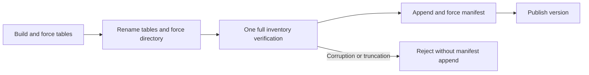

# Bulk Verification v2: Phase 1

Status: implementation and local correctness validation; remote performance gate
not yet measured. This does not authorize Phase 2 or a longitudinal confirmatory run.

## Changed Boundary

Only the empty-store bulk path defers builder verification and removes its second
post-rename reader open. `VersionSet.logAndApplyMeasured` still invokes the same
full `verifyInventory` before any manifest append/force/install. The verifier
itself, ordinary `SSTableBuilder.finish()` overloads, table encoding, SHA/CRC,
file forces, online writes, and compaction policy are unchanged.

The deferred builder method is package-private. `BulkInstallSupport` is an internal
cross-module bridge, guarded by a never-populated version; it is not a supported
application API. It returns unpublished metadata, not permission to skip inventory
verification. There is no unchecked manifest-publication entrypoint.



The existing `bulk.before_verification` and `bulk.after_verification` fault points
now surround the authoritative inventory rather than a per-table redundant open.
Crash tests retain both boundaries. A corrupt final table is tested after earlier
tables exist: the manifest remains byte-for-byte unchanged and reopen exposes no
partial dataset. Normal builder tests count actual completed full verifications.

Successful bulk receipts include:

```json
{
  "storage": {
    "verificationPolicy": "bulk-deferred-inventory-v2",
    "verification": {
      "inventoryCalls": 1,
      "tablesFullyVerified": 8,
      "bytesFullyVerified": 236000000
    }
  }
}
```

Counts above illustrate an eight-table run; bytes are physical SSTable bytes, not
an exact expected payload count. Counters cover this thread's entire bulk finish,
so reintroduced builder/reopen verification increases them. They exclude later
restart/readback. Counts are incremented by completed verification, not guessed
from the number of manifest additions. Failed commits return no success receipt.
The build timing is now `sstableBuildFinishRename`; old redundant `verificationNs`
is absent, and the inventory timing remains `manifest.inventoryVerificationNs`.

## Frozen Control

Before edits, the local source was preserved at:

```text
build/bulk-verification-v2/baseline-source.zip
SHA-256: 2537f36051aad13a8ee81213748258136c228ef96ec637b2b9555a6ae3dffa83
```

The archive records its dirty-worktree provenance honestly (`sourceClean=false`).
It is a content-addressed diagnostic control, not a clean confirmatory release.
The uploaded comparison instead uses the earlier clean JFR source archive:
`build/bulk-jfr/prepared/source/aether-paper-artifact.zip`, commit
`742f431c8443dd073c1bc2f55cade469a16724c4`, ZIP SHA-256
`9e909619a2339ebbf6510effd51ecf85c762f9be7f631c71d21b3906532ad1e1`.
Its engine, Python, configuration and build source bytes match the pre-edit backup;
differences are documentation, ignore rules and generated Gradle files in the dirty
backup. The original backup is retained unchanged. Do not substitute historical
timings for fresh control measurements. Generated `.build` directories are excluded
from source inventories so independent compilation does not invalidate provenance.

Extract it to a separate fresh checkout on the measurement host. Build its own
`:modules:aether-training-cache:paperRuntimeClasspath`; do not copy candidate
classes or runtime metadata into the control. Use the same JDK, Python environment,
dataset mount and host for both. Preserve the ZIP and its checksum sidecar.

The dedicated Kaggle mode performs this extraction and separate build automatically:

```powershell
build/kaggle-venv/Scripts/python.exe scripts/kaggle_remote.py prepare `
  --mode population-verification --no-server-trace `
  --bulk-baseline build/bulk-jfr/prepared/source/aether-paper-artifact.zip `
  --dataset-source grgur321/aether-oct5k-pilot
```

Prepare from a clean committed candidate snapshot. Both ZIP identities are bound
to the notebook; the private source dataset includes both archives. The notebook
runs the seven storage-module test suites and real-JVM bulk/restart tests before
three fresh pairs. Test failures stop the comparison; JUnit reports and logs are
included in the results ZIP. It does not automatically run JFR or Phase 2.

## Unprofiled Comparison

The new runner reuses each checkout's existing population worker. It requires
3-5 fresh paired repetitions, alternates baseline/candidate order, uses fresh
stores/processes, validates baseline file hashes and shared Python feeding code,
and binds both source identities into the campaign. It is not a resume mode.

Run storage/recovery suites and real-JVM bulk tests first. On a Kaggle host with
the frozen OCT5K mount, two built checkouts, and pinned MONAI dependencies:

```bash
/kaggle/working/aether-paper-venv/bin/python scripts/profile_bulk_verification.py \
  --baseline-root /kaggle/working/Aether-Bulk-Baseline \
  --repetitions 3 \
  --scratch-root /kaggle/working/aether-population-stores \
  --output /kaggle/working/aether-results/bulk-verification-v2
```

The workload remains 1,200 frozen V0 artifacts, 32 MiB target SSTables, batch 16,
no model, no training, no JFR, and no server trace. Common input/reference work is
outside backend timing. Summary JSON reports median/mean/min/max population time
and population minus measured source-load/preprocessing time. That residual
includes Python feeding/encoding and storage; it is not pure Java database time.
Failed worker stores/logs are retained. Successful stores are cleaned only after
restart validation and checksummed result receipts have been written.

The timing gate is a complete paired campaign with at least 750 ms difference
between baseline and candidate population medians. It does not automatically
launch a profile, optimize the verifier, or declare all correctness gates passed.
Only after reviewing those results should one follow-up remote JFR be collected.
A tiny local JFR event-contract test is correctness evidence, not this performance
profile. A successful v2 finish should emit one inventory `SSTABLE_VERIFY` event.

## Phase 2 Remains Gated

No streaming verifier, restart-block scanner, key scratch optimization, payload
copy change, or verification pipelining is implemented in this phase. Require the
fresh Phase-1 timing gate and follow-up profile before changing the authoritative
verifier. Any later verifier must be differentially tested against the existing
corruption checks before replacing it.

Do not interpret functional warm-read/incremental-write tests as performance
non-regression evidence. Those timings still need a matched experiment before
returning to longitudinal work.
